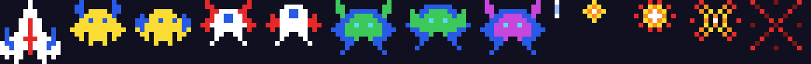
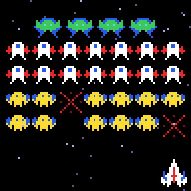

# g32 ギャラガ風（自機とスプライト）

ギャラガ風シューティング 5 段階の 1 つ目。**多色のドット絵**を Python の文字列とパレットで持ち、96×96 ドットの画面に描きます。
自機は左右に動き、弾を撃ち、並んだ敵（ハチ・チョウ・ボス）を落とすと爆発の 4 コマが出る。星は奥行きの違う 3 つの速さで流れます。
編隊の動きと急降下は次の段階から。





今回の主題は 4 つです。

- **ドット絵をパレット＋文字列で** — `sprite("bee-a", """ .B..YYYY..B. ... """)`。文字が色、`.` が透明。`recolor` でボスの緑を紫に
- **トゥルーカラーの ANSI と半角ブロック `▀`** — 端末の 1 文字に上下 2 ドットを詰める（前景色が上、背景色が下）。`\x1b[38;2;r;g;bm`
- **`struct` + `zlib` で PNG を手書き** — ライブラリなしでスプライトを PNG に。README の画像もブラウザの `canvas` に貼る画像もこれ
- **`itertools.cycle`** — 2 コマの羽ばたきを無限に回す。`shutil.get_terminal_size` で端末の大きさを確かめる

## ブラウザ版

インストールせずに遊べます → **https://hicocho.github.io/python-study/g32/**

ソースは [`docs/g32/game.py`](../docs/g32/game.py)。定数とパレット、`Sprite` / `sprite()`、全スプライト、`Screen`、`png_bytes()` / `data_uri()`、`Body` / `Enemy` / `Explosion`、そして `class Game` を **1 文字も変えずに**持ってきています。
持ってこなかったのは端末に描く `Screen.render()` と `play()` / `read_keys()` / `check_terminal()` / `main()` だけ。出口は 96×96 の `canvas` を CSS で 4 倍にしたもので、各スプライトは `data_uri()`（Python が組み立てた PNG）を `Image` にして `drawImage` で置きます。

## 遊び方（ターミナル）

端末は **96 桁 × 51 行以上**にしてください（1 桁 1 ドット、1 行 2 ドット）。トゥルーカラー対応の端末（macOS の Terminal / iTerm2 / VS Code）で。

```bash
python3 main.py                        # 遊ぶ
python3 main.py --show                 # スプライトを描いて終わる
python3 main.py --sheet sprites.png    # スプライトを 1 枚の PNG に（--scale 4）
```

- `←` `→`（`A` `D`）で移動、スペースで撃つ（同時に 2 発まで）、`q` でやめる
- 敵を全部落とすとクリア。敵はまだ撃ち返さない

## 仕様

- 画面 96×96 ドット、30 fps。自機 60 ドット/秒、弾 120 ドット/秒
- スプライト 13 枚: 自機 13×14、ハチ 12×10 × 2 コマ、チョウ 12×10 × 2 コマ、ボス 14×12 × 2 コマ（＋紫の recolor）、弾 1×4、爆発 4 コマ（5×5 → 11×11）
- 編隊: ボス 4、チョウ 7×2、ハチ 7×2 の 32 体。0.5 秒ごとに羽ばたき（`cycle`）
- 当たり判定は矩形（`Body.overlaps`）。爆発は 1 秒に 12 コマ
- 得点: ボス 150、チョウ 80、ハチ 50。命中率を表示
- PNG: 8 ビット RGBA、フィルタ 0、`IHDR` `IDAT` `IEND` の 3 チャンク。透明は alpha 0、`--sheet` は暗い背景

## メモ

### ドット絵は「文字列＋パレット」

```python
BEE = [sprite("bee-a", """
..B......B..
.BB......BB.
.BB.YYYY.BB.
..BYYYYYYB..
..YYBYYBYY..
.YYYYYYYYYY.
YYYYYYYYYYYY
.YY.YYYY.YY.
..Y.YYYY.Y..
....Y..Y....
"""), sprite("bee-b", ...)]
```

g09 は 1 色のドット絵を `#` と `.` で持ちました。ここでは文字ごとに色を割り当てる `PALETTE` を用意して、**絵と色を分ける**。
`Sprite.pixels` が `(x, y, RGB)` の一覧を返すので、端末に描く `Screen.blit` も PNG を作る `png_bytes` も同じものを見ます。
`recolor({"G": "M"})` は `str.maketrans` + `translate` で文字を置き換えるだけ——ボスの「2 発目で色が変わる」（g35）はこれで作れます。

### 端末に「ドット」を描く

```python
    code, ch = f"\x1b[38;2;{a[0]};{a[1]};{a[2]}m\x1b[48;2;{b[0]};{b[1]};{b[2]}m", "▀"
```

端末の 1 文字は縦長なので、上半分だけ塗る `▀` を使い、**前景色を上のドット、背景色を下のドット**にすると 1 文字に 2 ドット入ります。
色は `\x1b[38;2;r;g;bm`（前景）と `\x1b[48;2;r;g;bm`（背景）のトゥルーカラー。色が変わるときだけエスケープを出すと、1 コマ 96×48 文字で 30 fps が間に合います。
g07 以来の `\x1b[H` で上書き描画、`sys.stdout.write` 1 回、はそのまま。

### PNG を自分で作る

```python
def chunk(kind: bytes, body: bytes) -> bytes:
    return struct.pack(">I", len(body)) + kind + body + struct.pack(">I", zlib.crc32(kind + body))

return b"\x89PNG\r\n\x1a\n" + chunk(b"IHDR", header) + chunk(b"IDAT", zlib.compress(raw)) + chunk(b"IEND", b"")
```

PNG は「署名 + チャンクの列」で、チャンクは「長さ（4 バイト、ビッグエンディアン）+ 種類 + 中身 + CRC32」。`struct.pack(">I", n)` が 4 バイトの整数、`zlib.crc32` が検査値、`zlib.compress` が画像データの圧縮。
1 行の先頭にフィルタ種別 0 を置き、あとは RGBA を並べるだけ。標準ライブラリだけで書けて、テストでは自分で読み戻して色と透明を確かめました。
ブラウザ版はこの PNG を `base64` にした `data:image/png;base64,…` を `Image.src` に入れます——`functools.cache` で同じスプライトは一度だけ作る。

### `itertools.cycle` — 2 コマを無限に

`cycle(BEE)` は `bee-a, bee-b, bee-a, …` と回り続けるイテレータ。敵ごとに 1 つ持たせ、0.5 秒ごとに `next()`。最初の 1 コマを `next()` で取ってから渡すと、初回の羽ばたきで 2 コマ目に変わります。

### `shutil.get_terminal_size`

画面が入らない端末で崩れた絵を出すより、先に「96 桁 × 51 行以上にしてください（今は 80 × 24）」と言う。
