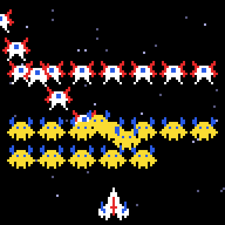

# g33 ギャラガ風（入場曲線と編隊）

ギャラガ風シューティング 5 段階の 2 つ目。敵は 5 つの波に分かれて**ベジェ曲線**を描いて飛来し、編隊の席に着くと**呼吸**するように広がったり縮んだりします。飛来中も撃ち落とせます。



今回の主題は 4 つです。

- **ベジェ曲線** — 制御点 4 つから `math.comb` のバーンスタイン多項式で曲線を作る。`--paths` で 4 本を端末に描いて確かめる
- **ジェネレータでパスをたどる** — `follow(折れ線, 速さ)` が 1 コマごとの位置を `yield`。曲線でも速さが一定になるように、線分の余りを次へ持ち越す
- **`itertools.chain`** — 曲線の終点から席までの直線を、曲線のジェネレータにつなぐ。敵は `next()` するだけ
- **`math.sin` の呼吸** — 席の位置（編隊の中心からの差）に `1 + 0.07 sin(2πt/4)` を掛ける

## ブラウザ版

インストールせずに遊べます → **https://hicocho.github.io/python-study/g33/**

ソースは [`docs/g33/game.py`](../docs/g33/game.py)。g32 のスプライト一式に加えて `bezier()` / `sample_curve()` / `follow()` / `ENTRY_PATHS`、`Enemy` の `route` / `advance`、そして `class Game` を **1 文字も変えずに**持ってきています。出口は g32 と同じ canvas です。

## 遊び方（ターミナル）

```bash
python3 main.py              # 遊ぶ（端末は 96 桁 × 51 行以上）
python3 main.py --paths      # 入場の曲線 4 本を描いて終わる
python3 main.py --show       # スプライトを描いて終わる
```

- `←` `→` で移動、スペースで撃つ、`q` でやめる。敵はまだ撃ち返さない（g34 から）

## 仕様

- 波: ハチ 7（左ループ）→ チョウ 7（右ループ）→ ハチ 7（右から急降下）→ チョウ 7（左から急降下）→ ボス 4（左ループ）。0.18 秒おきに 1 体、波の間は 1.2 秒。14 秒ほどで全員が席に着く
- 入場の速さ 70 ドット/秒。曲線の終点から自分の席までは直線
- 席: 編隊の中心 (48, 14) からの差で持つ。列の間隔 13（ボス 16）、行の間隔 12
- 呼吸: 全員が席に着いてから。周期 4 秒、±7%（端の敵が画面から出ない範囲）
- 飛来中の敵にも弾は当たる。全滅でクリア

## メモ

### ベジェ曲線 — 制御点で形を決める

```python
def bezier(points, t):
    n = len(points) - 1
    x = sum(math.comb(n, i) * (1 - t) ** (n - i) * t ** i * px for i, (px, _) in enumerate(points))
    ...
```

`t` を 0 から 1 に動かすと、最初の制御点から最後の制御点へ、途中の制御点に引き寄せられながら滑らかに進みます。係数 `comb(n, i) (1−t)^(n−i) t^i` はバーンスタイン基底で、`math.comb` は g19 の `combinations` の「数だけ」版。
`ENTRY_PATHS` は 4 本で、画面の外（x = −14 や 110）から入って画面の中でループします。`--paths` で色分けして描き、制御点を白い点で出すと形が直しやすい。

### ジェネレータでパスをたどる — 速さを一定に

```python
def follow(polyline, speed, fps=FPS):
    step = speed / fps
    carry = 0.0
    for (x0, y0), (x1, y1) in zip(polyline, polyline[1:]):
        length = math.hypot(x1 - x0, y1 - y0)
        t = carry
        while t <= length:
            yield x0 + (x1 - x0) * t / length, y0 + (y1 - y0) * t / length
            t += step
        carry = t - length
```

`bezier(t)` を等間隔の `t` で刻むと、曲線の曲がりが強いところで点が密になり、速さが変わって見えます。そこで曲線を折れ線（200 点）にしてから、**線分の上を 1 コマ `step` ドットずつ**進む。線分の終わりで余った分 `carry` を次の線分の始まりに持ち越すと、線分の境目でも速さが一定になります（テストで 0.997〜1.000 ドット/コマ）。
g13 のロボット（`robot_walk` を `next()` で 1 歩ずつ）と同じ「ジェネレータを持って進める」形。

### `itertools.chain` — ジェネレータをつなぐ

```python
enemy.route = chain(follow(curve, ENTRY_SPEED), follow(straight(curve[-1], home), ENTRY_SPEED))
```

曲線を回り終えたら、そこから自分の席までまっすぐ。2 本のジェネレータを `chain` で 1 本にすると、`Enemy.advance` は `next(self.route)` だけで、尽きたら（`StopIteration`）席に固定する。

### 呼吸は「席の座標に倍率」

席を「編隊の中心からの差」で持っておくと、横の差に `breath` を掛けるだけで編隊全体が中心から広がる。全員が着席してから始めるのは、入場中の敵の目的地が動かないように。

### 波は `(敵のリスト, 曲線の名前)` の列

`waves[0]` の敵を `ENTRY_GAP` ごとに 1 体ずつ `launch`。全員出たら `WAVE_GAP` 待って次の波へ。`Game` が持つのは `wave_timer` と `entered` だけで、敵ごとの状態は `route` が `None` かどうか。
