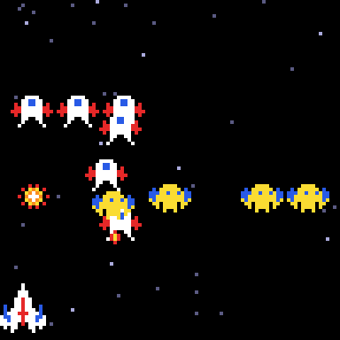
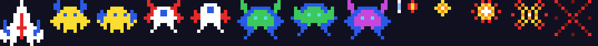

# g34 ギャラガ風（急降下と敵の弾）

ギャラガ風シューティング 5 段階の 3 つ目。席に着いた敵が**状態機械**で動きます。自機めがけて急降下し、弾を撃ち、画面の下へ抜けて上から席に戻る。当たると残機が 1 つ減り、3 機でゲームオーバー。



今回の主題は 4 つです。

- **`IntEnum` の状態機械** — 敵の「出撃前・入場中・席・急降下・帰還」を 1 つの値で。g33 の `launched` と `route is None` の組み合わせでは足りなくなった
- **`match` 文** — 曲線が尽きたとき、状態ごとに次の行き先を分ける。`case A | B:` でまとめる
- **`random.choices` の重み** — 急降下する敵をハチ 5 : チョウ 3 : ボス 1 で選ぶ
- **残機と復活** — `dead_timer` が 0 でないあいだは自機が無い。`alive` プロパティ 1 つで「撃てない・動けない・描かない・当たらない」をそろえる

スプライトに敵の弾（3×3）が増えました。



## ブラウザ版

インストールせずに遊べます → **https://hicocho.github.io/python-study/g34/**

ソースは [`docs/g34/game.py`](../docs/g34/game.py)。`State`、`dive_path()`、`Enemy.advance()` の `match`、`class Game` の急降下・弾・撃墜を **1 文字も変えずに**持ってきています。

## 遊び方（ターミナル）

```bash
python3 main.py              # 遊ぶ（端末は 96 桁 × 51 行以上）
python3 main.py --paths      # 入場の曲線 4 本を描いて終わる
python3 main.py --sheet sprites.png --scale 6
```

- `←` `→` で移動、スペースで撃つ、`q` でやめる
- 降下してくる敵は**出撃時の自機の位置**を狙う（±8 ドット）。動かないと当たる、動けばよけられる。赤い弾も同じ

## 仕様

- 急降下: 席に着いた敵がいれば 2.2 秒ごとに 1 体。席から外へふくらみ、自機の x へ急降下し、画面の下へ抜けたら上から直線で席に戻る（速さ 55 ドット/秒）
- 敵の弾: 急降下中、自機より 10 ドット以上上にいるあいだ、1 秒あたり 35% の確率で撃つ。速さ 70
- 撃墜: 敵の弾か、降下中の敵に触れると爆発。残機 3。1.5 秒後に中央に戻る。0 でゲームオーバー
- 自動プレイ（テスト）: 完璧に撃つとクリア、並の腕で半分クリア（残機 1）、下手だとほぼゲームオーバー

## メモ

### `IntEnum` の状態機械

```python
class State(IntEnum):
    WAITING = 0
    ENTERING = 1
    FORMATION = 2
    DIVING = 3
    RETURNING = 4
```

g33 では `launched`（bool）と `route`（None かどうか）の組み合わせで 3 つの状態を表していた。急降下と帰還が増えて 5 つになると、組み合わせでは読めない。`IntEnum` なら `State.DIVING` と名前で書けて、`int(state)` で数字にもなる（ブラウザ版との同値テストで座標と一緒に比べた）。`Enum` でなく `IntEnum` にしたのは、g26 の `IntEnum` の駒と同じで「並べ替えや比較に数字が要る」から。

### `match` で「曲線が尽きたら次」

```python
match self.state:
    case State.ENTERING | State.RETURNING:      # 席に着いた
        self.route = None
        self.state = State.FORMATION
    case State.DIVING:                          # 画面の下へ抜けた → 上から席へ戻る
        self.route = follow(straight((home[0], -16), home), DIVE_SPEED)
        self.state = State.RETURNING
```

`advance()` は `next(route)` が `StopIteration` を出したときだけここへ来る。g24 の `match` は手の種類、ここは状態の遷移。`|` で「入場でも帰還でも、着いたら席」とまとめられる。

### `random.choices(seq, weights=...)`

`choice` は等確率。`choices` は重みが付けられて、`k=1` でもリストで返るので `(enemy,) = ...` で受ける。テストでは 200 回選んでハチ 125・チョウ 67・ボス 8。

### `alive` プロパティ 1 つで足並みをそろえる

「撃墜されている 1.5 秒」と「ゲームオーバー」を `alive` にまとめると、`fire()`・`move()`・`draw()`・当たり判定の 4 か所が同じ条件になる。撃墜されると自機は中央に戻る（本家と同じ）。

### 難しさは自動プレイで測る

人間の代わりに「腕前」を変えた自動プレイを 10 回ずつ回して、クリア率と残機を見る。完璧なら全滅させられ、並なら半分、下手ならゲームオーバー、の形になるまで `DIVE_INTERVAL` と狙いの誤差 ±8 を調整した。
