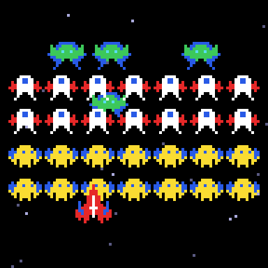
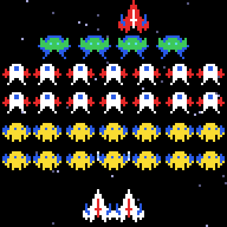
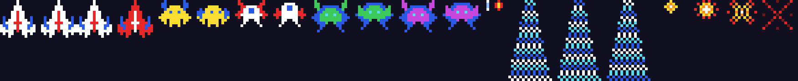

# g35 ギャラガ風（ボスと牽引ビーム）

ギャラガ風シューティング 5 段階の 4 つ目。ボスが席から降りてきて**牽引ビーム**を出します。ビームに入ると自機は吸い上げられて捕虜になり、ボスが連れて席へ戻る。捕虜を連れたボスが降下中に撃ち落とすと救出できて、**デュアルファイター**（2 機並び、弾が 2 発ずつ）に。ボスは 2 発で、1 発目で紫になります。

 

今回の主題は 4 つです。

- **`send()` でジェネレータに値を渡す（コルーチン）** — ビームの手順（降りる → ビーム 3 秒 → 捕まえたら終わり）を 1 つのジェネレータに書く。`Game` は毎コマ「自機がビームの中にいるか」を `send()` で答える
- **`heapq` のタイムライン** — 「1.2 秒後に吸い上げ終わり」「1 秒後に合流」を `later(秒, 関数)` で予約。`(時刻, 通し番号, 関数)` のヒープなので、いつ入れても時刻順に出てくる
- **`__post_init__`** — dataclass の初期化のあとに、種類（得点）から HP を決める
- **描く先を差し替える** — ブラウザ版は `Screen` と同じ `clear()` / `plot()` / `blit()` を持つ `CanvasScreen` を渡して `Game.draw()` をそのまま呼ぶ。描く手順を 2 か所に書かない

スプライトはビーム 3 コマ（伸びる 3 段階 × 色の 3 コマ）、赤く反転した捕虜、2 機並びの自機、紫のボスが増えました。



## ブラウザ版

インストールせずに遊べます → **https://hicocho.github.io/python-study/g35/**

ソースは [`docs/g35/game.py`](../docs/g35/game.py)。`tractor_beam()` のコルーチン、`Player`、`class Game` の捕獲・救出・タイムラインを **1 文字も変えずに**持ってきています。

## 遊び方（ターミナル）

```bash
python3 main.py              # 遊ぶ（端末は 96 桁 × 51 行以上）
python3 main.py --sheet sprites.png --scale 6
```

- `←` `→` で移動、スペースで撃つ、`q` でやめる
- 青いビームは最初は短く、だんだん伸びる。伸びきったときに中にいると捕まる。横へ逃げれば大丈夫
- 捕虜を連れたボス（自機が上に乗っている）は降下しやすい。降下中に 2 発当てると自機が戻ってきて 2 機に。席にいるときに倒すと自機は戻らない（得点は倍）
- 2 機のときに当たると 1 機に戻るだけで、残機は減らない

## 仕様

- ボス: HP 2。1 発目で緑 → 紫。席に着いて 2.5 秒後に最初のビーム、以後 7 秒ごとに 1 体
- ビーム: 自機の x の上、高さ 40 まで降りて 3 秒。16 幅 × 10 → 20 → 30 の 3 段階で伸びる。伸びきってから当たり判定
- 捕獲: 1.2 秒かけて自機がボスの上へ。残機 −1、1.5 秒で中央に復活。ボスはその場から席へ戻る
- 救出: 降下中（またはビーム中）の捕虜ボスを倒すと、その位置から自機の右隣まで 1 秒で降りてくる。合流でデュアル（幅 26、弾 4 発まで、1 回で 2 発）
- ボスの急降下の選ばれやすさは 1、捕虜を連れていると 4

## メモ

### コルーチン — `yield` が値を「受け取る」

```python
def tractor_beam(boss, target_x):
    for boss.x, boss.y in follow(straight((boss.x, boss.y), (target_x, TRACTOR_HEIGHT)), DIVE_SPEED):
        yield None                                   # 降下中
    for frame in range(int(BEAM_TIME * FPS)):
        boss.beam = BEAM[stage][(frame // 4) % 3]
        caught = yield "beam"                        # ← ここで Game の答えを受け取る
        if caught and stage == len(BEAM) - 1:
            yield "capture"
            return
```

g33 の `follow` は値を出すだけのジェネレータだった。`caught = yield "beam"` と書くと、`yield` は**式**になって、`Game` が `script.send(True/False)` で渡した値が `caught` に入る。手順が「降りる → ビーム → 捕まえたら終わり」と上から下に読めるのが利点で、状態機械（g34）に `BEAM_FRAME_12` のような細かい状態を足さずに済む。
最初の `send()` は `None` でないといけない（まだ `yield` に着いていないから）。`Game` は `beam is None` のあいだ `None` を送るので、自然にそうなる。

### `heapq` のタイムライン

```python
def later(self, delay, action):
    self.serial += 1
    heapq.heappush(self.timeline, (self.time + delay, self.serial, action))

def run_due(self):
    while self.timeline and self.timeline[0][0] <= self.time:
        _, _, action = heapq.heappop(self.timeline)
        action()
```

g34 の `dead_timer` のように「残り秒数を引く」変数を増やしていくと、状態が散らばる。`later()` なら「何秒後に何をする」を 1 行で予約できて、`update` の先頭で `run_due()` を呼ぶだけ。`serial` を入れるのは、同じ時刻の予約が来たときに関数どうしを比べようとして `TypeError` にならないため（g24 の A* と同じ `(優先度, 通し番号, 中身)` の形）。

### `__post_init__`

```python
@dataclass
class Enemy(Body):
    ...
    hp: int = 1

    def __post_init__(self):
        if self.points == 150:
            self.hp = BOSS_HP
```

dataclass は `__init__` を自動で作るので、初期化のあとに何かしたいときは `__post_init__`。呼び出し側は `Enemy(...)` のままで、ボスだけ HP が 2 になる。

### 描く先を差し替える

CLI 版の `Game.draw(screen)` は `screen.clear()` / `screen.plot()` / `screen.blit()` しか使わない。ブラウザ版はこの 3 つを canvas の `fillRect` / `drawImage` で実装した `CanvasScreen` を渡すだけ。g33〜g34 では `draw` をブラウザ用に書き直していたので、ビームや捕虜の描画が増えた今回は 2 か所を合わせるのをやめた。
