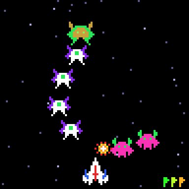

# g36 ギャラガ風（ステージと演出）

ギャラガ風シューティング 5 段階の完成版。編隊を全滅させると**次のステージ**へ（急降下が速く、弾が増える）。3 の倍数のステージは**チャレンジングステージ**で、虹色の敵が曲線を飛んで抜けていく。全部倒すと 10000 点。右下の旗がステージ数。終わったら名前を聞いて**スコア表（CSV）**に残します。



今回の主題は 4 つです。

- **`colorsys`** — 色相・彩度・明度で色を作る。ステージの旗は色相をステージごとに回し、チャレンジの敵はパレット全部の色相を毎コマ回して虹色に
- **`csv` と dataclass** — スコアの行は `ScoreRow`（dataclass）。`csv.DictWriter` / `DictReader` と `dataclasses.asdict` / `fields` で CSV の文字列と行き来する。ファイルに置くか localStorage に置くかは呼ぶ側
- **`@property` で難度** — `dive_interval` と `fire_chance` をステージから毎回計算する。定数を書き換えるのでなく、式で持つ
- **編隊の作り直し** — `__init__` に直に書いていた編隊の生成を `build_enemies()` に出し、`finish_stage()` から呼ぶ

ステージの旗と虹色の 1 コマ:


## ブラウザ版

インストールせずに遊べます → **https://hicocho.github.io/python-study/g36/**

ソースは [`docs/g36/game.py`](../docs/g36/game.py)。`ScoreBoard` を含む `class Game` を **1 文字も変えずに**持ってきていて、スコア表は同じ CSV の文字列を localStorage に置きます。名前は入力欄から。

## 遊び方（ターミナル）

```bash
python3 main.py              # 遊ぶ（端末は 96 桁 × 51 行以上）
python3 main.py --scores     # スコア表を見る
python3 main.py --scores-file ~/galaga.csv   # スコア表の置き場所を変える
```

- `←` `→` で移動、スペースで撃つ、`q` でやめる
- 終わったとき（ゲームオーバーでも `q` でも）スコア表の 10 位以内なら名前を聞かれる。`scores.csv` に書く
- チャレンジングステージでは敵は撃たず、急降下もビームも無い。1 体 100 点、32 体全部で +10000

## 仕様

- ステージの間は 2 秒。旗が点滅する。急降下の間隔は 2.2 秒 × 0.85^(ステージ−1)（下限 0.7 秒）、撃つ確率は 35% × (1 + 0.25 × (ステージ−1))
- チャレンジ: 4 つの波が左右交互に。曲線の先で編隊の席へは着かず、画面の上へ抜ける（`home_of` が画面の外を返す）
- スコア表: 上位 10 件。`name,score,stage,date` の CSV

## メモ

### `colorsys` — 色を「色相」で扱う

```python
def hsv(h, s, v):
    return tuple(round(c * 255) for c in colorsys.hsv_to_rgb(h % 1.0, s, v))

def hue_shift(rgb, amount):
    h, s, v = colorsys.rgb_to_hsv(*(c / 255 for c in rgb))
    return hsv(h + amount, s, v)
```

RGB のままでは「少し違う色」が作れない。HSV なら色相 `h`（0〜1 で一周）を回すだけで、明るさを保ったまま色が変わる。旗は `stage * 0.11` で 9 本まで別の色、虹色は `step / 12` で 12 段階。`colorsys` は標準ライブラリで、値は 0〜1。

### 虹色とキャッシュの罠

`Sprite` は名前と rows で「同じ」を判定し、パレットは見ない（g32 で `field(hash=False, compare=False)` にした）。`data_uri` は `@cache` なので、パレットだけ変えたスプライトを同じ名前で作るとブラウザでは最初の色のまま。`rainbow()` は名前に `-rainbow{step}` を付けて別物にする。`rainbow` 自体も `@cache` なので、12 × 敵の種類ぶんしか作らない。

### `csv` と dataclass

```python
writer = csv.DictWriter(buf, fieldnames=[f.name for f in fields(ScoreRow)])
writer.writeheader()
for row in self.rows:
    writer.writerow(asdict(row))
```

列名を dataclass の `fields()` から取るので、列を足すときは dataclass を直すだけ。読むときは `DictReader` が列名をキーにした dict を返すので、`int()` に通して `ScoreRow` に戻す。`io.StringIO` を挟むと「ファイル」でなく文字列と行き来できて、CLI（`Path.read_text` / `write_text`）でもブラウザ（localStorage）でも同じ `ScoreBoard` が使える。g31 の `StringIO` と同じ使い方。

### `@property` で難度

`DIVE_INTERVAL` を書き換えると「元に戻す」が要る。`self.dive_interval` を `stage` から計算するプロパティにすれば、ステージが変わった瞬間から新しい値で、リセットも要らない。

### 自動プレイの結果

完璧に撃つとステージ 17〜19（240 秒）、並の腕で 1〜7、下手だと 1〜2。ステージが進むほど急降下が速くなるので、完璧でも 20 面あたりで止まる設計。
