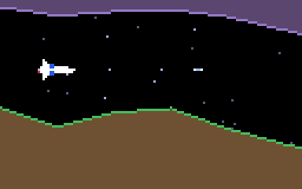

# g43 グラディウス風（自機と横スクロール）

グラディウス風横スクロールシューティング 6 段階の 1 つ目。上下の**地形**が流れる洞窟を、自機（ビックバイパー）で飛び抜けます。地形に触れると撃墜、残機 3。先へ行くほど通り道が狭くなり、100 秒（2400 ドット）で出口。敵はまだ出ません（g44 から）。ドット絵・端末描画・PNG の道具はギャラガ（g32）のものをそのまま使っています。画面は横長の 128×80。



今回の主題は 4 つです。

- **`itertools.pairwise`** — 地形の折れ線を「隣り合う 2 点の組」に。`pairwise(zip(xs, floors, ceilings))` で線分の列
- **`bisect`** — スクロール位置（世界座標 x）から、どの線分の上にいるかを二分探索で。`bisect_right(xs, x) - 1`
- **`typing.Protocol`** — 「描けるもの」を `draw(screen, scroll)` を持つかどうかで決める。継承なしで `Terrain` も `Starfield` も `Player` も同じ層のリストに並ぶ。`@runtime_checkable` で `isinstance` も効く
- **横スクロールと視差** — 画面の左端の世界座標 `scroll` を進めるだけで地形が流れる。星は `scroll * depth` でゆっくり動く

## ブラウザ版

インストールせずに遊べます → **https://hicocho.github.io/python-study/g43/**

ソースは [`docs/g43/game.py`](../docs/g43/game.py)。`Terrain` / `Starfield` / `Player` / `autopilot` / `class Game` を **1 文字も変えずに**持ってきています。「自動操縦を見る」でデモ。

## 遊び方（ターミナル）

```bash
python3 main.py                  # 遊ぶ（端末は 128 桁 × 43 行以上）
python3 main.py --auto           # 自動操縦のデモ（地形の真ん中へ寄る）
python3 main.py --map --seed 1   # 地形の断面を文字で
python3 main.py --sheet sprites.png --scale 6
```

- 矢印か W A S D で上下左右、スペースで撃つ（同時に 3 発まで）、`q` でやめる

## 仕様

- 地形: 24 ドットごとの折れ線。通り道の真ん中が ±12 ずつふらつき、広さは 60 → 34 ドットに狭まる（種で決まる）
- スクロール 24 ドット/秒。自機は 55 ドット/秒。弾は 150 ドット/秒で右へ、地形に当たると消える
- 撃墜: 残機 −1、1.5 秒後に左端の「地形のすき間の真ん中」に復活、2 秒無敵（点滅）
- 得点は進んだ距離 / 10。出口でクリア
- 自動操縦（12 ドット先の地形の真ん中へ寄る）は 5 回とも残機を残してクリア。何もしないと 80〜90 秒で撃墜、ランダムは 15〜30 秒

## メモ

### `pairwise` と `bisect` で折れ線

```python
self.segments = list(pairwise(zip(self.xs, self.floors, self.ceilings)))

def heights(self, world_x):
    i = min(max(bisect_right(self.xs, world_x) - 1, 0), len(self.segments) - 1)
    (x0, f0, c0), (x1, f1, c1) = self.segments[i]
    t = (world_x - x0) / (x1 - x0)
    return f0 + (f1 - f0) * t, c0 + (c1 - c0) * t
```

`pairwise([a, b, c, d])` は `(a, b), (b, c), (c, d)`。折れ線の各線分がそのまま取れる。`bisect_right` は「x 以下の点がいくつあるか」を二分探索で返すので、100 本の線分から 7 回の比較で当たりの線分が決まる（g13 の迷路や g24 の探索で線形に探していた所を、ソート済みの列なら二分探索で）。範囲外は端の線分に丸める。

### `Protocol` — 継承しない型

```python
@runtime_checkable
class Drawable(Protocol):
    def draw(self, screen: Screen, scroll: float) -> None: ...

@property
def layers(self) -> list[Drawable]:
    return [self.stars, self.terrain, *self.shots, *self.explosions, self.player]
```

`Terrain` は `Body` でも `dataclass` でもないが、`draw` を持つので `Drawable`。`Game.draw` は層のリストを順に描くだけ。g27 の `StrEnum` や g45 で使う `ABC` は「継承で型を決める」、`Protocol` は「形で決める」（ダックタイピングに型を付けたもの）。`@runtime_checkable` を付けると `isinstance` でも確かめられる（テストで `Body` は `Drawable` でないことを見た）。

### 視差

星は `x - scroll * depth` で描く。`depth` が 0.2 の星は地形の 1/5 の速さで流れ、遠くに見える。

### 難しさは自動操縦で

g34 と同じ。「地形の真ん中へ寄る」操縦が 5 回ともクリアし、「何もしない」が必ず撃墜されるように、通り道の広さと揺れ幅を決めた。最初は真ん中にいれば当たらない地形で、自動操縦なしでもクリアできてしまった。
