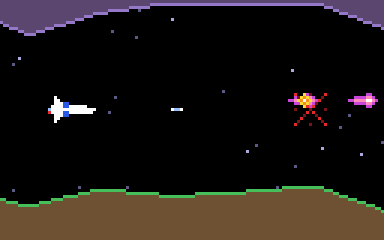

# g44 グラディウス風（敵の出現）

グラディウス風 6 段階の 2 つ目。**出現表**（世界座標のどこで・何を・何体）に沿って敵が出ます。波打って飛ぶ**ファン**、まっすぐ速い**ガルン**、地面を歩く**ダッカー**、地面に据わって自機を狙う**砲台**。正面から来る敵は撃ち落とし、弾はよける。自動操縦（デモ）は 8 回中 6 回、残機 1〜2 を残してクリア。



今回の主題は 4 つです。

- **`enum.auto()`** — 敵の種類 `Kind`。値は使わないので自動で振る
- **`dataclass(kw_only=True)`** — 出現表の 1 行 `Spawn(at=200, kind=Kind.FAN, count=4)`。位置引数を禁じて、表を読める形に
- **`functools.partial`** — 種類ごとの「工場」。`partial(Enemy, spr=FAN[0], points=100, mover=fan_move)` に位置だけ渡す
- **`itertools.groupby`** — 出現表を種類ごとにまとめて「何組・何体」。並べてから使う

そして敵の動きを**関数**（`mover`）に任せる設計、`math.atan2` で自機を狙う弾。


## ブラウザ版

インストールせずに遊べます → **https://hicocho.github.io/python-study/g44/**

ソースは [`docs/g44/game.py`](../docs/g44/game.py)。`Kind` / `Spawn` / `Enemy` と動きの関数 / `FACTORY` / `make_script` / `autopilot` / `class Game` を **1 文字も変えずに**持ってきています。

## 遊び方（ターミナル）

```bash
python3 main.py                  # 遊ぶ（端末は 128 桁 × 43 行以上）
python3 main.py --auto           # 自動操縦のデモ（よけて撃つ）
python3 main.py --script --seed 1   # 出現表と種類ごとの数
python3 main.py --map --seed 1   # 地形の断面
```

## 仕様

- 出現表: 200 ドットから 150〜260 ドットおき（先へ行くほど詰まる）。ファン 4 体（14 おき、波打つ ±12）、ガルン 3 体（20 おき、85 ドット/秒）、ダッカー 2 体（地面を歩く、HP 2）、砲台 1（HP 2、2.2 秒ごとに自機を狙う。真上に来たら撃たない）
- 出す条件: 画面の右端（`scroll + WIDTH`）が `at` に達したら、右の外に `gap` おきに並べる
- 得点: ファン 100、ガルン 150、ダッカー 200、砲台 300。進んだ距離 / 10 も
- 自動操縦: 1.5 秒以内に自機の x へ来るものの「来たときの高さ」を予測し、少し先までの通り道の上・中・下から最も遠い所へ。正面から来る敵（±5）は動かず撃つ

## メモ

### `dataclass(kw_only=True)` — 表の行は名前で書く

```python
@dataclass(kw_only=True)
class Spawn:
    at: int
    kind: Kind
    count: int = 1
    gap: int = 14
    y: float | None = None

Spawn(at=200, kind=Kind.FAN, count=4, gap=14, y=35)
```

`Spawn(200, Kind.FAN)` は `TypeError`。表の行は「どこで・何を・何体」を名前で書いた方が読める。g37 で `Enemy(..., points, slot)` を位置で渡して `alive` に入る事故があったが、`kw_only` ならそれが起きない。

### `functools.partial` — 種類ごとの工場

```python
FACTORY = {
    Kind.FAN: partial(Enemy, spr=FAN[0], frames=FAN, kind=Kind.FAN, points=100, mover=fan_move),
    ...
}
enemy = FACTORY[sp.kind](x=x, y=y, base_y=y, phase=i * 0.6)
```

`partial` は「引数の一部を先に固めた関数」。種類ごとの設定（絵・点数・HP・動き）はここに 1 回書き、出すときは位置だけ。g29 の `partial` は仕掛けの引数だったが、今回はクラスに使う（クラスも呼べるものなので同じ）。

### 動きは関数に任せる

`Enemy.mover` は `(enemy, game, dt)` を受ける関数。`fan_move` は `base_y + 12 sin(...)`、`ducker_move` は地面の高さに `y` を合わせる、`cannon_move` は間隔ごとに `game.enemy_fire()`。種類を増やすときは関数を 1 つ足して `FACTORY` に 1 行。g34 の `IntEnum` の状態機械（1 つのクラスに `match`）と比べると、「種類ごとに振る舞いが全然違う」ならこちら。

### `groupby` は並べてから

`groupby` は「隣り合う同じキー」をまとめるだけなので、`sorted(script, key=...)` してから同じキーで `groupby`。SQL の GROUP BY と違って並べ替えはしてくれない。

### 自動操縦を賢くするのに時間がかかった

「よける」を素直に書くと、壁に突っ込む（よけた先が地形）・振動する（よけたらもう危険でなくなり戻る）・近い弾は間に合わない、の 3 つで全滅した。少し先までの通り道を見て「上・中・下」の候補から最も遠い所を選び、正面の敵は撃つ、砲台は真上では撃たない、と直して 8 回中 6 回クリアに。難しさをこの数字で決めた。
