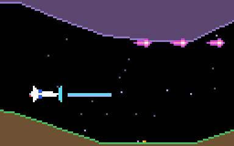

# g45 グラディウス風（パワーアップ）

グラディウス風 6 段階の 3 つ目。敵を 3 体倒すと**パワーカプセル**が出て、取るたびに画面下の**ゲージ**が進みます。欲しい所で発動（X か Enter）。**SPEED**（速く、3 段まで）・**MISSILE**（斜め下に落ちて地面を這う）・**DOUBLE**（斜め上にも）・**LASER**（長い光で貫く）・**?**（シールド。前からの当たりを 3 回受ける）。撃墜されると全部失います。



今回の主題は 4 つです。

- **`abc.ABC` と `@abstractmethod`** — 武器の型 `Weapon`。`fire(player)` を実装しないと作れない。`Normal` / `Double` / `LaserGun` が継承
- **`functools.singledispatch`** — 弾が敵に当たったときの処理 `hit(shot, game, enemy)` を、弾の型で分ける（普通の弾は消える、ミサイルは 2 ダメージ、レーザーは貫いて同じ敵に 1 回だけ）
- **`Enum` の順送り** — `Power.SPEED.next` → `MISSILE` → … → `SHIELD` → `SPEED`。`list(Power)` の添字を 1 つ進めて剰余
- **状態は `Player` に、切り替えは `Game.power_up`** — 速さ・ミサイル・武器・シールド・ゲージを自機が持ち、発動で書き換える


## ブラウザ版

インストールせずに遊べます → **https://hicocho.github.io/python-study/g45/**

ソースは [`docs/g45/game.py`](../docs/g45/game.py)。`Power` / `Weapon` 一式 / `hit` / `class Game` を **1 文字も変えずに**持ってきています。携帯は「発動」ボタン。

## 遊び方（ターミナル）

```bash
python3 main.py                  # 遊ぶ。X か Enter で発動
python3 main.py --auto           # 自動操縦（カプセルを取りに行き、SPEED → DOUBLE → MISSILE の順に発動）
```

## 仕様

- カプセル: 3 体倒すごとに、倒した所に出て 20 ドット/秒で左へ流れる。取ると `gauge` が次へ（`None` → SPEED → …）
- SPEED: +12 ドット/秒、3 段まで。MISSILE: 撃つたびに 1 発（画面に 1 発まで）、70 ドット/秒で斜め下、地面に着いたら這う。DOUBLE: 前 + 斜め上、4 発まで。LASER: 24 ドットの線、画面に 1 本、2 ダメージで貫く。SHIELD: 自機の前に付き、前からの敵と弾を 3 回受ける（敵は壊す）
- 撃墜: 全部失って NORMAL / S0 に戻る
- 自動操縦: 8 回中 5 回クリア（DOUBLE + MISSILE + S1 まで育つ回も）

## メモ

### `ABC` — 「これを実装しないと作れない」

```python
class Weapon(ABC):
    name = "?"
    max_shots = 3

    @abstractmethod
    def fire(self, player: "Player") -> list[Body]: ...

class Double(Weapon):
    name = "DOUBLE"
    max_shots = 4
    def fire(self, player):
        return [Shot(...), Shot(..., vy=-BULLET_SPEED)]
```

`Weapon()` は `TypeError`。`fire` を実装した子だけ作れる。g43 の `Protocol` は「形が合えば何でも」、`ABC` は「この親を継いで、これを実装せよ」。武器のように「種類が増えるが型は 1 つ」に向く。テストでは `Spread`（3 方向）を足して動くことを見た。

### `singledispatch` — 第 1 引数の型で処理を選ぶ

```python
@singledispatch
def hit(shot, game, enemy) -> bool:      # 既定: 1 ダメージで消える
    game.damage(enemy, 1); return True

@hit.register(Laser)
def _(shot, game, enemy) -> bool:        # レーザー: 貫く、同じ敵に 1 回だけ
    ...; return False

@hit.register(Missile)
def _(shot, game, enemy) -> bool:        # ミサイル: 2 ダメージ
    ...
```

`if isinstance(shot, Laser): ... elif ...` を書かずに、型ごとの関数を登録する。呼ぶ側は `hit(shot, self, target)` だけ。注意 2 つ: `register` は注釈から型を読むが、`"Game"` のような文字列の前方参照があると評価に失敗するので `register(Laser)` と型を引数で渡す。dataclass の `Enemy` は hash できないので、レーザーが「当てた敵」を覚えるのは `id(enemy)` の集合。

### `Enum` の順送り

`list(Power)` は定義順。`(index + 1) % len` で最後の次は最初へ。ゲージの「ぐるっと回る」をそのまま。

### 難しさ

自動操縦の「欲しい順」（SPEED → DOUBLE → MISSILE → LASER → SHIELD）で発動させ、8 回中 5 回クリア。カプセルを取りに行く動きを足す前は 6 回中 4 回で、装備はほぼ NORMAL のままだった。
