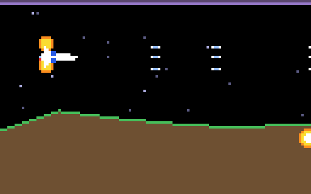

# g46 グラディウス風（オプション）

グラディウス風 6 段階の 4 つ目。ゲージに **OPTION** が加わり、発動すると自機の後ろに**分身**が付きます。分身は自機が通った道を少し遅れてなぞり、自機と同じ武器を撃ちます。最大 4 つ。編隊のしんがりの**赤い敵**は倒すと必ずカプセルを落とします。



今回の主題は 4 つです。

- **`array` のリングバッファ** — 自機の軌跡 `Trail`。決まった数だけ覚え、古い所を上書き。添字は剰余で回す
- **`__len__` と `__iter__`** — `Trail` を `len(trail)` / `for x, y in trail:` で普通の入れ物のように扱う
- **`math.dist`** — 前回の記録から 1 ドット以上動いたときだけ記録する（止まっていればオプションも止まる）
- **`functools.cache` と frozen dataclass** — 赤い敵の絵は `Sprite.recolor` を種類ごとに 1 回だけ。`Sprite` は frozen なので hash できて `cache` の鍵になる


## ブラウザ版

インストールせずに遊べます → **https://hicocho.github.io/python-study/g46/**

ソースは [`docs/g46/game.py`](../docs/g46/game.py)。`Trail` / `Option` / `Game` を **1 文字も変えずに**持ってきています。

## 遊び方（ターミナル）

```bash
python3 main.py                  # 遊ぶ。X か Enter で発動
python3 main.py --auto           # 自動操縦（SPEED → OPTION 2 つ → DOUBLE → … の順に育つ）
```

## 仕様

- ゲージ: SPEED → MISSILE → DOUBLE → LASER → **OPTION** → ?（シールド）
- オプション: 発動ごとに 1 つ増え、4 つまで。n 個目は軌跡の 10 × n 個前の位置。無敵で、敵に触れても何も起きない
- 撃つと自機と全オプションが同じ武器で撃つ。画面に出せる弾は `max_shots × (1 + オプション数)`
- 軌跡: 64 個ぶんのリングバッファ。自機が 1 ドット以上動いたときだけ記録
- 赤い敵: 3 体以上の編隊のしんがり。倒すと必ずカプセル（ほかは 3 体ごと）
- 撃墜: オプションも軌跡も失う
- 自動操縦: 8 回中 5 回クリア（オプション 2 つまで育つ回も）

## メモ

### リングバッファ — 「古い所を上書き」を剰余で

```python
class Trail:
    def __init__(self, size=TRAIL_SIZE):
        self.data = array("d", [0.0] * (size * 2))   # x0, y0, x1, y1, …
        self.count = 0                               # 記録した数（size を超えても増え続ける）

    def record(self, x, y):
        i = (self.count % self.size) * 2             # 古い所を上書きしていく
        self.data[i], self.data[i + 1] = x, y
        self.count += 1

    def at(self, lag):
        lag = min(lag, len(self) - 1)
        i = ((self.count - 1 - lag) % self.size) * 2
        return self.data[i], self.data[i + 1]
```

`deque(maxlen=)` でも書けるが、「n 個前」を添字で引くならこちら。`count` を減らさず増やし続けて剰余を取るのがコツ。`at()` の上限は `count - 1` ではなく `len(self) - 1`。上書きされた分はもう無いので、そこを間違えると別の（新しい）位置が返る。テストで見つけた。

`array("d")` は float の配列で、`list` より小さく、C の並びそのまま。`Terrain` の `bisect` に続いて「数だけの列」に使う。

### `__len__` と `__iter__`

`len(trail)` と `for x, y in trail:` が書けると、デバッグ表示や「まだ記録が無い」の判定が普通の入れ物と同じ書き方になる。`__iter__` はジェネレータ（`yield`）で古い順に返すだけ。

### `Weapon.fire` は誰でも撃てる

`fire(player)` は `player.x` / `player.y` しか見ないので、`Option` を渡しても弾が出る。g45 で武器を `ABC` にしておいたので、オプションを足しても武器側は 1 行も変えていない。

### 難しさ

オプションはゲージの 5 番目なので、3 体ごとのカプセルだけでは自動操縦がほぼ辿り着けなかった（8 回中 2 回）。本家と同じ赤い敵を足して、5 回クリア・最大 O2。
