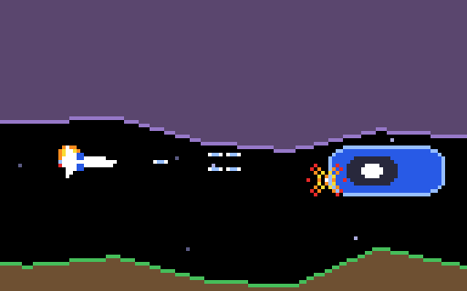
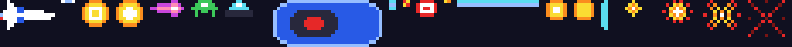

# g47 グラディウス風（ビッグコア）

グラディウス風 6 段階の 5 つ目。ステージの終わりでスクロールが止まり、**ビッグコア**が右から入ってきます。前の **4 枚のバリア**を壊すと、その列から奥の**コア**を撃てます。ビッグコアは自機の高さを揺れながら狙い、列からまっすぐ・コアから狙って撃ってきます。コアの体力を削り切ると 2.5 秒爆発し続けてから、ステージクリア。



今回の主題は 4 つです。

- **`enum.Flag`** — 4 枚のバリアを 1 枚 1 ビットで。残っている組み合わせを 1 つの値 `barriers` で持ち、`lane in barriers` で調べ、`barriers &= ~lane` で 1 枚落とす
- **`random.gauss`** — 狙う高さの揺れ、弾のぶれ、撃破の演出で爆発する場所。「だいたいここ」を正規分布で
- **`contextlib.suppress`** — 同じコマにもう消えた弾を `remove` しても構わない、を `try/except ValueError: pass` の代わりに
- **`Enum` で段階** — `Phase.ENTER → FIGHT → DYING`。ボスの動き `boss_move` が段階ごとに分かれる



## ブラウザ版

インストールせずに遊べます → **https://hicocho.github.io/python-study/g47/**

ソースは [`docs/g47/game.py`](../docs/g47/game.py)。`Barrier` / `Phase` / `BigCore` / `boss_move` / `Game` を **1 文字も変えずに**持ってきています。`?boss` を付けるといきなりボスの手前から（https://hicocho.github.io/python-study/g47/?boss）。

## 遊び方（ターミナル）

```bash
python3 main.py                  # 遊ぶ。ステージの終わりでビッグコア
python3 main.py --boss           # いきなりボスの手前から（練習用）
python3 main.py --auto --boss    # 自動操縦でボス戦を見る
```

## 仕様

- 登場: スクロールが `STAGE_LENGTH - WIDTH` に達したら足止め。右から 20 ドット/秒で入ってきて、止まったら戦闘
- バリア: 4 列（TOP / UPPER / LOWER / BOTTOM）、1 枚 3 発。ミサイルは 2 発ぶん、レーザーは同じ列に 1 回だけ。壊れると爆発
- コア: 体力 24。バリアが無い列の弾だけ届く。撃たれると白く光る。HUD の `CORE ████` は 3 発で 1 目盛り
- 動き: 0.8 秒ごとに「自機の高さ + gauss(0, 8)」を狙い、18 ドット/秒で寄る。1.4 秒ごとに、残っている列から 1 発（vy に gauss(0, 6)）とコアから自機を狙って 1 発（角度に gauss(0, 0.25)）
- 撃破: 0.15 秒ごとに船体のどこか（gauss）で爆発、2.5 秒後に消えて 5000 点、クリア
- ボス本体に触れるとシールドがあっても撃墜
- 自動操縦: 空いた列（無ければ一番弱ったバリアの列）の高さで撃つ。ボス戦だけなら 8 回中 8 回撃破（残機 1〜2 を失う）、通しでは 8 回中 3 回クリア

## メモ

### `Flag` — 「どれが残っているか」を 1 つの値で

```python
class Barrier(Flag):
    TOP = auto()
    UPPER = auto()
    LOWER = auto()
    BOTTOM = auto()
    ALL = TOP | UPPER | LOWER | BOTTOM

boss.barriers = Barrier.ALL
if lane in boss.barriers: ...          # まだある？
boss.barriers &= ~lane                 # 1 枚落とす
for lane in Barrier: ...               # 1 ビットのメンバーだけ回る（ALL は出ない）
if not boss.barriers: ...              # 全部無くなった（Barrier(0) は偽）
```

`set[Barrier]` でも書けるが、`Flag` は「組み合わせが 1 つの整数」なので、コピーも比較も表示も軽い。g37 の `IntFlag` 駒は整数として使ったが、今回は整数にしない `Flag`。

### `random.gauss(μ, σ)`

`uniform` は範囲の中で均等、`gauss` は真ん中に寄って端はまれ。狙いの揺れに使うと「だいたい合っているが、たまに外す」になる。爆発の場所に使うと船体の真ん中が多く燃える。

### `contextlib.suppress`

```python
with suppress(ValueError):
    self.shots.remove(shot)
```

レーザーが同じコマに 2 体に当たるなど、もう消えている弾を消そうとすることがある。`if shot in self.shots:` と書くより意図が読める。

### 段階は `Enum`、動きは関数

`boss_move` は `phase` で早めに `return` して分岐。g44 の「動きは mover 関数」の続きで、ボスも `Enemy` の子（`BigCore(Enemy)`）にして同じ配列・同じ当たり判定に乗せた。違うのは「バリアが受け止めるか」だけで、それは `absorb()` を先に呼ぶ 1 行。

### 難しさ

ボスだけなら自動操縦は必ず倒せるが残機を 1〜2 失う。通しでは 3 / 8。「バリアの列に留まる」と列からの弾に当たるので、`arrivals` のよけ（g44）がそのまま効いている。
