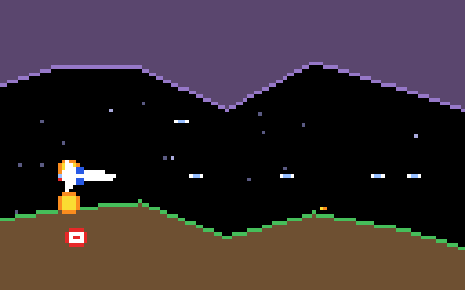

# g48 グラディウス風（ステージと難度）

グラディウス風 6 段階の最後。**砂漠 → 火山 → 要塞**の 3 面を、ビッグコアを倒して進みます。面ごとに通り道の広さ・敵の顔ぶれ・ボスの体力が違い、それは **TOML の表**に書いてあります。3 面を抜けると 2 周目で速くなり、オプションが多いほど少し速い（本家の「ランク」）。終わったら**ハイスコア**に記録。



今回の主題は 4 つです。

- **`tomllib`**（g22 以来の復習） — ステージの表 `[[stage]]` を `tomllib.loads` で読み、`Stage.from_dict` で dataclass に。知らない敵の名前や逆さの `gap` はここで止める
- **`functools.reduce`** — 難度の係数を「ステージの倍率 × 周回 × オプションの数」と全部掛ける。`reduce(mul, factors, 1.0)`
- **`logging`** — 面の始まり・パワーアップ・撃墜・ボスを `log.info`、出現を `log.debug`。既定では出ず、`-v` や `--log FILE` で有効に（端末の画面を壊さないようにファイルへ）
- **`argparse` のサブコマンド** — `play` / `stages` / `scores` / `map` / `script` / `sheet` / `show`。`set_defaults(func=…)` で「コマンド → 関数」


## ブラウザ版

インストールせずに遊べます → **https://hicocho.github.io/python-study/g48/**

ソースは [`docs/g48/game.py`](../docs/g48/game.py)。`Stage` / `load_stages` / `STAGES` / `Game` を **1 文字も変えずに**持ってきています（ブラウザには `tomllib` も `logging` もある）。`?boss` を付けると 1 面のボスの手前から。

## 遊び方（ターミナル）

```bash
python3 main.py                        # 遊ぶ（play と同じ）。終わるとハイスコアに記録
python3 main.py play --demo            # 自動操縦で見る
python3 main.py play --boss --loops 1  # 1 面のボスから、1 周で終わる
python3 main.py stages                 # ステージの表
python3 main.py --stages my.toml play  # 自分の表で遊ぶ
python3 main.py scores                 # ハイスコア
python3 main.py -v play                # 記録を gradius.log に細かく残す
python3 main.py map --stage 3          # 3 面の地形の断面
```

## ステージの表

```toml
[[stage]]
name = "砂漠"
length = 2400
scroll = 0.9                                # スクロールの速さの倍率
gap = [60, 42]                              # 通り道の広さ（始め → 終わり）
enemies = { FAN = 4, GARUN = 1, DUCKER = 2, CANNON = 1 }   # 出現の重み
boss_hp = 18
```

| 面 | 長さ | 速さ | 通り道 | 敵（重み） | ボス |
|---|---|---|---|---|---|
| 1 砂漠 | 2400 | ×0.9 | 60→42 | FAN 4 / GARUN 1 / DUCKER 2 / CANNON 1 | 18 |
| 2 火山 | 2800 | ×1.1 | 56→36 | FAN 3 / GARUN 2 / DUCKER 1 / CANNON 1 | 26 |
| 3 要塞 | 3200 | ×1.3 | 48→30 | FAN 2 / GARUN 2 / DUCKER 2 / CANNON 2 | 32 |

書かなかった項目は既定値。`enemies` に `BIGCORE` は書けない（ボスは最後に必ず出る）。

## 仕様

- 難度 = `stage.scroll × 1.15^周回 × (1 + 0.05 × オプションの数)`。スクロール（と地上の敵の流れ）に掛かる
- ボスを倒すと次の面。地形と出現表を作り直し、パワーアップは持ち越し。面の始めに 2.5 秒「STAGE n 名前」
- 3 面を抜けると 2 周目（`--loops N` で N 周で終わる。ブラウザ版は終わらない）
- ハイスコア: `scores.json` に上位 10 件（点・面・日付）。壊れていれば作り直す
- 自動操縦: 1 面のクリア率は 32 回中 16 回に調整（表の数値だけで）。死因は敵弾 > ファン > ボスの弾 > ガルン

## メモ

### `tomllib` と「表 → dataclass」

`tomllib.loads` は辞書とリストを返すだけ。そのまま使うと `data["stage"][0]["gap"][1]` のような添字だらけになるので、`Stage.from_dict` で 1 度だけ型に直す。`Kind[name]` で名前 → Enum（無い名前は `KeyError`）、`gap` はタプルに、範囲の検査もここ。以後は `stage.gap` と書ける。

### `reduce` — 「全部掛ける」

```python
factors = [self.stage.scroll, LOOP_FACTOR ** self.loop, 1 + RANK_PER_OPTION * len(self.player.options)]
return reduce(mul, factors, 1.0)
```

`sum` の掛け算版は無いので `reduce(operator.mul, …)`。要素が増えても式が伸びない。`math.prod` でも同じ（こちらは 3.8 から）。

### `logging` は既定で黙る

`log = logging.getLogger("gradius")` に `log.info(...)` を書いておくだけなら何も出ない。`main` が `-v` / `--log` を見て `logging.basicConfig(filename=…)` したときだけファイルに残る。`print` と違って、出す・出さない・どこへ出すを呼ぶ側が決められる。ブラウザ版もそのまま持っていける。

### `argparse` のサブコマンド

```python
sub = parser.add_subparsers(dest="command", metavar="コマンド")
p = sub.add_parser("play", help="遊ぶ（既定）")
p.add_argument("--seed", type=int)
p.set_defaults(func=cmd_play)
...
args = parser.parse_args(sys.argv[1:] or ["play"])   # サブコマンド無しなら play
args.func(args)
```

`--sheet` `--map` `--script` のようなフラグの山（g43〜g47）を、コマンドに整理した。`-v` `--log` `--stages` はサブコマンドの前に置く「全体の引数」。
