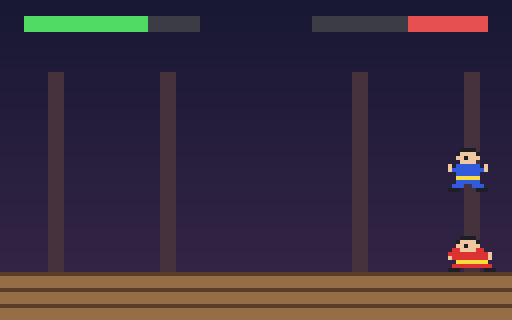

# g49 イー・アル・カンフー風（舞台と格闘家）

イー・アル・カンフー風 6 段階の 1 つ目。まだ技はありません。舞台に 2 人の格闘家（自機のウーロンと、赤い道着の練習相手ワン）。**← →** で歩き、**↑** で跳び（横を押していればその方向へ）、**↓** でしゃがみます。地面にいれば自動で相手の方を向き、重なれば押し合います。上に 2 人分の体力バー。



今回の主題は 4 つです。

- **`match` 文** — 「姿勢・上キー・下キー」の組を 1 つの `match` にかけて、次の姿勢を決める。`case Pose.JUMP, _, _:` のようにタプルの形で分岐
- **`typing.Literal`** — 向きは `Literal["left", "right"]`。文字列だが「この 2 つだけ」と型で言う
- **`dataclasses.replace`** — 右向きの絵から左向きの絵を作る。`replace(spr, name=…, rows=反転)`。frozen な dataclass の「一部だけ違う複製」
- **`property` の setter** — `hp` は `@hp.setter` で 0〜100 に丸める。`player.hp -= 30` と書くだけで範囲を守る


## ブラウザ版

インストールせずに遊べます → **https://hicocho.github.io/python-study/g49/**

ソースは [`docs/g49/game.py`](../docs/g49/game.py)。`Fighter` / `Pose` / `flipped` / `Game` を **1 文字も変えずに**持ってきています。

## 遊び方（ターミナル）

```bash
python3 main.py                  # 遊ぶ。矢印（か W A S D）、q でやめる
python3 main.py --auto           # 2 人とも自動で動くデモ（20 秒）
python3 main.py --sheet out.png  # スプライトを PNG に
```

## 仕様

- 画面 128 × 80。地面は y = 68。舞台の端（2 と 126）から出ない
- 歩く 42 ドット/秒。跳ぶ: 上向き 130 ドット/秒、重力 380 → 最高 22 ドット、0.7 秒。空中では入力を受け付けず、横の勢いは跳んだ瞬間のまま
- しゃがむ: 下を押している間。しゃがんでいる間は歩けない
- 向き: 地面にいるときだけ相手の方へ（空中では変わらない）
- 押し合い: 2 人とも地面にいて当たり判定が重なったら、重なった分を半分ずつ押し戻す
- 体力バー: 自機は左から右へ、相手は右から左へ減る。この段階では減らない
- 練習相手: 間合い 26〜34 ドットを保ち、0.6〜1.4 秒ごとに気まぐれ（何もしない・跳ぶ・しゃがむ）

## メモ

### `match` 文 — 「状態と入力の組」で分ける

```python
match who.pose, "up" in keys, "down" in keys:
    case Pose.JUMP, _, _:                  # 空中では何もできない
        pass
    case _, True, _:                       # 上で跳ぶ
        who.jump()
    case _, False, True:                   # 下でしゃがむ
        who.pose = Pose.CROUCH
    case Pose.CROUCH, False, False:        # 下を離したら立つ
        who.pose = Pose.STAND
    case Pose.STAND, False, False:         # 立っているときだけ歩ける
        who.x += dx * WALK_SPEED * dt
```

`if … elif …` でも書けるが、上から順に「この形なら」と読める。`_` は「何でもいい」。`Pose.JUMP` のようなドット付きの名前は値として比べられる（裸の名前は「変数に束縛」になるので注意）。ステップ 2 では `match "left" in keys, "right" in keys:` で「左だけ・右だけ・両方か無し」を分けた。

### `Literal` と `replace`

`facing: Literal["left", "right"]` は実行時には何もしないが、型検査と読む人に「2 つしかない」と伝える。`flipped()` は `replace(spr, name=spr.name + "-left", rows=tuple(row[::-1] for row in spr.rows))`。frozen な `Sprite` は書き換えられないので、「一部だけ変えた新しいもの」を `replace` で作り、`@cache` で 1 回だけ。

### `property` の setter

```python
@property
def hp(self) -> int:
    return self._hp

@hp.setter
def hp(self, value: int) -> None:
    self._hp = max(0, min(MAX_HP, int(value)))
```

`player.hp -= 30` は `player.hp = player.hp - 30` なので setter を通る。呼ぶ側が丸めを気にしなくていい。dataclass のフィールドは `_hp` にして `repr=False`。

### 次

g50 で技（パンチ・キック）と当たり判定、硬直、ガード。
