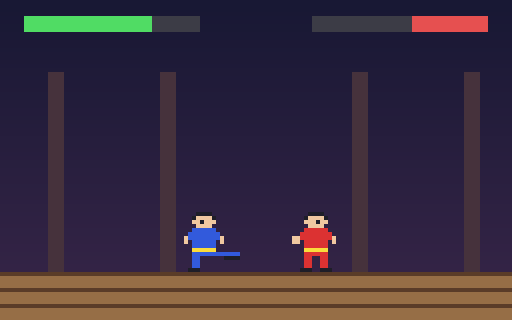
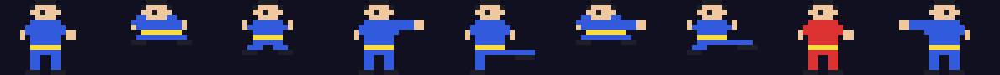

# g50 イー・アル・カンフー風（技と当たり判定）

イー・アル・カンフー風 6 段階の 2 つ目。**Z**（か J）でパンチ、**X**（か K）でキック。立ちパンチは上段、キックは下段の足払い、しゃがみながらパンチで下段、跳びながらキックで跳び蹴り。技の**攻撃ボックス**が相手の体に重なればダメージ、相手は少し**硬直**して下がる。体力を 0 にすれば勝ち。相手のワンはまだ練習相手（間合いに入るとたまに技を出す）。



今回の主題は 4 つです。

- **`itertools.accumulate`** — 技はコマ（絵と秒）の列。各コマが終わる時刻を累積で `(0.06, 0.20, 0.32)` のように作る
- **`__next__` の自作イテレータ** — `Animation` は `next()` を呼ぶたびに dt 秒進んで今のコマの絵を返し、終わったら `StopIteration`。`for` でも回せる
- **`functools.wraps` のデコレータ** — `@only_when_free` を技のメソッドに付けると、硬直中と技の途中は何もしない。`wraps` で名前と docstring が残る
- **frozen dataclass の技の表** — `Move(name, frames, active, box, damage)` を 4 つ並べるだけで技が増える。攻撃ボックスは「前方 dx・足元からの高さ dy」で書き、向きで反転



## ブラウザ版

インストールせずに遊べます → **https://hicocho.github.io/python-study/g50/**

ソースは [`docs/g50/game.py`](../docs/g50/game.py)。`Move` / `Animation` / `only_when_free` / `Fighter` / `Game` を **1 文字も変えずに**持ってきています。

## 遊び方（ターミナル）

```bash
python3 main.py                  # 遊ぶ。矢印 + Z パンチ + X キック、q でやめる
python3 main.py --auto           # 2 人とも自動で対戦（決着まで、最長 60 秒）
```

## 仕様

| 技 | 出し方 | コマ | 当たる時間 | 攻撃ボックス（前方 x, 高さ y） | ダメージ |
|---|---|---|---|---|---|
| パンチ | 立ちで Z | 構え 0.06 → 突き 0.14 → 戻し 0.12 | 0.06〜0.16 | 6〜13, 9〜12（上段） | 8 |
| キック | 立ちで X | 0.08 → 蹴り 0.16 → 0.16 | 0.08〜0.20 | 6〜14, 2〜6（下段） | 12 |
| しゃがみパンチ | ↓ + Z | 0.06 → 0.14 → 0.12 | 0.06〜0.16 | 6〜13, 3〜6（下段） | 8 |
| 跳び蹴り | 空中で X | 着地まで | 0.02〜 | 5〜13, 1〜4（跳んだ高さ + ） | 14 |

- 体（食らい判定）は幅 10 ドット（絵は幅 20、伸ばした腕や脚は含まない）。上段パンチはしゃがんだ相手に当たらない。跳んでいる相手に足払いは当たらない
- 1 つの技で当たるのは 1 回。当たると相手は 0.35 秒硬直し、8 ドット下がり、出しかけの技は消える
- 硬直中と技の途中は次の技が出ない。技の途中は歩けない・しゃがめない（跳び蹴りは飛び続ける）
- 自動対戦: 8 回中 8 回勝ち（相手が練習相手なので。AI は g51）

## メモ

### `accumulate` — 累積の列

```python
@property
def ends(self) -> tuple[float, ...]:
    return tuple(accumulate(seconds for _, seconds in self.frames))   # (0.06, 0.20, 0.32)
```

`sum` が 1 つの値を返すのに対し、`accumulate` は途中の合計を全部返す。「今 t 秒なら何コマ目か」は `next(i for i, end in enumerate(ends) if t < end)`。

### `__iter__` と `__next__`

```python
class Animation:
    def __iter__(self):
        return self
    def __next__(self) -> Sprite:
        if self.t >= self.move.length:
            raise StopIteration
        index = next(i for i, end in enumerate(self.move.ends) if self.t < end)
        self.t += self.dt
        return self.move.frames[index][0]
```

g46 の `Trail` は `__iter__` がジェネレータだった。今回は `__next__` を自分で書く「イテレータ」。`Fighter.update` が毎コマ `next(self.anim)` を呼び、`StopIteration` で技が終わる。`list(Animation(PUNCH, 0.05))` のように `for` でも回せる（`__iter__` が `self` を返すから）。

### `wraps`

```python
def only_when_free(method):
    @wraps(method)
    def wrapper(self, *args, **kwargs):
        if self.stun > 0 or self.anim is not None:
            return False
        return method(self, *args, **kwargs)
    return wrapper
```

`@only_when_free` を `punch` と `kick` に付ける。`wraps` が無いと `Fighter.punch.__name__` が `"wrapper"` になり、docstring も消える。`__wrapped__` で元の関数も取れる。

### 次

g51 で最初の敵ワンの AI（間合いで行動、反応の遅れ、腕前の調整）。
