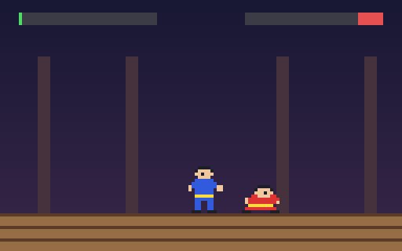

# g51 イー・アル・カンフー風（最初の敵ワンと AI）

イー・アル・カンフー風 6 段階の 3 つ目。相手のワンが本当に戦います。間合いを見て「寄る・下がる・技・跳ぶ・しゃがむ・待つ」に点を付けて一番高いものを選び、こちらの技には少し**遅れて気づいて**、上段はしゃがんで、下段は跳んでよけます。難度は easy / normal / hard の 3 段階。自動操縦の自機を何十回も戦わせた**統計**で調整しました。



今回の主題は 3 つです。

- **`collections.ChainMap`** — AI の設定を「難度 → 敵ごと → 既定」の 3 層で重ねる。手前の層に無い項目は奥の層から。`LEVELS["hard"]` に `dodge` だけ書けば、他は既定
- **`dataclass(order=True)`** — 行動の候補 `Option(score, name, keys)` を `max()` で選ぶ。`name` と `keys` は `compare=False` で比較から外す
- **`statistics`** — `bench(n)` が勝率（`mean`）・時間の平均と中央値（`median`）・残り体力のばらつき（`pstdev`）を出す。難度の調整はこの数字で


## ブラウザ版

インストールせずに遊べます → **https://hicocho.github.io/python-study/g51/**

ソースは [`docs/g51/game.py`](../docs/g51/game.py)。`DEFAULT_BRAIN` / `ENEMIES` / `LEVELS` / `Option` / `Brain` / `Game` を **1 文字も変えずに**持ってきています。`?level=easy` / `?level=hard` で難度。

## 遊び方（ターミナル）

```bash
python3 main.py                        # 遊ぶ（normal）
python3 main.py --level hard           # 難度
python3 main.py --auto --level easy    # 自機も自動で見る
python3 main.py --bench 32             # 3 段階それぞれ 32 回戦わせて腕前を数字で
```

## 仕様

| 設定 | 既定 | easy | hard | 意味 |
|---|---|---|---|---|
| interval | 0.15 | 0.25 | 0.12 | 次の行動を決めるまでの秒 |
| aggression | 0.8 | 0.4 | | 間合いに入ったとき技を出したがる度合い |
| reaction | 0.12 | 0.3 | 0.08 | 人の技に気づくまでの秒（±50% ばらつく） |
| dodge | 0.5 | 0.2 | 0.95 | 気づいたときによける確率 |
| jump_rate / crouch_rate | 0.08 / 0.15 | | | 跳びたがり・しゃがみたがり |
| retreat_gap | 10 | | | これより近ければ下がる |
| kick_rate | 0.4（ワンは 0.5） | | | 技を出すときキックを選ぶ確率 |

- 候補の点: 寄る（遠ければ 0.8）、下がる（近すぎれば 0.7）、技（間合いなら aggression。しゃがんだ相手には下段、跳んでいる相手には出さない）、跳ぶ・しゃがむ（rate）、待つ（0.2）。全部に 0〜0.3 の乱数を足して `max`
- 寄っている途中で間合いに入ったら、interval を待たずに決め直す
- よけ: 上段（攻撃ボックスの高さ 8 以上）はしゃがみ、下段は跳ぶ。0.3 秒続ける
- 自動操縦（腕前の物差し）も 0.15 秒ごとに決める。以前は毎コマ決めていて AI より強すぎた
- 自動対戦 32 回の勝率: easy 81%、normal 59%、hard 25%

## メモ

### `ChainMap` — 設定の層

```python
ENEMIES = {"WANG": ChainMap({"kick_rate": 0.5}, DEFAULT_BRAIN)}
brain = Brain(ChainMap(LEVELS[level], *ENEMIES[enemy].maps), rng)   # 難度 → 敵 → 既定
brain.params["dodge"]     # hard なら 0.95、無ければ敵の層、無ければ既定
```

辞書を `{**DEFAULT, **enemy, **level}` と合成してもいいが、`ChainMap` は**コピーしない**ので、奥の層（既定）を後から変えても見える。`maps` で層の一覧が見え、`maps[0]` だけが書き込み先。

### `dataclass(order=True)`

```python
@dataclass(order=True)
class Option:
    score: float
    name: str = field(compare=False)
    keys: frozenset[str] = field(compare=False, default=frozenset())

best = max(options)
```

`order=True` で `<` `>` などがフィールドの順（タプル比較）で付く。`compare=False` のフィールドは比較にも `==` にも入らない。`max(options, key=lambda o: o.score)` と書くより「候補は点で比べるもの」が型に書いてある。

### `statistics`

`mean` は平均、`median` は中央値（外れ値に強い。長引いた 1 試合に引っ張られない）、`pstdev` は母標準偏差（`stdev` は標本）。難度の調整で「勝率」だけ見ていると、勝つが体力がほとんど残らない、が分からない。

### 難度の調整で分かったこと

- 反応の遅れをきっちり秒で入れると、コマ（1/30 秒）の巡り合わせで勝率が 0% と 100% を行き来した。`uniform(0.5, 1.5)` 倍のばらつきを入れると滑らかになった
- よける確率 `dodge` が一番素直な物差し（0.2 → 72%、0.5 → 53%、1.0 → 9%）。攻めっ気 `aggression` はほとんど効かない
- 物差し（自動操縦）が毎コマ判断していると AI が何をしても勝てない。人と同じ 0.15 秒間隔にした

### 次

g52 で武器の敵（タオの火の玉、チェンの鎖、ランの手裏剣、飛ぶムー）。
