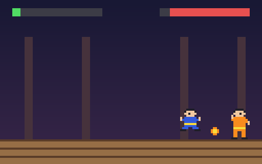

# g52 イー・アル・カンフー風（武器の敵）

イー・アル・カンフー風 6 段階の 4 つ目。武器を持つ 4 人が加わりました。**タオ**は火の玉（高い玉はしゃがんで、低い玉は跳んでよける）、**チェン**は長い鎖、**ラン**は落ちてくる手裏剣と跳び蹴り、**ムー**は高く跳んで空中から飛び込む。敵ごとの動きは、小さなジェネレータを `yield from` でつないだ**台本**です。



今回の主題は 3 つです。

- **`yield from` の台本** — `hold(keys, 秒)` / `approach(gap)` / `retreat(gap)` という小さなジェネレータを `yield from` でつないで、敵ごとの動きを「読める手順」にする。毎コマ `next()` でキーの集合が出てくる
- **`typing.Generic` と `TypeVar`** — 飛び道具の入れ物 `Slot[T]`（上限つきのリスト）。`Slot[Projectile]` と型で書ける
- **`TypedDict`** — 敵の表 `EnemyDef`（色・AI の設定・武器・台本・跳ぶ速さ）。辞書のまま書けて、鍵の名前と型が決まっている


## ブラウザ版

インストールせずに遊べます → **https://hicocho.github.io/python-study/g52/**

ソースは [`docs/g52/game.py`](../docs/g52/game.py)。`EnemyDef` / `Slot` / `Projectile` / 台本 / `ScriptBrain` / `ENEMIES` / `Game` を **1 文字も変えずに**持ってきています。`?enemy=tao` などで相手、`?level=hard` で難度。

## 遊び方（ターミナル）

```bash
python3 main.py --enemy tao            # 相手を選ぶ（wang / tao / chen / lang / mu）
python3 main.py --enemy mu --level hard
python3 main.py --auto --enemy chen    # 自機も自動で見る
python3 main.py --bench 16 --enemy lang   # 3 段階それぞれ 16 回戦わせる
```

## 仕様

| 敵 | 武器・動き | 台本 |
|---|---|---|
| ワン | なし | 点数で選ぶ AI（g51） |
| タオ | 火の玉 2 発（高さ 13 か 6、70 ドット/秒、10）。近づかれたらキック | 下がる → 火の玉 ×2 → 近ければキック |
| チェン | 鎖（前方 8〜36、高さ 9〜11、10） | 鎖の間合いまで寄る → 振る（近ければキック）→ 少し下がる |
| ラン | 手裏剣 2 枚（上へ投げて落ちる、6）、跳び蹴り | 離れる → 手裏剣 ×2 → 寄って跳び蹴り → 着地の隙 |
| ムー | 高く跳ぶ（150）、空中から跳び蹴り | 34〜44 まで寄る → 跳ぶ → 落ち始めてから蹴る → 着地の隙 → 離れる |

- 飛び道具は 1 人 2 発まで（`Slot`）。相手に当たるか、画面の外か地面に着いたら消える
- 幅 36 の鎖の絵でも体の位置がずれないように、絵の左端の基準を「体は右向きの絵の 6〜13 列」に変えた
- よけ（反応の遅れ）と難度は g51 のまま。自動操縦は飛び道具を半分よける（低い玉は跳ぶ）
- 自動対戦 16 回（normal）の勝率: タオ 88%、チェン 62%、ラン 56%、ムー 88%（hard: 44 / 31 / 81 / 75%）

## メモ

### `yield from` — ジェネレータをつなぐ

```python
def hold(keys: set[str], seconds: float) -> Script:
    for _ in range(max(1, round(seconds * FPS))):
        yield keys

def tao_script(game: Game) -> Script:
    while True:
        if abs(game.player.x - game.enemy.x) <= REACH + 6:
            yield from hold({"kick"}, 1 / FPS)
            yield from hold(set(), 0.45)
            continue
        yield from retreat(game, 44, 0.8)
        for _ in range(2):
            yield from hold({"weapon"}, 1 / FPS)
            yield from hold(set(), 0.5)
```

`yield from 下請け` は「下請けが yield するものを全部そのまま外へ出す」。`for k in hold(...): yield k` と同じだが、意図が読める。台本は毎コマ 1 つの `next()` で 1 コマぶんのキーを返し、`while True` で永遠に回る。「0.5 秒待つ」が `hold(set(), 0.5)` と書ける。状態機械を `if` で書くより手順が上から読める。

### `Generic[T]`

```python
T = TypeVar("T")

class Slot(Generic[T]):
    def add(self, item: T) -> bool: ...
    def keep(self, alive: Callable[[T], bool]) -> None: ...
    def __iter__(self) -> Iterator[T]: ...

self.projectiles: dict[str, Slot[Projectile]]
```

中身の型を後から決める入れ物。実行時には何もしないが、`Slot[Projectile]` から取り出したものが `Projectile` だと型検査と読む人に伝わる。

### `TypedDict`

```python
class EnemyDef(TypedDict):
    colors: dict[str, str]
    brain: dict
    weapon: Move | None
    script: Callable[[Game], Script] | None
    jump: float

ENEMIES: dict[str, EnemyDef] = {"TAO": {"colors": {...}, "brain": {...}, "weapon": FIRE_THROW, "script": tao_script, "jump": JUMP_SPEED}, ...}
```

dataclass にしてもいいが、表として辞書リテラルで並べたいときに。鍵の抜けや型の違いは型検査が見つける（実行時は普通の辞書）。

### 次

g53 で対戦の流れ（ラウンド・制限時間・KO・5 人連戦・コンティニュー・結果）。
