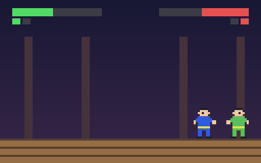

# g53 イー・アル・カンフー風（対戦の流れ）

イー・アル・カンフー風 6 段階の 5 つ目。**ワン → タオ → チェン → ラン → ムー**の 5 人連戦。1 ラウンド **60 秒**、**2 本先取**で次の相手。時間切れは体力の多い方の判定勝ち。2 本取られたら 9.9 秒以内に何かキーで**コンティニュー**（3 回まで）。最後に**結果の表**。



今回の主題は 4 つです。

- **`__format__`** — `f"{clock:clock}"` で `0:43`、`f"{clock:tenths}"` で `43.2`、`f"{result:row}"` で結果の表の 1 行。書式指定子を自分のクラスが受け取る
- **`functools.total_ordering`** — 結果 `BoutResult` に `__eq__` と `__lt__` だけ書けば、`>` `>=` `<=` と `max` / `sorted` が使える
- **`datetime.timedelta`** — かかった時間。足し算できるので `sum(..., timedelta())` で合計
- **`__enter__` / `__exit__`** — `RawTerminal` を `with` で。例外で抜けても端末の設定とカーソルが必ず戻る


## ブラウザ版

インストールせずに遊べます → **https://hicocho.github.io/python-study/g53/**

ソースは [`docs/g53/game.py`](../docs/g53/game.py)。`Clock` / `BoutResult` / `Game` を **1 文字も変えずに**持ってきています。`?level=` で難度、`?start=3` で 3 人目から。

## 遊び方（ターミナル）

```bash
python3 main.py                     # 5 人連戦
python3 main.py --start 3           # 3 人目（チェン）から（練習用）
python3 main.py --auto --level easy # 自機も自動で最後まで
python3 main.py --bench 12          # 自動で 12 回連戦して、何人倒せるかを数字で
```

## 仕様

- 段階: `intro`（1.5 秒「ROUND n FIGHT!」）→ `fight` → `ko`（1.6 秒）→ 次のラウンドか、次の相手か、`continue`（9.9 秒）→ `end`
- ラウンド: 60 秒、2 本先取。ラウンドの始めに位置・体力・時計・飛び道具・AI の状態をリセット
- 時間切れ: 体力の多い方の勝ち。同じなら相手（本家と同じで、攻めないと負ける）
- コンティニュー: 3 回まで。使うと本数は 0-0 に戻るが、その相手の結果には `続き 1` と残る
- 点: 残り体力 × 100 − 秒 × 5 − コンティニュー × 1000（負けは 0）
- 自動連戦の成績（12 回、コンティニューは必ず使う）: easy はクリア 100%、normal は 75%（平均 4.1 人）、hard は 8%（平均 1.6 人）

## メモ

### `__format__` — 自分のクラスに書式を持たせる

```python
class Clock:
    def __format__(self, spec: str) -> str:
        if spec == "clock":
            minutes, seconds = divmod(int(self.seconds), 60)
            return f"{minutes}:{seconds:02d}"
        if spec == "tenths":
            return f"{self.seconds:.1f}"
        return str(int(self.seconds))

f"残り {clock:clock}"      # 残り 0:43
f"CONTINUE? {clock:tenths}"  # CONTINUE? 9.9
```

`f"{obj:spec}"` は `type(obj).__format__(obj, "spec")` を呼ぶ。`spec` はただの文字列なので、意味は自分で決められる（組み込みの型が `:.2f` や `:>10` を解釈しているのと同じ場所）。`__str__` は 1 通りしか持てないが、`__format__` なら用途ごとに書き分けられる。`BoutResult` も `:row` で表の行、指定なしで短い形。

### `total_ordering`

```python
@total_ordering
@dataclass
class BoutResult:
    ...
    def __eq__(self, other): ...
    def __lt__(self, other): ...
```

`__lt__` と `__eq__` があれば、`total_ordering` が `__le__` `__gt__` `__ge__` を足してくれる。`max(results)` や `sorted(results, reverse=True)` がそのまま書ける。比べる中身は「点」1 つなので、`__lt__` は `self.score < other.score` の 1 行。

デコレータの順は `@total_ordering` を上（`@dataclass` の外側）に。`dataclass` が `__eq__` を作ってから `total_ordering` が残りを足す。

### `timedelta`

`timedelta(seconds=48.3)` を持っておくと、`sum((r.elapsed for r in results), timedelta())` で合計できる（`sum` の初期値に `0` は使えないので `timedelta()` を渡す）。`total_seconds()` で秒に戻して `divmod(..., 60)`。

### `__enter__` / `__exit__`

```python
class RawTerminal:
    def __enter__(self):
        self.old = termios.tcgetattr(self.fd)
        tty.setcbreak(self.fd)
        sys.stdout.write("\x1b[2J\x1b[?25l")
        return self
    def __exit__(self, exc_type, exc, tb):
        sys.stdout.write("\x1b[0m\x1b[?25h")
        termios.tcsetattr(self.fd, termios.TCSADRAIN, self.old)

with RawTerminal() as term:
    ...  # term.fd から読む
```

g38 の `contextmanager` は関数から作る形。こちらはクラスに `__enter__` / `__exit__` を書く形で、「入るときに返すもの」を `__enter__` の戻り値にできる。`try / finally` を毎回書かずに済み、例外で抜けてもカーソルが消えたままにならない。

### 段階を持つゲームループ

`phase`（`intro` / `fight` / `ko` / `continue` / `end`）と `phase_timer` を `Game` に持ち、`update()` は「戦っていない間はタイマーを減らして `advance()` を呼ぶだけ」。`control()` は `fighting` でなければ何もしない。描画は変えない（`status()` が段階ごとの文言を返す）。ブラウザ版もそのまま同じ流れになる。

### 次

g54（最後）でリプレイと記録。
