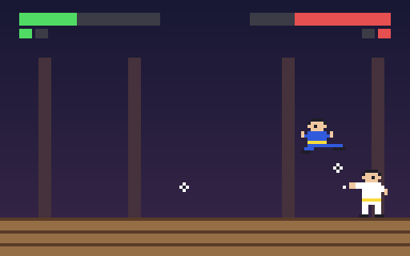

# g54 イー・アル・カンフー風（リプレイと記録）

イー・アル・カンフー風 6 段階の最後。遊んでいる間、**毎コマの入力が記録**されます。同じ種・同じ入力から試合を作り直せば、乱数も同じなので**まったく同じ試合**が再生されます。落としたラウンドの初めに**巻き戻せる**練習モード（`deepcopy` の控え）、記録を **`shelve`** に保存して後から再生・検証。



今回の主題は 4 つです。

- **`__set_name__` の記述子** — 「範囲に丸める」を `Bounded` クラスに。`hp = Bounded(0, 100)` と書くだけで、`__set_name__` が「自分は `hp` だ」と教わって実体を `_hp` に置く。g49 の `property` の setter を置き換え、`stun` にも使い回す
- **`copy.deepcopy`** — ラウンドの初めの `Game` をまるごと控える。ジェネレータを持つ `ScriptBrain` は `__deepcopy__` で台本を作り直す
- **`itertools.zip_longest`** — 記録に残した 1 秒ごとの目印と、再生で作った目印を突き合わせる。長さが違っても最後まで比べられる（足りない方は `None`）
- **`shelve`** — 「辞書のように使えるファイル」。`Replay`（dataclass）をそのまま入れて、名前で取り出す


## ブラウザ版

インストールせずに遊べます → **https://hicocho.github.io/python-study/g54/**

「リプレイを見る」で、今の（または終わったばかりの）試合をそのまま再生します。ソースは [`docs/g54/game.py`](../docs/g54/game.py)。`Bounded` / `Replay` / `replay_game` / `verify` / `Game` を **1 文字も変えずに**持ってきています（`shelve` の保存だけは CLI 版のみ）。

## 遊び方（ターミナル）

```bash
python3 main.py --save 初挑戦        # 遊んで、終わったら記録を保存
python3 main.py --list              # 保存した記録の一覧
python3 main.py --replay 001-初挑戦  # 記録を再生（端末に描く）
python3 main.py --verify 001-初挑戦  # 記録どおりに再生できるか確かめる
python3 main.py --practice          # ラウンドを落としたら、その初めからやり直す
python3 main.py --auto --save demo  # 自動操縦の試合を記録する
```

## 仕様

- 記録: 毎コマの「押しているキー」を `lp`（左とパンチ）のように 1 文字ずつ並べた文字列。1 試合 3000 コマでも数十 KB
- 目印: 1 秒ごとに状態の要約（時刻・段階・何人目・本数・位置・体力）を残す。再生で作り直したものと `zip_longest` で突き合わせる
- 再生できる条件: 種が同じで、同じ入力を同じ順に流すこと。だから**自動操縦の乱数を敵と分けた**（`pilot_rng`）。人が操縦したときに敵の乱数までずれると、再生が合わなくなる
- 巻き戻し: `save_checkpoint()` が `deepcopy(self)`、`rewind()` が控えの複製を返す。控えの中に控えは入れない
- 保存: `shelve.open("replays")` に `001-ラベル` の名前で。`Replay` は dataclass なので pickle できる

## メモ

### 記述子 — `property` を使い回せる形に

```python
class Bounded:
    def __init__(self, low, high, cast=int):
        self.low, self.high, self.cast = low, high, cast

    def __set_name__(self, owner, name):
        self.name = "_" + name          # hp → _hp

    def __get__(self, obj, objtype=None):
        if obj is None:
            return self                 # クラスから見たときは記述子そのもの
        return getattr(obj, self.name)

    def __set__(self, obj, value):
        setattr(obj, self.name, self.cast(max(self.low, min(self.high, value))))


@dataclass
class Fighter:
    hp = Bounded(0, MAX_HP)             # 注釈が無いのでフィールドではなく、クラス属性 = 記述子
    stun = Bounded(0.0, 99.0, float)
    _hp: int = field(default=MAX_HP, repr=False)
    _stun: float = field(default=0.0, repr=False)
```

`property` は 1 つの属性ごとに getter / setter を書く。記述子は「同じ規則をいくつもの属性に」使い回せる。`__set_name__(owner, name)` はクラスが作られるときに Python が呼んでくれるので、「自分がどの名前で置かれたか」を覚えられる（Python 3.6 から。これが無いと `Bounded("hp", 0, 100)` と名前を二度書くことになる）。

dataclass との組み合わせ: 注釈のない `hp = Bounded(...)` はフィールドにならず、ただのクラス属性＝記述子として働く。実体は注釈のある `_hp` フィールドに入る。`self.stun = self.stun - dt` と書くだけで 0 で止まる。

### `deepcopy` とジェネレータ

`copy.deepcopy(game)` は `Fighter` も `Slot` も `Brain` も丸ごと複製する。ただし**ジェネレータはコピーできない**（`TypeError: cannot pickle 'generator' object`）。g52 の台本（`ScriptBrain.script`）がそれ。

```python
class ScriptBrain(Brain):
    def __deepcopy__(self, memo):
        game = copy.deepcopy(self.game, memo)
        clone = ScriptBrain(self.params, copy.deepcopy(self.rng, memo), self.make_script, game)
        clone.timer, clone.keys, clone.noticed, clone.notice_at = self.timer, self.keys, self.noticed, self.notice_at
        return clone
```

`__deepcopy__(memo)` を書くと、そのクラスのコピーの仕方を自分で決められる。`memo` は「もうコピーしたもの」の辞書で、`Game` ⇄ `Brain` のような相互参照を無限ループにしないために、下請けの `deepcopy` にそのまま渡す。台本は作り直す（控えを取るのはラウンドの初めなので、台本も初めから）。

### `zip_longest`

```python
for i, (saved, now) in enumerate(zip_longest(rep.checks, fresh, fillvalue=None), 1):
    if saved != now:
        return False, f"{i} 秒目で食い違い: {saved} ≠ {now}"
```

`zip` は短い方で止まるので、「記録の方が長い（再生が早く終わった）」を見逃す。`zip_longest` は足りない方を `fillvalue` で埋めるので、長さの違いも食い違いとして出る。

### `shelve`

```python
with shelve.open(str(path)) as db:
    db[name] = rep          # pickle できるものなら何でも
with shelve.open(str(path), flag="r") as db:
    return sorted(db.items())
```

`dbm` の上に pickle を重ねた「辞書のように使えるファイル」。JSON と違って dataclass をそのまま入れられる（読むときも `Replay` で戻る）。その代わり、クラスの形を変えると古い記録が読めなくなるので、長く残す記録には JSON の方が向く。`flag="r"` は「無ければエラー」なので、まだ 1 つも保存していない場合を `except` で受ける。

### 再生できるようにするには

同じ入力を流しても、乱数の呼ばれ方が変われば結果は変わる。この段階で 2 つ直した。

- 自動操縦（腕前の物差し）が `game.rng` を使っていた → 人が操縦すると、その分だけ敵の乱数がずれる。`pilot_rng` に分けた
- コンティニューを `autopilot` の中で `game.press()` を呼んで行っていた → 記録に残らない。キーを返す形にして、記録を通るようにした

「1 コマ進める」を `Game.step()` 1 つにまとめたのも同じ理由で、遊ぶときも自動操縦も再生も、必ず同じ道（記録 → 押す → 動かす → 更新 → 目印）を通る。

### この 6 連作で作ったもの

g49 舞台と格闘家 → g50 技と当たり判定 → g51 敵の AI → g52 武器の敵 → g53 対戦の流れ → g54 リプレイと記録。
