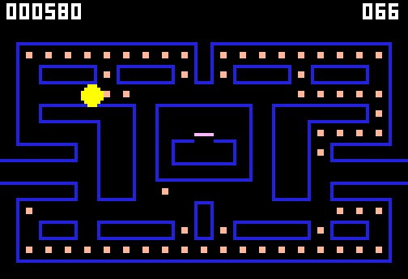

# g55 パックマン風（迷路とパックマン）

パックマン風 6 段階の 1 つ目。まだおばけはいません。21 × 13 の迷路を矢印キーで走り、124 個のエサを全部食べたらクリアです。曲がれない向きを押しても**覚えておいて**、角に来たら自動で曲がります。逆向きはその場で振り向き、左右の端はトンネルで反対側へ抜けます。



今回の主題は 4 つです。

- **`collections.abc.Mapping` の継承** — 迷路を「`(x, y)` から文字を引ける入れ物」にする。`__getitem__` / `__iter__` / `__len__` の 3 つを書くだけで、`in`・`get`・`items`・`keys`・`values` が付いてくる
- **`typing.Self`** — `from_text` の戻り値と `Direction.opposite` の戻り値。「このクラス自身」と書けるので、クラス名を文字列で繰り返さずに済む
- **`zip(*rows, strict=True)`** — 迷路の行の幅がそろっているかを、読み込んだその場で確かめる。列に並べ替えられなければ長さが違う
- **`itertools.takewhile`** — 「壁にぶつかるまでの通路」を、無限に伸びる 1 マス先・2 マス先…の並びから切り取る。自動プレイが「この向きに見えるエサ」を数えるのに使う

数字は 3 × 5 のドット絵。1 桁を 15 文字の 1 本の文字列で書いて、`itertools.batched` で 3 文字ずつ 5 行に切り戻しています。


## ブラウザ版

インストールせずに遊べます → **https://hicocho.github.io/python-study/g55/**

ソースは [`docs/g55/game.py`](../docs/g55/game.py)。`Maze` / `Direction` / `Pacman` / `draw` 一式 / `Game` を **1 文字も変えずに**持ってきています。違うのは入口（キー入力）と出口（canvas）だけ。

## 遊び方（ターミナル）

```bash
python3 main.py                    # 遊ぶ。矢印（か W A S D）、q でやめる
python3 main.py --auto             # 自動プレイを見る
python3 main.py --auto --seed 3    # 同じ種なら毎回まったく同じ動き
```

画面の下に状態が出ます。

```text
   580 点   残り  66   11.0 秒   矢印 移動   q やめる
```

端末は 126 桁 × 45 行以上が要ります（足りなければその旨が出て終わります）。

## 仕様

- 迷路 21 × 13 マス。左右対称。通れるマスは 128（うち巣の中が 3）、エサ 120 個 + パワーエサ 4 個
- 1 マス = 6 ドット。画面は 126 × 86 ドット（上の 8 ドットが得点欄）。端末では 2 ドットを 1 行に詰めて 43 行
- 速さ 6.0 マス/秒。エサ 10 点、パワーエサ 50 点。全部で 1400 点
- 位置は「今いるマス」と「次のマスへどれだけ進んだか（0.0〜1.0）」の 2 つで持つ
- 曲がれるのはマスの中心にいるときだけ。押した向きは曲がれるまで覚えておく（先行入力）
- 逆向きだけは中心でなくてもその場で振り向く（本家と同じ）
- 左右の端（y = 7 の行）はつながっている。`% 迷路の幅` で回る
- 巣の扉（`-`）はパックマンには壁。中の 3 マスへは入れない
- パワーエサは 1 秒に 2.5 回点滅する。この段階では食べても点が入るだけ

## メモ

### `Mapping` を継承すると、書くのは 3 つで済む

```python
class Maze(Mapping):
    def __getitem__(self, pos): ...
    def __iter__(self): ...
    def __len__(self): ...
```

この 3 つだけ書けば、`(x, y) in maze`・`maze.get(pos, WALL)`・`maze.items()`・`maze.keys()`・`maze.values()` が付いてきます。自分で書くと 5 つとも書き方を間違えかねないところを、標準ライブラリに任せられる。

肝は **`__getitem__` が迷路の外で `KeyError` を投げること**です。`IndexError` にすると `get` の既定値が効きません（`Mapping.get` は `KeyError` だけを捕まえる）。`KeyError` にしておくと、

```python
def wall(self, pos) -> bool:
    return self.get(pos, WALL) in (WALL, DOOR)      # 迷路の外は壁
```

の 1 行で「範囲の外は壁」が書けます。上下の端の判定を `if 0 <= y < height` と書かずに済むのが効きました。

### `zip(*rows, strict=True)` は `list` で使い切らないと何も起きない

```python
list(zip(*rows, strict=True))       # 幅が違う行があると ValueError
```

`zip` は遅延評価なので、`zip(...)` と呼んだだけでは長さの違いに気づきません（短い方が尽きた瞬間に投げるので、そこまで進める必要がある）。最初 `list` を付けずに書いていて、幅を 1 文字ずらした迷路が素通りしました。捨てる値でも一度は回す。

行を `zip(*rows)` で列に並べ替えると、行の長さが違えば必ず途中で尽きる——「幅がそろっているか」を長さの比較ではなく形で確かめられるのが気に入っています。

### 位置は「マス + 進み具合」で持つ

浮動小数の `x, y` で持つと、壁との当たり判定と「通路の中心にそろえる」処理が要ります。代わりに

```python
cell: tuple[int, int]       # 今いるマス
facing: Direction           # 向き
offset: float               # 次のマスへどれだけ進んだか。0.0〜1.0
```

とすると、壁の判定は「次のマスが壁か」だけになり、中心そろえは要りません。描画用の連続した座標は `pos` プロパティで計算します。

**小数の端数でつまずきました。** `offset` に `速さ × dt` を足していくと、`0.8 + 0.2` が `1.0000000000000002` になったり、引き算の残りが `4.16e-17` だけ残ったりします。残りが 0 にならないと「マスの中心にいる（`offset == 0.0`）」が永遠に成り立たなくなり、曲がれなくなりました。`while remaining > 1e-9:` と下限を付けて端数を捨てています。

### 曲がる判断は、コマの切れ目ではなくマスの中心で

最初は「1 コマ進める → 中心にいれば曲がる」と外側の輪で判断していました。これだと **`dt` が 1 マスぶんを超えるコマで中心を飛び越して**しまい、自動プレイが曲がれません。速さを 5.0 から 7.0 に上げただけで 40 戦 40 敗（1 度もクリアできない）になったのはこれでした。

直したのは、`step()` の中の「中心に着いた瞬間」に考えてもらう形です。

```python
def step(self, maze, dt, decide=None):
    remaining = SPEED * dt
    while remaining > 1e-9:
        if self.at_center:
            if decide:
                self.wish = decide()        # 中心に着くたびに呼ぶ
```

人が遊ぶときは `decide` なしで、押されたキーが `wish` に入っているだけ。**人・自動プレイ・（この先の）おばけが同じ `step()` を通る**ので、どれかを差し替えても他が壊れません（g49〜g54 で学んだ形をそのまま持ってきています）。

### 壁は「通路に面した辺だけ」引く

壁のマスを塗りつぶすと太い迷路になります。本家のような輪郭にするには、壁のマスごとに**隣が通路の辺だけ**に線を引きます。斜めだけが通路の「内側の角」は、どの辺も引かれず穴が空くので、角に点を 1 つ打って線をつなぎます。

```python
for sx, sy, px, py in ((-1, -1, 0, 0), (1, -1, end, 0), (-1, 1, 0, end), (1, 1, end, end)):
    if solid(cx + sx, cy) and solid(cx, cy + sy) and not solid(cx + sx, cy + sy):
        screen.plot(x0 + px, y0 + py, WALL_COLOR)
```

迷路の外も壁とみなすので、外周は内側にだけ線が出ます。

### ブラウザは画素の板ごと canvas へ

g35〜g54 は `Screen` と同じ `plot()` を持つ `CanvasScreen` を渡し、1 点ずつ `fillRect` していました。この課題は塗る点が毎コマ 1900 を超えるので、それだと間に合いません。代わりに **`Screen` をそのまま継承して**、描き終えた `pixels` を RGBA の並びに直し、`putImageData` に 1 回で渡しています。

```python
class CanvasScreen(Screen):
    def flush(self) -> None:
        ...
        image.data.assign(bytes(buf))
        ctx.putImageData(image, 0, 0)
```

`Game.draw()` の側は端末版と 1 文字も変わりません。

**名前がぶつかりました。** ブラウザ層の「描き直す」関数を `draw()` という名前にしたら、共有部分の module 直下の `draw(screen, maze, pac, eaten, score, t)` を上書きしてしまい、`Game.draw` の中から呼ばれて `draw() takes 0 positional arguments but 6 were given` で落ちました。ブラウザ層の関数名は `refresh()` にしています。**共有部分に module 直下の関数があるときは、ブラウザ層で同じ名前を使わない。**

### 難しさは自動プレイで測る

「見える範囲にエサがあればそちらへ（`takewhile`）、無ければ幅優先探索で一番近いエサへ」という自動プレイで 40 回。

| 自動プレイ | クリア | 平均 | 中央 | 最短 | 最長 |
|---|---|---|---|---|---|
| 見えるエサだけ（貪欲） | 40 / 40 | 59.3 秒 | 56.1 秒 | 39.0 秒 | 123.7 秒 |
| 見えるエサ + 幅優先 | 40 / 40 | 34.6 秒 | 34.9 秒 | 31.0 秒 | 39.5 秒 |

貪欲だけだと、終盤に「どの向きにもエサが見えない」状態が続いて行き当たりばったりになり、最長 123.7 秒とばらつきました。幅優先を足すと 31〜39 秒に収まります。エサを全部踏むだけで最低 20.7 秒（124 個 ÷ 6.0 マス/秒）なので、無駄は 1.5 倍ほど。

速さは、この自動プレイが 35 秒前後で終わる 6.0 マス/秒にしました。

### 次

g56 で 4 体のおばけ。それぞれ違う追いかけ方（自機を狙う・先回りする・気まぐれ・遠くにいるときだけ寄る）と、追いかけ／散らばりの切り替え。
