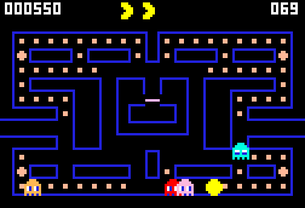

# g56 パックマン風（4 体のおばけ）

パックマン風 6 段階の 2 つ目。赤・桃・水色・橙の 4 体が追ってきます。**狙い方が 1 体ずつ違う**のがこのゲームの肝で、赤は自機をまっすぐ、桃は 4 マス先へ回り込み、水色は赤と自機の位置から目標を作り、橙は近づくと自分の隅へ帰ります。7〜20 秒ごとに**散らばりと追いかけ**が入れ替わり、そのたびにおばけが反転します。機は 3 つ。パワーエサはまだ効きません（g57 で）。



今回の主題は 4 つです。

- **`__init_subclass__`** — `Ghost` を継承したクラスは、**定義しただけで一覧に載る**。`Ghost.kinds` に登録する行を親に 1 つ書いておけば、おばけを増やすとき「登録し忘れ」が起きない
- **`typing.ClassVar`** — 色・散らばる隅・巣の待ち位置・出る順番は、**そのおばけ全体で 1 つ**の値。`dataclass` のフィールドと区別して「インスタンスごとに持たない」と型で言う
- **`typing.assert_never`** — 構えごとに目標を決める `match` の最後に置く。`Mode` を増やして書き忘れると、**動かす前に型検査が教えてくれる**
- **`itertools.accumulate` と `bisect_right`** — 散らばり／追いかけの時間割。長さの表を足し上げて「切り替わる時刻」にし、今が何番目かは二分探索で


## ブラウザ版

インストールせずに遊べます → **https://hicocho.github.io/python-study/g56/**

ソースは [`docs/g56/game.py`](../docs/g56/game.py)。`Walker` / `Pacman` / `Ghost` と 4 体、`draw` 一式、`Game` を **1 文字も変えずに**持ってきています。

## 遊び方（ターミナル）

```bash
python3 main.py                        # 遊ぶ。矢印（か W A S D）、q でやめる
python3 main.py --auto                 # 自動プレイを見る
python3 main.py --auto --skill 3       # 腕前を変える（0 が下手、2 が並、5 は慎重すぎ）
python3 main.py --auto --seed 3        # 同じ種なら毎回まったく同じ動き
```

## 仕様

- 迷路は g55 と同じ 21×13。**巣の扉の上（10, 4）だけ開けました**（g55 では壁で、おばけが出られなかった）。エサの数は 124 のまま
- 自機 6.0 マス/秒、おばけ 5.4 マス/秒（90%）。トンネルの中ではおばけが半分の速さになる
- 4 体の狙い方
  - **ブリンキー（赤）**: 自機のいるマス。最初から巣の外
  - **ピンキー（桃）**: 自機の向きに 4 マス先。2 秒後に出る
  - **インキー（水）**: 自機の 2 マス先を、ブリンキーから見て 2 倍に伸ばした所。2 体の位置で目標が動く。5 秒後
  - **クライド（橙）**: 8 マスより遠ければ自機、近づくと自分の隅。8 秒後
- 交差点では「来た道以外で、目標に一番近くなるマス」へ。同点なら 上・左・下・右 の順（本家と同じ）
- おばけが引き返すのは、行き止まりのときと、構えが切り替わった瞬間だけ
- 時間割: 散らばり 7 秒 → 追いかけ 20 秒 → 散らばり 7 → 追いかけ 20 → 散らばり 5 → 追いかけ 20 → 散らばり 5 → 以降ずっと追いかけ
- 0.7 マスより近づくと捕まる。1.2 秒止まってからやり直し。機が尽きたらゲームオーバー

## メモ

### `__init_subclass__` — 定義しただけで一覧に載る

```python
@dataclass
class Ghost(Walker):
    kinds: ClassVar[list[type["Ghost"]]] = []       # 定義された順に並ぶおばけの一覧

    def __init_subclass__(cls, **kwargs) -> None:
        super().__init_subclass__(**kwargs)
        Ghost.kinds.append(cls)
```

`class Pinky(Ghost):` と書いた**その瞬間**に `Ghost.kinds` へ入ります。`GHOSTS = [Blinky, Pinky, Inky, Clyde]` のような一覧を別に持つと、増やしたときに片方を直し忘れる。デコレータで登録する手（g29 でやった）もありますが、継承そのものが登録の合図になるのでこちらの方が短い。

順番も意味を持っていて、`Ghost.kinds[0]` がブリンキー。インキーの目標はブリンキーの位置を使うので、**定義した順がそのまま「1 番目のおばけ」の意味**になります。

`super().__init_subclass__(**kwargs)` を呼ぶのを忘れないこと（親の仕掛けが止まる）。

### `ClassVar` — 1 体ごとに持たない値

```python
label: ClassVar[str] = "?"
color: ClassVar[str] = "R"
corner: ClassVar[tuple[int, int]] = (1, 1)
```

`dataclass` は注釈のある名前をフィールドにしますが、`ClassVar` を付けたものは**フィールドにしない**（`__init__` の引数にもならない）。「赤いおばけの色は赤に決まっている」ような値をここに置くと、`Blinky(cell=...)` と書くだけで色まで決まります。

### `assert_never` — 増やしたときの書き忘れを型で止める

```python
match self.mode:
    case Mode.HOME | Mode.LEAVING:
        return HOME_EXIT
    case Mode.SCATTER:
        return self.corner
    case Mode.CHASE:
        return self.target(game)
    case _:
        assert_never(self.mode)
```

すべての `Mode` を書けば `case _` に来ることはないので、型検査は `self.mode` の型を `Never` と見ます。`Mode` に `FRIGHTENED`（g57 で足す予定）を増やすと、そこだけ型が合わなくなって**型検査が落ちる**。実行時に「なぜか目標が返らない」と悩まずに済む。

### `accumulate` と `bisect_right` — 時間割

```python
SCHEDULE = ((Mode.SCATTER, 7.0), (Mode.CHASE, 20.0), ...)
PHASE_ENDS = list(accumulate(seconds for _, seconds in SCHEDULE))   # [7, 27, 34, 54, ...]

def phase_at(t: float) -> Mode:
    i = bisect_right(PHASE_ENDS, t)
    return SCHEDULE[i][0] if i < len(SCHEDULE) else Mode.CHASE
```

「7 秒、20 秒、7 秒…」という**長さ**の表を、`accumulate` で**時刻**の表に変える。あとは二分探索で「今が何番目か」。`if t < 7: ... elif t < 27: ...` と書かずに済み、表を書き換えるだけで時間割を変えられます。

### 走るものを `Walker` にまとめる

g55 の `Pacman` が持っていた「マス + 進み具合」「中心に着くたびに向きを決める」を `Walker` に上げて、`Pacman` と `Ghost` の親にしました。子で変えるのは 2 つだけです。

```python
def blocked(self, maze, pos) -> bool:   # そのマスへ入れないか
def speed(self, maze) -> float:         # 今いる場所での速さ
```

おばけは `blocked` を上書きして「巣を出るときだけ扉を通れる」、`speed` を上書きして「トンネルでは半分」。**入口（誰が向きを決めるか）と出口（描き方）だけが違って、走り方の本体は 1 つ**という形は g49〜g55 と同じです。

### つまずいた: 「巣を出た」の判定を毎コマの頭でしていた

最初は `Ghost.update` の先頭で `if self.cell == HOME_EXIT and self.at_center:` として構えを切り替えていました。**`at_center` がコマの切れ目で真になることはほとんどない**（g55 で学んだのと同じ罠）ので、巣を出たおばけがいつまでも `LEAVING` のままで、扉のあたりをうろついた。

直したのは、`step()` の中から呼ばれる `choose()`（＝マスの中心に着くたびに呼ばれる）の先頭に移すこと。

```python
def choose(self, game):
    if self.mode is Mode.LEAVING and self.cell == HOME_EXIT:
        self.mode = game.phase                  # 外に出た。時間割に合流する
```

**「中心に着いた瞬間」にやりたいことは、外側の輪ではなく `step()` の中で。**

### 難しさは自動プレイで測る

自動プレイに腕前（`--skill`）を付けました。おばけ全部を出発点にした幅優先で「どのマスが何歩の所か」を測り、**`skill` 歩より近いマスへは行かない**。40 回ずつ。

| 腕前 | クリア | 食べたエサの平均 |
|---|---|---|
| skill 0（何も避けない） | 0 / 40 | 91 / 124 |
| skill 1 | 5 / 40 | 102 / 124 |
| skill 2（既定） | 19 / 40 | 118 / 124 |
| skill 3 | 19 / 40 | 119 / 124 |
| skill 5（慎重すぎ） | 3 / 40 | 107 / 124 |

**慎重にしすぎると弱くなる**のが面白いところ。`skill 5` は「おばけから 5 歩以内には入らない」ので、通れる道がほとんど無くなり、隅に追い詰められて捕まります。避ける距離には**ちょうどいい所がある**。

おばけの速さ（5.4 → 5.0 → 4.6）はほとんど効きませんでした（40 回でクリア 4 → 4 → 1）。自動プレイは追いつかれて捕まるのではなく、**自分からおばけの方へ歩いて**捕まっているからです。難しさを動かす当たりは「速さ」ではなく「先を読む距離」でした。

### 次

g57 でパワーエサ。食べるとおばけがイジケて逃げ、捕まえると 200・400・800・1600 点。目玉だけになって巣へ帰る。
