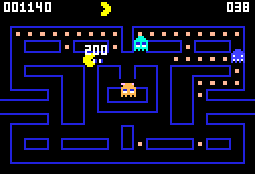

# g57 パックマン風（パワーエサとイジケ）

パックマン風 6 段階の 3 つ目。四隅の**パワーエサ**を食べると、おばけが 8 秒間青くなって逃げます。その間に捕まえると **200 → 400 → 800 → 1600 点**と倍々。食べられたおばけは**目玉だけ**になって巣へ帰り、また出てきます。残り 2 秒で白く点滅して知らせます。



今回の主題は 4 つです。

- **`type` 文（PEP 695 の型エイリアス）** — `type Cell = tuple[int, int]` の 1 行で、ファイル中の `tuple[int, int]` が全部 `Cell` になる。`dict[Cell, int]`、`set[Cell]`、`ClassVar[Cell]` と、読む側にも意味が伝わる
- **`functools.singledispatchmethod`** — 「描くもの」の型ごとにメソッドを分ける。自機・おばけ・点数表示を `if isinstance(...)` の連なりではなく、型で選ぶ
- **`typing.Final`** — 書き換えない表だと型で言う（`GHOST_SCORES: Final = (200, 400, 800, 1600)`）
- **`typing.assert_never` の回収** — g56 で仕込んだ `match` の番人。`Mode` に `FRIGHTENED` と `EATEN` を足したとき、直すべき場所を型検査が全部教えてくれた


## ブラウザ版

インストールせずに遊べます → **https://hicocho.github.io/python-study/g57/**

ソースは [`docs/g57/game.py`](../docs/g57/game.py)。`Walker` / `Ghost` と 4 体、イジケ・目玉の絵、`Popup`、`Game` を **1 文字も変えずに**持ってきています。

## 遊び方（ターミナル）

```bash
python3 main.py                        # 遊ぶ。矢印（か W A S D）、q でやめる
python3 main.py --auto                 # 自動プレイを見る
python3 main.py --auto --skill 3       # 腕前を変える
```

## 仕様

- パワーエサ 1 個でイジケが **8 秒**。残り **2 秒**で白く点滅
- イジケているおばけは **3.6 マス/秒**（ふだんの 5.4 より遅い）。行き先はでたらめ
- 続けて食べると **200・400・800・1600 点**。パワーエサを新しく食べると 200 に戻る
- 食べられたおばけは **12.0 マス/秒**で巣へ直行。扉を通れる（行きも帰りも）。巣に着いたらまた出直す
- パワーエサを食べた瞬間、外にいるおばけは全員その場で反転する
- 満点は 1400（エサ）+ 12000（4 個 × 3000）= **13400 点**

## メモ

### `type` 文 — マスの位置に名前を付ける

```python
type Cell = tuple[int, int]     # 迷路のマスの位置
```

Python 3.12 から。これまで `dict[tuple[int, int], Direction]` と書いていたところが `dict[Cell, Direction]` になります。長さが半分になるだけでなく、**「これは色の 3 つ組ではなくマスの位置だ」**と読む側に伝わる。

`Cell = tuple[int, int]` とただの代入で書いても動きますが、`type` 文だと**遅延評価**になり（中身は使われるまで組み立てられない）、まだ定義していない型を先に参照できます。型検査器にも「これは別名であって値ではない」と正しく伝わる。

このために [`extract_shared.py`](../.claude/skills/gnn/scripts/extract_shared.py) にも 2 行足しました。`type` 文は `ast.TypeAlias` という専用のノードで、`Assign` でも `AnnAssign` でもないので拾えていませんでした。

### `singledispatchmethod` — 描くものの型で分ける

```python
    @singledispatchmethod
    def paint(self, actor, screen: Screen) -> None:
        raise TypeError(f"描き方を知らない: {actor!r}")

    @paint.register
    def _(self, actor: Pacman, screen: Screen) -> None: ...

    @paint.register
    def _(self, actor: Ghost, screen: Screen) -> None: ...

    @paint.register
    def _(self, actor: Popup, screen: Screen) -> None: ...
```

呼ぶ側は種類を気にせず並べるだけ。

```python
actors = [*game.ghosts, *([] if game.dying > 0 else [game.pac]), *game.popups]
for actor in actors:
    game.paint(actor, screen)
```

g45（グラディウス）で使った `functools.singledispatch` の**メソッド版**です。関数版は第 1 引数で分けますが、メソッド版は `self` の次の引数で分ける。`register` は注釈から型を読むので、**注釈を書き忘れると黙って親のまま**になる（`raise TypeError` を置いておくと気づける）。

描くものが増えるたびに `if isinstance(...)` を伸ばさずに済み、**新しい種類は register を 1 つ足すだけ**。g58 で果物を足すときに効くはず。

### `assert_never` が本当に働いた

g56 で `Ghost.aim` の `match` の最後に `case _: assert_never(self.mode)` を置いておきました。今回 `Mode` に `FRIGHTENED` と `EATEN` を足したところ、**直すべき場所が型検査で全部出ました**。

```python
case Mode.FRIGHTENED:
    return self.corner                  # 使わない（イジケているときの行き先はでたらめ）
case Mode.EATEN:
    return HOME_SEAT                    # 巣の中へ帰る
```

`speed()` も `match self.mode:` にしてあるので、そちらも同じ形で足せました。**「増やしたら壊れる場所」を先に印を付けておく**という投資が、1 段階あとで返ってきた。

### つまずいた: `replace` を 2 回つないだら体まで赤くなった

イジケたおばけの絵は、体の `#` と目・口の `W` を色の文字に置き換えて作ります。最初こう書きました。

```python
row.replace("#", body).replace("W", mark)       # body="W", mark="R" のとき壊れる
```

白いおばけ（`body="W"`, `mark="R"`）を作ると、1 回目で `#` → `W` にした**体まで** 2 回目の `W` → `R` に拾われて、真っ赤なおばけになりました。

```python
table = str.maketrans({"#": body, "W": mark})
row.translate(table)                            # 1 度に置き換わる
```

`translate` なら 1 文字ずつ 1 回だけ見るので、置き換えた結果を再び置き換えることがない。**置換を鎖にするときは、後ろの置換が前の結果を拾わないか確かめる。**

### つまずいた: イジケの青が壁と同じ青だった

`(33, 33, 222)` は壁の色。イジケたおばけを同じ青にしたら、壁に溶けて見えませんでした。`(66, 66, 255)` に上げて解決。**画面に出して目で見るまで気づけない類**です（`Screen` の画素をそのまま PNG にして確認）。

### 難しさは自動プレイで測る

40 回ずつ。g56（パワーエサが効かない）と比べます。

| 腕前 | g56 クリア | g57 クリア | g57 の得点（平均） |
|---|---|---|---|
| skill 0（何も避けない） | 0 / 40 | 9 / 40 | 2338 |
| skill 1 | 5 / 40 | 14 / 40 | 3014 |
| skill 2（既定） | 19 / 40 | 36 / 40 | 4344 |
| skill 3 | 19 / 40 | 32 / 40 | 3838 |
| skill 5（慎重すぎ） | 3 / 40 | 26 / 40 | 3796 |

**パワーエサが入るとゲームが一気にやさしくなる**（skill 2 で 19 → 36）。とくに効いたのは慎重すぎる腕前で、3 → 26 と大きく伸びました。逃げ場のない詰みが、8 秒の無敵で解けるからです。得点は最高 7800（満点 13400 の 6 割弱）。

自動プレイは「イジケの残りが 2 秒より多く、8 歩以内に獲物がいるときだけ追う」ようにしています。無闇に追うと、点滅が始まってから戻ってきたおばけに捕まる。

### 次

g58 でステージと果物。面をクリアすると次の面へ、レベルごとに速さとイジケ時間が変わる表、途中に出るボーナスの果物。
