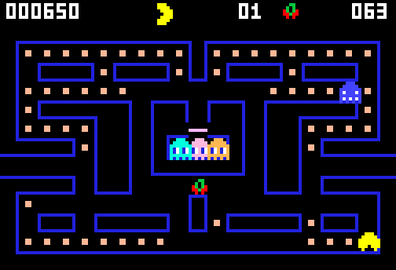

# g58 パックマン風（ステージと果物）

パックマン風 6 段階の 4 つ目。エサを全部食べると**次の面**へ。面が進むとおばけが速くなり（自機の 90% → 110%）、イジケの時間が短くなります（8 秒 → 2 秒）。エサを 60 個・160 個食べたところで**果物**が 9 秒だけ出ます（さくらんぼ 100 点 〜 メロン 1000 点）。機が尽きるまで何面でも。



今回の主題は 4 つです。

- **`fractions.Fraction`** — おばけの速さを「自機の何割」で持つ。`Fraction(9, 10)` は `0.9` と違って**丸め誤差がない**し、表を見たときに割合だと分かる
- **`collections.abc.Sequence` の継承** — 面の表を `__getitem__` と `__len__` の 2 つだけ書いて Sequence にする。`in`・`index`・`count`・`reversed` が付いてくる
- **`itertools.repeat` と `chain`** — 「表を過ぎたら最後の行がずっと続く」を `chain(表, repeat(表[-1]))` の 1 行で
- **`singledispatchmethod` の回収** — 果物を描くのに `@paint.register` を 1 つ足すだけ。呼ぶ側は何も変えない


## ブラウザ版

インストールせずに遊べます → **https://hicocho.github.io/python-study/g58/**

ソースは [`docs/g58/game.py`](../docs/g58/game.py)。`Stage` / `Levels` / `Fruit` を含めて **1 文字も変えずに**持ってきています。

## 遊び方（ターミナル）

```bash
python3 main.py                        # 遊ぶ。矢印（か W A S D）、q でやめる
python3 main.py --auto                 # 自動プレイを見る
python3 main.py --level 5              # 5 面から始める（速いおばけを試す）
```

## 仕様

| 面 | おばけの速さ | イジケ | 果物 |
|---|---|---|---|
| 1 | 9/10（5.40 マス/秒） | 8.0 秒 | さくらんぼ 100 点 |
| 2 | 19/20（5.70） | 7.0 秒 | いちご 300 点 |
| 3 | 1（6.00） | 5.0 秒 | オレンジ 500 点 |
| 4 | 1（6.00） | 4.0 秒 | りんご 700 点 |
| 5 | 21/20（6.30） | 3.0 秒 | メロン 1000 点 |
| 6 以降 | 11/10（6.60） | 2.0 秒 | メロン 1000 点 |

- 自機は常に 6.0 マス/秒。**5 面からおばけの方が速い**（逃げ切れるのはトンネルだけ）
- 果物はエサを 60 個・160 個食べたときに巣の下（10, 8）へ 9 秒だけ出る。1 面に 2 回
- 面をクリアすると 1.5 秒の間を置いて次の面。エサは戻り、得点と機はそのまま
- 終わりはゲームオーバーだけ。何面まで行けるかを競う

## メモ

### `Fraction` — 速さは割合で持つ

```python
@dataclass(frozen=True)
class Stage:
    ghost_ratio: Fraction                           # 自機の速さに対する割合

    @property
    def ghost_speed(self) -> float:
        """マス/秒。分数で持っておいて、使うときだけ小数にする。"""
        return SPEED * float(self.ghost_ratio)
```

`0.9` と書いても動きますが、`Fraction(9, 10)` には利点が 2 つあります。

- **丸め誤差がない。** `0.9 + 0.05` は `0.9500000000000001` になるが、`Fraction(9,10) + Fraction(1,20)` はぴったり `19/20`。表を足し算で作るときに効く
- **読んで割合だと分かる。** `19/20` と表示されるので、「自機の 95%」だとひと目で分かる。`0.95` だとマス/秒なのか割合なのか迷う

使うのは `float()` に直す 1 か所だけ。**正確に持って、使うときだけ崩す。**

### `Sequence` の継承と、そこで踏んだ罠

```python
class Levels(Sequence):
    def __getitem__(self, i: int) -> Stage:
        return self.table[i]                        # 範囲外は IndexError。Sequence の作法どおり

    def __len__(self) -> int:
        return len(self.table)

    def stage(self, level: int) -> Stage:
        """level 面（1 始まり）の決まりごと。表を過ぎたら最後の行がずっと続く。"""
        forever = chain(self.table, repeat(self.table[-1]))
        return next(islice(forever, max(level - 1, 0), None))
```

最初は「表を過ぎたら最後の行を返す」を `__getitem__` に入れました。**繰り返しが永遠に止まらなくなりました。**

```python
list(LEVELS)                    # → 止まらない
Stage(...) in LEVELS            # → 止まらない
```

`collections.abc.Sequence` の `__iter__` は「`self[0]`, `self[1]`, … を `IndexError` が出るまで」で終端を知ります。`__contains__` も `index()` も `count()` もその `__iter__` を使う。だから**範囲外を丸めて返すと、終端が来ない**。

直し方は「Sequence としては普通に振る舞い、尽きないふるまいは別のメソッドにする」。これで `in`・`index`・`count`・`reversed` が全部正しく動きます。

> **ABC を継承するときは、もらえるミックスインが何を前提にしているかを確かめる。** `Mapping`（g55）は `KeyError` を、`Sequence` は `IndexError` を終端の合図にしている。

### `chain` と `repeat` — 尽きない表

```python
forever = chain(self.table, repeat(self.table[-1]))     # 表 → 最後の行の繰り返し
return next(islice(forever, max(level - 1, 0), None))
```

`self.table[min(level - 1, len(self.table) - 1)]` と書いても同じですが、`chain(表, repeat(最後))` の方が**やりたいことがそのまま文になっている**。`repeat` は引数なしだと無限に同じものを出し続けるので、`islice` で 1 つだけ取り出します。

### `singledispatchmethod` が効いた

g57 で描き分けを `singledispatchmethod` にしておいたので、果物を足すのに**登録を 1 つ書くだけ**で済みました。

```python
    @paint.register
    def _(self, actor: Fruit, screen: Screen) -> None:
        blit_wrapped(screen, FRUIT_SPRITES[actor.name], *actor.pos)
```

呼ぶ側は並べるものが 1 つ増えただけ。

```python
    actors = [*([] if game.fruit is None else [game.fruit]), *game.ghosts,
              *([] if game.dying > 0 else [game.pac]), *game.popups]
```

`if isinstance(...)` の連なりだったら、条件を 1 本足して順番も気にする必要がありました。

### 面のまたぎ方

```python
    def start_stage(self) -> None:
        """新しい面を始める。エサを戻し、面の表を読み直す。"""
        self.stage = LEVELS.stage(self.level)
        self.eaten = set()
        self.fruit = None
        self.fruits_done = 0
        self.restart()
```

`restart()`（自機とおばけを出発点に戻す。捕まったときにも呼ぶ）と `start_stage()`（面を始める。エサも戻す）を分けました。**「どこまで戻すか」が 2 段階あるので、関数も 2 つ**。おばけの速さは `spawn(stage)` のときに 1 体ずつ渡します。

### つまずいた: 果物の色がパレットに無かった

果物の絵に `G`（緑のヘタ）や `A`（橙）を使ったのに、パレットに足すのを忘れて `KeyError: 'G'` で落ちました。**ドット絵の文字とパレットは対で足す。** ついでに、メロンの黄色を `Y` にしていたら「イジケの白」と紛らわしかったので `M`（うす緑）に変えました。

### 難しさは自動プレイで測る

40 回ずつ、何面まで行けるか。

| 腕前 | 到達（平均） | 到達（最高） | 得点（平均） | 得点（最高） |
|---|---|---|---|---|
| skill 0（何も避けない） | 1.0 面 | 2 面 | 2064 | 4410 |
| skill 2（既定） | 2.5 面 | 5 面 | 8888 | 17830 |
| skill 3 | 2.6 面 | 6 面 | 8945 | 20540 |

1 面はほぼ確実に抜けられて、2〜3 面で力尽き、うまくいくと 5〜6 面。**面が進むごとに確実に難しくなる**形になりました。得点は g57 の最高 7800 から 20540 へ。面を重ねるほど伸びるので、「何面まで」と「何点まで」が両方の目標になります。

### 次

g59 で演出とアトラクトモード。始まりの「READY!」、捕まったときの動き、放っておくと勝手に始まるデモ画面。

