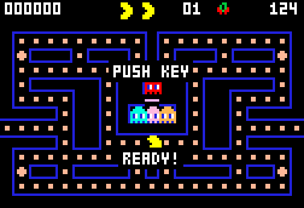

# g59 パックマン風（演出とアトラクトモード）

パックマン風 6 段階の 5 つ目。開いたときは**デモ**が流れています。**キーを押すと**あなたの番。面の始まりに「READY!」、捕まると口が開いて消え、面をクリアすると迷路が白く点滅します。ゲームオーバーのあとはまたデモに戻り、最高得点だけが残ります。



今回の主題は 4 つです。

- **`enum` の `_generate_next_value_`** — `auto()` が返す値を自分で決める。`Scene.READY.value` が `"ready"` になるので、そのまま画面や記録に出せる
- **`functools.partialmethod`** — 「引数を先に決めたメソッド」を作る。`self.ready()`・`self.dying()`・`self.clearing()` が、1 つの `enter()` から生える
- **`math.atan2` で絵を作る** — 捕まったときの 6 コマを手で描かず、円から「口の角度ぶん」を削って作る
- **3×5 の英字フォント** — 数字と同じ仕掛け（15 文字の 1 本の文字列を `batched` で 5 行に）を A〜Z に広げる


## ブラウザ版

インストールせずに遊べます → **https://hicocho.github.io/python-study/g59/**

ソースは [`docs/g59/game.py`](../docs/g59/game.py)。`Scene` / 演出 / `Game` を **1 文字も変えずに**持ってきています。

## 遊び方（ターミナル）

```bash
python3 main.py                        # 開くとデモ。何かキーを押すと自分の番
python3 main.py --auto                 # ずっと自動で見る
python3 main.py --level 5              # 5 面から
```

## 仕様

- 場面は 5 つ。`READY`（2.0 秒）→ `PLAY` → `DYING`（1.4 秒）または `CLEAR`（1.6 秒）→ `OVER`（3.0 秒）
- `READY!` と `GAME OVER` は巣の下の通路に、黒い下地つきで出す
- 捕まると口が 20° から 160° まで開いて消える（6 コマ）
- 面をクリアすると、壁だけを白く塗った画面と普通の画面が 1 秒に 3 回入れ替わる
- 誰も遊んでいない間はデモ。自動プレイが動き、上の方に `PUSH KEY` が出る
- ゲームオーバーから 3 秒でデモに戻る。**最高得点だけが残る**

## メモ

### `_generate_next_value_` — `auto()` の値を自分で決める

```python
class Scene(Enum):
    """今どの場面か。auto() の値を名前から作るので、Scene.READY.value は "ready"。"""

    def _generate_next_value_(name, start, count, last):
        return name.lower()

    READY = auto()
    PLAY = auto()
    DYING = auto()
    CLEAR = auto()
    OVER = auto()
```

ふつう `auto()` は 1, 2, 3… を振ります。`_generate_next_value_` を定義すると、その戻り値が `auto()` の値になる。ここでは**名前を小文字にしたもの**にしたので、`Scene.READY.value == "ready"`。画面下の状態表示にそのまま出せるし、記録に書いても読める。

`self` を取らない書き方（第 1 引数が `name`）なのが独特です。Enum のクラス本体で、メンバーが作られる前に呼ばれるため。`StrEnum`（g27）とは違い、**メンバー自体は文字列ではない**ので `Scene.READY == "ready"` は偽。値だけが文字列。

### `partialmethod` — 引数を先に決めたメソッド

```python
    def enter(self, scene: Scene, seconds: float = 0.0) -> None:
        """場面を切り替える。seconds が 0 より大きければ、その秒数で次へ進む。"""
        self.scene = scene
        self.timer = seconds

    # 場面ごとの入口。partialmethod は「引数を先に決めたメソッド」を作る
    ready = partialmethod(enter, Scene.READY, READY_TIME)
    play = partialmethod(enter, Scene.PLAY)
    dying = partialmethod(enter, Scene.DYING, DEATH_TIME)
    clearing = partialmethod(enter, Scene.CLEAR, CLEAR_TIME)
    over = partialmethod(enter, Scene.OVER, OVER_TIME)
```

呼ぶ側が `self.enter(Scene.DYING, DEATH_TIME)` ではなく `self.dying()` と書ける。**「場面と秒数の対応」が 1 か所（この 5 行）に集まる**のが値打ちで、秒数を変えたいときに呼び出し側を探さなくていい。

`functools.partial`（g29 で使った）はただの関数を包むもので、`self` を受け取れません。`partialmethod` はクラスの中で使える版で、`self` は呼ぶときに前に付きます。

### `atan2` で絵を作る

```python
def death_frames(count: int = 6) -> tuple[Sprite, ...]:
    """捕まったときのコマ。右向きの口が少しずつ開いていって、最後は消える。"""
    frames = []
    for i in range(count):
        half = radians(20 + i * 28)                 # 口の半角。20° から 160° へ
        rows = []
        for y in range(7):
            row = ""
            for x in range(7):
                dx, dy = x - 3, y - 3
                inside = dx * dx + dy * dy <= 9
                row += "Y" if inside and abs(atan2(dy, dx)) > half else "."
            rows.append(row)
        frames.append(Sprite(f"death-{i}", tuple(rows)))
    return tuple(frames)
```

6 枚を手で描くと、口の開き方がガタガタになります。**円の内側で、中心から見た角度が「口の半角」より外なら体**、という 1 つの式で全部作ると、開き方がなめらかにそろう。`atan2(dy, dx)` は右向きが 0、上下が ±π。`abs()` を取れば「右からの開き」になります。

最初は角度を使わず `abs(dy) * 6 <= opened * max(dx + 3, 0)` のような直線の式で書いて、**四角い変な形**になりました。PNG に書き出して目で見て気づいた。**幾何の形は、幾何の言葉（角度・距離）で書く。**

### `banner()` — 黒い下地を敷いてから字を置く

```python
    def banner(self, s: str, y: int) -> None:
        """横の真ん中に、黒い下地を敷いてから置く。迷路やエサに重なっても読める。"""
        width = len(s) * 4 - 1
        left = (WIDTH - width) // 2
        for bx in range(left - 2, left + width + 2):
            for by in range(y - 2, y + 7):
                self.plot(bx, by, (0, 0, 0))
        self.text(s, left, y)
```

最初は下地なしで、巣のあたりに「READY!」を出しました。**おばけと重なって全然読めない**。文字の周りを黒く塗ってから書くだけで解決します。置く場所も、巣の中（rows 5〜7）から巣の下の通路（row 9）へ動かしました。

### 「デモかどうか」は場面と分けた

最初は `Scene.ATTRACT` という場面を作りましたが、うまくいきませんでした。デモの中でも `READY` は出るし、面のクリアも起きる。**「今どの場面か」と「誰が遊んでいるか」は別の軸**でした。

```python
self.demo = True        # 誰も遊んでいない。自動で動くデモ
```

- `update()`: `auto = auto or self.demo`（デモなら自動プレイ）
- `control()`: デモ中に何か押されたら `new_game()`
- `draw()`: デモなら `PUSH KEY` を出す
- `finish_scene()` の `OVER`: デモに戻す

**2 つのことを 1 つの enum に押し込もうとしたら、場面の遷移が絡まった。** 分けたら 4 か所に 1 行ずつで済みました。

### 検証

| 何を | どう確かめたか | 結果 |
|---|---|---|
| `Scene` の値 | `_generate_next_value_` が効いているか | `[('READY','ready'), ('PLAY','play'), ('DYING','dying'), ('CLEAR','clear'), ('OVER','over')]` |
| 字の数 | `GLYPHS` の件数 | 38（数字 10 + 英字 26 + `!` と `-`） |
| 場面のつながり | デモを 200 秒流し、切り替わりを記録 | `demo:ready → demo:play → demo:dying → demo:ready …` と巡り、100 秒でキーを押すと `play:ready` から本番が始まった |
| 各ステップ | step1〜5 を 1 局ずつ | step1 は場面なしで動き、step2 以降は 5 つの場面が全部出る。step5 だけデモに戻るので終わらない |
| 移植 | 同じ種で CLI 版とブラウザ版を 6000 コマ、場面・タイマー・デモかどうかまで突き合わせ | 全コマ一致。画素も完全一致 |
| ブラウザ | Playwright でキー・携帯幅・デモ復帰 | エラー 0。コマ落ちなし |

### 次

g60 で記録と分析。遊んだ結果を残して、あとから「何面まで行けたか」「どのおばけに捕まったか」を振り返る。パックマン 6 連作の完成。
