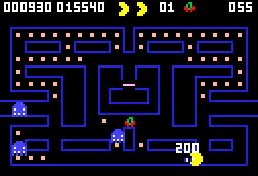

# g60 パックマン風（記録と分析）

パックマン風 6 段階の**完成形**。遊び終わるたびに、到達した面・得点・食べたエサ・かかった秒数・**最後に捕まえたおばけ**が 1 行 1 件で残ります。`--stats` で、得点の散らばりや死因の内訳を振り返れます。



今回の主題は 4 つです。

- **`collections.abc.MutableMapping` の継承** — 記録の入れ物。`Mapping`（g55）の 3 つに `__setitem__` と `__delitem__` を足した 5 つを書くだけで、`update`・`pop`・`setdefault`・`clear` まで付いてくる
- **`statistics.quantiles`** — 得点の四分位。平均だけでは分からない「散らばり」を見る
- **`dataclasses.astuple` と `fields`** — 記録を「並び」として保存し、見出しは `fields` から取る。`Record` を直せばファイルの形も表の見出しも付いてくる
- **`operator.attrgetter`** — 並べ替えの鍵。`key=attrgetter("when")` は `key=lambda r: r.when` より短く、速い

## ブラウザ版

インストールせずに遊べます → **https://hicocho.github.io/python-study/g60/**

**記録はそのブラウザの中（localStorage）に残ります。** 端末版はファイル（`records.jsonl`）。**入れ物のクラスは同じで、読み書きの口だけが違います。**

```python
# 端末版
Records(read=lambda: path.read_text(), write=lambda text: path.write_text(text))

# ブラウザ版
Records(read=lambda: localStorage.getItem(STORE_KEY) or "",
        write=lambda text: localStorage.setItem(STORE_KEY, text))
```

## 遊び方（ターミナル）

```bash
python3 main.py                        # 開くとデモ。何かキーを押すと自分の番
python3 main.py --stats                # これまでの記録をまとめて出す
python3 main.py --auto                 # ずっと自動で見る
```

`--stats` の出力例。

```text
10 回  最高 15540 点  最低 1580 点  平均 9486 点
得点の散らばり: 下から 1/4 が 6380 点、まんなかが 9600 点、上から 1/4 が 12972 点
到達した面: 1 面 ×1  2 面 ×3  3 面 ×3  4 面 ×3
最後に捕まえた相手: PINKY ×6  BLINKY ×3  INKY ×1

    when     level     score   pellets   seconds    killer
2026-09-         4     15540       490     216.6     PINKY
2026-09-         1      1580       100      46.9      INKY
2026-09-         3      8710       319     133.5    BLINKY
```

## 仕様

- 1 件の中身は `when`（ISO 8601）/ `level` / `score` / `pellets` / `seconds` / `killer` の 6 つ
- ファイルは **1 行 1 件の JSON の配列**（`["2026-09-08T09:00:00", 4, 15540, 490, 216.6, "PINKY"]`）
- 鍵は `when`。同じ秒に 2 回終わることはないので、これで足りる
- **デモの結果は残さない**。`keep()` の先頭で `if self.demo: return`
- 得点欄の 2 つ目が、これまでの最高得点

## メモ

### `MutableMapping` — 5 つ書けば辞書として使える

```python
class Records(MutableMapping):
    # --- MutableMapping が求める 5 つ ---
    def __getitem__(self, when): return self.rows[when]
    def __setitem__(self, when, record): self.rows[when] = record; self.flush()
    def __delitem__(self, when): del self.rows[when]; self.flush()
    def __iter__(self): return iter(self.rows)
    def __len__(self): return len(self.rows)
```

g55 の `Maze` は `Mapping` を継承して 3 つ（`__getitem__` / `__iter__` / `__len__`）でした。書き換えられる版は、そこに `__setitem__` と `__delitem__` を足した 5 つ。すると `update`・`pop`・`popitem`・`setdefault`・`clear` がついてきます。

**`__setitem__` の中で保存している**のがこの設計の要で、「辞書に入れる」がそのまま「ファイルに残る」になります。呼ぶ側は `records.add(rec)`（中身は `self[rec.when] = rec`）と書くだけで、保存を気にしなくていい。

この連作で ABC を 3 つ継承しました。

| 課題 | ABC | 書くもの | もらえるもの | 終端の合図 |
|---|---|---|---|---|
| g55 | `Mapping` | 3 つ | `in`・`get`・`items`・`keys`・`values` | `KeyError` |
| g58 | `Sequence` | 2 つ | `in`・`index`・`count`・`reversed` | `IndexError` |
| g60 | `MutableMapping` | 5 つ | 上に加えて `update`・`pop`・`setdefault`・`clear` | `KeyError` |

### 読み書きの口を外から渡す

```python
    def __init__(self, read: Callable[[], str] = lambda: "",
                 write: Callable[[str], None] = lambda text: None):
        self.read, self.write = read, write
```

端末版はファイル、ブラウザ版は `localStorage`、テストはメモリ上の辞書。**入れ物の中身（記録の持ち方・保存の形・まとめ方）は 1 つで、出入口だけが違う**。この連作でずっとやってきた「違うのは入口と出口だけ」が、保存にも当てはまりました。

既定値を「何も読まない・何も書かない」にしてあるので、`Records()` だけで**残らない入れ物**になります。テストで便利。

### `astuple` と `fields` — 保存の形と表の見出しを 1 か所から

```python
FIELDS: Final = tuple(f.name for f in fields(Record))       # 見出し。Record を直せば表も付いてくる

    def flush(self) -> None:
        self.write("\n".join(json.dumps(list(astuple(r))) for r in self.rows.values()))

    def load(self) -> None:
        for line in self.read().splitlines():
            if line.strip():
                record = Record(*json.loads(line))          # 並び順は FIELDS のとおり
```

`asdict`（g36 で使った）だと `{"when": ..., "level": ...}` と鍵が毎行に入って、ファイルが 3 倍くらいになります。`astuple` なら値だけの配列。**`Record` のフィールドを増やせば、保存の形も表の見出しも自動でついてくる**のが値打ち。

引き換えに、**フィールドの順番を変えると古いファイルが読めなくなる**。だから `Record` の docstring に「ここに並べた順が、そのままファイルの 1 行になる」と書いておきました。

### `quantiles` — 平均だけでは分からない

```python
    if len(scores) >= 4:
        low, mid, high = (round(q) for q in quantiles(scores, n=4))
```

`quantiles(data, n=4)` は**区切りを 3 つ**返します（4 つに分ける境目だから）。下から 1/4・まんなか・上から 1/4。平均 9486 点でも「6380〜12972 点の間に半分が入る」と分かると、**上振れなのか安定なのか**が見える。

データが 4 件に満たないと `quantiles` は例外を出すので、件数で守っています。

### `attrgetter`

```python
    recent = sorted(records.values(), key=attrgetter("when"), reverse=True)[:5]
```

`key=lambda r: r.when` と同じですが、短くて、C で書かれているぶん速い。`attrgetter("a", "b")` と複数書けばタプルになるので、多段の並べ替えもそのまま書けます。

### つまずいた: 得点欄が詰まってくっついた

これまでの最高得点を足したら、`005780015540` と 2 つの数がつながって読めなくなりました。得点欄の幅は 126 ドットしかないので、**置き場所を数えて割り振り直し**ました。

| 何 | x | 幅 |
|---|---|---|
| 得点（6 桁） | 2 | 24 |
| 最高得点（6 桁） | 28 | 24 |
| 残機（最大 2 個） | 56 | 18 |
| 面（2 桁） | 78 | 8 |
| その面の果物 | 90 | 5 |
| 残りエサ（3 桁） | 112 | 12 |

**画面に出して目で見ないと、こういう詰まりには気づけない。**

### わかったこと

自動プレイ 10 回ぶんの記録を取って `--stats` にかけると、**最後に捕まえた相手はピンキーが 6 回**で断然でした。ピンキーは「自機の 4 マス先へ回り込む」おばけなので、逃げた先に先回りされている。**まっすぐ追ってくるブリンキー（3 回）より、先回りする相手の方が危ない。** 記録を取って初めて見えた話です。

### 次

パックマン風 6 連作（g55〜g60）はこれで完成。次の連作は未定です。
