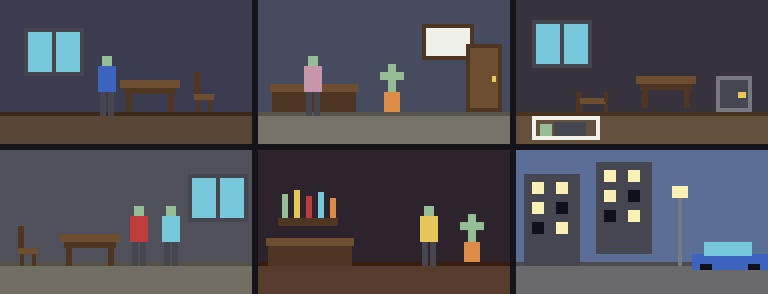

# g61 推理ゲーム風（現場と聞き込み）

コマンド選択式の推理ゲーム。日曜の夜、みなと商事の社長室で北浦社長が亡くなった。ドアは内側から施錠されていた。街を回って **しらべる**・**きく** を繰り返し、手がかりを集めます。

**手がかりが揃うと、聞ける話が増えます。** だから一度回っただけでは全部は集まりません（自動捜査で 1 周 10 個、2 周目で 11 個）。

> 事件・人物・台詞はすべてオリジナルです。遊びの仕組み（コマンド選択・聞き込みで手がかりが増える形）だけを、この種類のゲームから借りています。



今回の主題は 4 つです。

- **`collections.abc.Set` の継承** — 手がかり帳。`__contains__` / `__iter__` / `__len__` の 3 つを書くだけで、`&` `|` `-` と **`<=`（部分集合）** が付いてくる。「この話を聞くのに必要な手がかりが揃っているか」が **`needs <= clues` の 1 行**で書ける
- **`typing.NewType`** — 場所・人・手がかりの名札を別々の型に。中身はただの `str` だが、取り違えを型検査で止められる
- **`dataclasses.KW_ONLY`** — `_: KW_ONLY` から下はキーワードでしか渡せない。項目の多い定義（場所・人・手がかり）が読める形になる
- **`string.Template`** — 台詞の `$victim` `$assistant` を差し替える。名前を変えたくなったら 1 か所

絵は**長方形の重ね合わせ**で作っています。机や窓やビルはドット絵で 1 ドットずつ描くより短く、寸法も変えやすい。

## ブラウザ版

インストールせずに遊べます → **https://hicocho.github.io/python-study/g61/**

ソースは [`docs/g61/game.py`](../docs/g61/game.py)。世界のデータも `Clues` も `Game` も **1 文字も変えずに**持ってきています。違うのは入口（番号のボタン）と出口（canvas と HTML の文章窓）だけ。

## 遊び方（ターミナル）

```bash
python3 main.py                    # 遊ぶ。番号を打って進む。q でやめる
python3 main.py --auto             # 自動で捜査して、手がかりが全部集まるか見る
```

画面はこうなります（上が絵、下が文章と選択肢）。

```text
みなと商事 受付   手がかり 1 / 11
------------------------------------------------------------
受付。奥に社長室の扉が見える。
日曜の入館記録が残っていた。
【手がかり】日曜の入館記録 — 日曜の夜、北浦 さんのほかに 2 人が入館している。
------------------------------------------------------------
1 しらべる  2 きく  3 いどう  4 メモ  5 そうさをおえる
> 
```

## 仕様

- 場所 6 か所（探偵事務所・みなと商事 受付・社長室・会議室・酒場・街角）、人物 5 人、手がかり 11 個
- コマンドは **しらべる / きく / いどう / メモ**。選ぶと次の選択肢が出る二段構え
- 調べるところ・聞ける話には `needs`（必要な手がかり）を付けられる。揃っていない話は**選択肢に出てこない**、調べるところは**別の文になる**
- 絵は 126 × 72 ドット。端末では 2 ドットを 1 行に詰めて 36 行、その下に文章
- **日本語はドット絵のフォントでは出せない**ので、絵と文章を上下に分けている（端末は普通の `print`、ブラウザは HTML）

## メモ

### `Set` を継承すると「揃っているか」が 1 行になる

```python
class Clues(Set):
    def __contains__(self, clue): return clue in self.ids
    def __iter__(self): return iter(self.ids)
    def __len__(self): return len(self.ids)

    def _from_iterable(self, it):
        """& や | が新しい Clues を作れるようにする（Set が使う入口）。"""
        return Clues(it)
```

この 3 つ（+ `_from_iterable`）で、`&` `|` `-` `^` と `<=` `<` `>=` `>` が付いてきます。おかげで条件の判定が

```python
def can(self, needs: frozenset[ClueId]) -> bool:
    return needs <= self.clues        # 必要な手がかりが全部揃っているか
```

の 1 行。`all(c in self.clues for c in needs)` と書くより、**「部分集合か」という言葉のままコードになる**のが気持ちいい。

`_from_iterable` を忘れると `a & b` が `frozenset` を返してしまいます（`Set` が「新しい自分をどう作るか」を知らないため）。これを書いておくと `Clues` が返る。

この連作（g55〜g61）で ABC を 4 つ継承しました。

| 課題 | ABC | 書くもの | もらえるもの |
|---|---|---|---|
| g55 | `Mapping` | 3 つ | `in`・`get`・`items`・`keys`・`values` |
| g58 | `Sequence` | 2 つ | `in`・`index`・`count`・`reversed` |
| g60 | `MutableMapping` | 5 つ | 上に加えて `update`・`pop`・`setdefault`・`clear` |
| g61 | `Set` | 3 つ | `&`・`|`・`-`・`^`・`<=`（部分集合） |

### `NewType` — ただの文字列に名札を付ける

```python
PlaceId = NewType("PlaceId", str)
PersonId = NewType("PersonId", str)
ClueId = NewType("ClueId", str)
```

実行時はただの `str` です（`PlaceId("office")` は `"office"` を返すだけ）。でも型検査器は別の型として扱うので、**人の名札を場所の引数に渡すと怒られる**。

この課題は「文字列を鍵にした辞書」だらけなので、`dict[str, X]` が 3 種類あると、どれがどれだか分からなくなる。`dict[PlaceId, Place]` と書けるだけで読みやすさが変わります。`type Cell = tuple[int, int]`（g57）は**別名**でしたが、`NewType` は**別の型**。取り違えを止めたいときはこちら。

### `KW_ONLY` — ここから下はキーワードで

```python
@dataclass(frozen=True)
class Spot:
    name: str
    _: KW_ONLY                                      # ここから下はキーワードでしか渡せない
    text: str
    gives: ClueId | None = None
    needs: frozenset[ClueId] = frozenset()
    locked: str = ""
```

`Spot("金庫", text="金庫が開いている。", gives=ClueId("safe"))` としか書けなくなります。`Spot("金庫", "金庫が開いている。", "safe")` のような**順番頼みの書き方を封じる**のが目的。

項目が 5 つ以上ある定義では、順番を覚えていられません。`_` という名前は使い捨てで、フィールドにはなりません。

### `Template` — 台詞の穴埋め

```python
CAST = {"detective": "あなた", "assistant": "三沢", "victim": "北浦"}

def say(self, text: str) -> None:
    self.lines.append(Template(text).substitute(CAST))
```

台詞には `"$victim さんの腕時計です"` と書いておく。f-string と違って**データとして持ち運べる**のが要点で、世界のデータ（`PLACES` や `PEOPLE`）に台詞をそのまま書けます。

`substitute` は名前が足りないと `KeyError` を投げます（`safe_substitute` は黙って残す）。**足りないまま気づかない方が困る**ので、投げる方を使い、テストで全部の台詞が埋まることを確かめました。

### 絵は長方形の重ね合わせ

```python
FURNITURE = {
    "desk": (30, 16, ((0, 0, 30, 4, "N"), (2, 4, 26, 3, "M"), (3, 7, 3, 9, "M"), (24, 7, 3, 9, "M"))),
    "window": (30, 24, ((0, 0, 30, 24, "D"), (2, 2, 12, 20, "C"), (16, 2, 12, 20, "C"))),
    ...
}
```

`(x, y, 幅, 高さ, 色)` を重ねるだけ。**126 × 72 の一枚絵を 6 枚手描きすると 5 万文字を超えます**が、この形なら家具 17 個ぶんで 20 行。場所は「どの家具をどこに置くか」の並びで書きます。

```python
Place(PlaceId("room"), name="社長室（現場）", ...,
      scene=(("window", 8, 10), ("desk", 60, 38), ("safe", 100, 38), ("fallen", 30, 46), ("body", 8, 58)),
      spots=(...))
```

g59 では `atan2` で円から口を削って絵を作りました。**絵の作り方は 1 つではなく、対象に合った書き方がある**（丸いものは角度、家具は長方形、キャラクターはドット絵）。

床と壁の見切り線を 2 ドット入れるだけで奥行きが出ます。人の立ち位置は場所ごとに `stand=(46,)` のように指定して、家具と重ならないようにしました。

### 「その事件が詰まずに解けるか」を機械で確かめる

```python
def autopilot(game: Game, rounds: int = 10) -> list[str]:
    """全部の場所を歩いて回り、新しい手がかりが出なくなるまで繰り返す。"""
    for turn in range(1, rounds + 1):
        before = len(game.clues)
        for target in PLACES:
            for step in route(game.place, target):      # 幅優先で道をたどる
                game.go(step)
            harvest(game)                               # 調べる・聞くを全部
        if len(game.clues) - before == 0:
            break
```

```text
1 周目: +10 個（合計 10）
2 周目: +1 個（合計 11）
3 周目: +0 個（合計 11）
集まった手がかり 11 / 11
届かなかった手がかり: なし
```

推理ゲームで一番怖いのは**「条件を書き間違えて、どうやっても届かない手がかりがある」**こと。人が遊んで確かめるのは大変なので、自動で歩き回らせて「全部に届くか」を出します。

**1 周で 10 個、2 周目で 11 個**というのが、手がかりの依存関係がちゃんと効いている証拠です（1 周で全部揃うなら、条件が意味を持っていない）。

最初、移動を「出口を順番に選ぶ」だけにしていたら 11 個中 5 個しか届きませんでした。**探せていないのか、届かないのか**が区別できないので、幅優先で道をたどる `route()` を書いて、全部の場所を必ず訪れるようにしました。

### つまずいた: ブラウザで選択肢のボタンが 1 回も反応しない

選択肢のボタンは毎回作り直しています。`@when("click", "#choices .choice")` と書いたら、**クリックしても何も起きませんでした**。

`@when` は**登録したときに在る要素**に listener を付けます。あとから `createElement` で作ったボタンには付かない。入れ物の側で受けて、`event.target` から番号を読むように直しました。

```python
@when("click", "#choices")
def on_choice(event):
    index = event.target.getAttribute("data-index")
    if index is None:
        return
    game.choose(int(index))
    refresh()
```

g22（チェス）でも「後から `className` を付けるとクリックが効かない」で同じ所を踏んでいます。**動的に作る要素は、入れ物でクリックを受ける。**

### 次

続きを作るなら、g62 で手がかりの依存関係を `graphlib.TopologicalSorter` で扱い（「この順でしか解けない」を機械が言えるようにする）、g63 で証言の矛盾を突く、その先で犯人の指名と採点。
