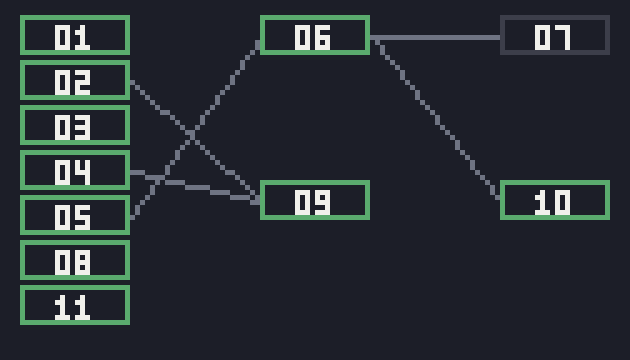

# g62 推理ゲーム風（推理ノートと手がかりの地図）

g61 の続き。**一度見た選択肢は消えます**——「ここで残り 3」と出るので、やり残しが一目で分かります。**ノート**を選ぶと、手がかりを「同時に手が届くもの」の層に並べた図が出ます。

そして **`--check` で「その事件が詰まないか」を機械が調べます**。g61 では街を歩き回らせて確かめていましたが、手がかりの依存は有向グラフなので、**歩かずにグラフの言葉で言えます**。



今回の主題は 4 つです。

- **`graphlib.TopologicalSorter`（`static_order()`）** — 手がかりの依存から「解ける順」を出す
- **同じ道具の 2 つ目の使い方（`prepare()` / `get_ready()` / `done()`）** — 「今いっぺんに手が届くもの」が**層**で出る。推理ノートの絵は、この層をそのまま左から右へ並べたもの
- **`graphlib.CycleError`** — 手がかりが輪になっている（＝どうやっても始められない）事件を、動かす前に見つける
- **`itertools.filterfalse`** — 「まだ見ていない調べどころ」を絞る。`[s for s in spots if not seen(s)]` を言葉のまま書ける

## ブラウザ版

インストールせずに遊べます → **https://hicocho.github.io/python-study/g62/**

ソースは [`docs/g62/game.py`](../docs/g62/game.py)。手がかりのグラフも推理ノートの絵も **1 文字も変えずに**持ってきています。

## 遊び方（ターミナル）

```bash
python3 main.py                    # 遊ぶ。番号を打って進む
python3 main.py --check            # 事件が詰まないか調べる
python3 main.py --auto             # 自動で捜査する
```

`--check` の出力。

```text
解ける順: 止まった腕時計 → 開いた金庫 → 外れた窓の掛け金 → 借金の督促状 → 日曜の入館記録
          → 堂島のアリバイ → 防犯カメラ → 使い込み → 三国の解雇 → 社長と専務の口論 → 三国が会っていた相手
  1 層目: 止まった腕時計、開いた金庫、外れた窓の掛け金、借金の督促状、日曜の入館記録、堂島のアリバイ、防犯カメラ
  2 層目: 三国の解雇、使い込み
  3 層目: 社長と専務の口論、三国が会っていた相手
見つかった問題: なし
```

## 仕様

- 一度**中身を見た**調べどころ・話は選択肢から消える。**条件が足りずに空振りしたものは残る**
- 画面の上に「ここで残り N」。0 なら「ここはもう調べ尽くした」
- **ノート**で絵が手がかりの図に切り替わる。枠の番号は下の文章の番号と同じ。緑が持っているもの
- `--check` が調べるのは 4 つ。**輪になっていないか** / **どこからも手に入らない手がかりが無いか** / **入手先が 2 か所以上ある手がかりが無いか** / **条件は満たせるのに、その場所へ行けない手がかりが無いか**

## メモ

### 「一度見たものは出さない」は、消し方に気をつける

Hicoさんの指摘から入れました。g61 は一度聞いた話も何度でも選べてしまい、**「まだ聞いていないのはどれか」が分からない**。ゲームとして進みにくい。

ただ、単純に「選んだら消す」は間違いです。

```python
    def investigate(self, spot: Spot) -> None:
        """調べる。条件が足りなければ別の文を出し、選択肢からは消さない。

        「頑丈なドアだ」→（掛け金を見つけたあと）「鍵穴に傷」と中身が変わるので、
        空振りで消してしまうと二度と見られなくなる。
        """
        if not self.can(spot.needs):
            self.say(spot.locked or "とくに何もない。")
            return
        self.say(spot.text)
        self.found(spot.gives)
        self.seen.add(self.key("spot", spot.name))      # ← 中身を見たときだけ印を付ける
```

社長室のドアと街角の裏口が、まさにこれです（条件つきで、手がかりはくれないが**文が変わる**）。データを調べて 2 か所あることを確かめてから作りました。

**「使ったら消す」ではなく「中身を見たら消す」。**

### `filterfalse` — 「〜でないもの」を言葉のまま

```python
    def spots(self) -> list[Spot]:
        """まだ中身を見ていない調べどころ。条件が足りずに空振りしたものは残る。"""
        return list(filterfalse(lambda s: self.done("spot", s.name), self.here.spots))
```

`[s for s in self.here.spots if not self.done(...)]` と同じですが、**「見た、の逆」**という読み方になります。`filter` と対で覚えるもの。

### `graphlib` は 1 つの道具を 2 通りに使う

**1 つ目: 1 列に並べる。**

```python
list(TopologicalSorter(clue_graph()).static_order())
# → 止まった腕時計, 開いた金庫, …, 三国が会っていた相手
```

**2 つ目: 層に分ける。**

```python
def layers() -> list[list[ClueId]]:
    """手がかりを「同時に手が届くもの」の層に分ける。"""
    sorter = TopologicalSorter(clue_graph())
    sorter.prepare()
    out = []
    while sorter.is_active():
        ready = sorter.get_ready()          # 今いっぺんに取れるもの
        out.append(sorted(ready, key=list(CLUES).index))
        sorter.done(*ready)                 # 取ったと伝えると、次が空く
    return out
```

`static_order()` は「並べてくれる」だけですが、`prepare()` → `get_ready()` → `done()` と回すと**「今どれが取れるか」を段階ごとに聞ける**。本来は並列に走らせるタスクを組むための API ですが、ここでは**推理ノートの列**にそのまま化けます。

この事件は 3 層です。1 層目が 7 個（何も知らなくても取れる）、2 層目が 2 個、3 層目が 2 個。

### グラフは世界のデータから組み立てる

```python
def clue_graph() -> dict[ClueId, set[ClueId]]:
    """手がかりの依存。「この手がかりを得るには、どの手がかりが要るか」。

    世界のデータ（調べどころと話）から組み立てる。表を別に持つと、
    データを直したときに必ずどちらかを直し忘れる。
    """
    graph = {c: set() for c in CLUES}
    for place in PLACES.values():
        for spot in place.spots:
            if spot.gives:
                graph[spot.gives] |= set(spot.needs)
    ...
```

依存の表を手で書くと、台詞を直したときに必ず食い違います。**遊びに使うデータそのものから組み立てる**ので、ずれようがない。

ただしこの組み立て方は「1 つの手がかりの入手先は 1 か所」を前提にしています（2 か所あると、必要条件を足し合わせてしまって厳しすぎる）。だから `--check` が**入手先の数**も見ています。前提を置いたら、その前提が崩れていないかを検査する。

### 詰む事件を、動かす前に見つける

```python
def check_case() -> list[str]:
    """事件が壊れていないか調べる。返すのは見つかった問題の一覧（空なら健全）。"""
```

見ているのは 4 つ。

1. **どこからも手に入らない手がかり** — 台詞を消したときに起きる
2. **入手先が 2 か所以上** — 上の前提が崩れる
3. **輪になっている** — `CycleError`。A を知るには B が要り、B を知るには A が要る。**動かすと永久に詰む**
4. **条件は満たせるのに、その場所へ行けない** — グラフだけでは分からない。街のつながりも歩いて確かめる

3 と 4 の使い分けが要点です。`graphlib` は**手がかりどうしの順序**しか知らないので、「その手がかりがある場所へ行けるか」は別に確かめないといけません。**グラフで言えることと、言えないことがある。**

```python
>>> list(TopologicalSorter({"a": {"b"}, "b": {"a"}}).static_order())
CycleError: nodes are in a cycle
```

### 推理ノートの絵

日本語はドット絵のフォントで出せないので、枠の中は**番号**にして、名前は下の文章窓に出しています。番号は `CLUES` の並び順そのまま。

線は g20（ダンジョンの視線）で書いたブレゼンハムを使い回しました。枠より先に線を引くので、線が枠の下に隠れます。

層の数は 3 まで（`NOTE_COLS = 3`）。それ以上の事件を作ったら、ここを増やすか縮尺を変えることになります。

### 検証

| 何を | どう確かめたか | 結果 |
|---|---|---|
| 一度見たら消える | 受付で「受付の記録」を調べたあとの選択肢 | 「掲示板」だけが残った |
| 空振りは消えない | 掛け金の前と後で、社長室のドアを調べる | 前: 「頑丈なドアだ」で残る / 後: 「鍵穴に傷」で消える |
| 話も同じ | 秋葉に聞ける話を全部聞く → 手がかりで増える → また全部聞く | 2 つ → 1 つ（新しく出た）→ 0 |
| 解ける順 | `--check` | 11 個すべて並んだ。層は 7 / 2 / 2 |
| 事件の健全さ | `--check` の 4 項目 | 問題なし |
| 自動捜査 | 全部の場所を回る | 1 周 10 個、2 周目で 11 個（g61 と同じ） |
| 各ステップ | step1〜5 を動かす | 手がかりは全段階で 11/11、層は step2 から、検査は step3 から、ノートの絵は step4 から |
| ブラウザ | Playwright で調べる → 消える → ノートを開く | 選択肢が消え、ノートに緑の枠が出た。エラー 0 |

### 次

続けるなら g63 で証言の突き合わせ（「誰が・いつ・どこに」を並べて矛盾を見つける）、g64 で告発と採点、g65 で事件を TOML に出して 2 つ目の事件を足す、g66 で記録と振り返り。
