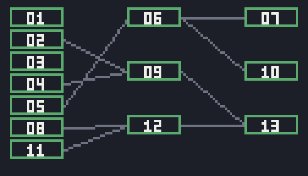

# g63 推理ゲーム風（証言の矛盾と告発）

推理ものの**完成形**（g61 → g62 → g63）。手がかりを集めると**証言**も溜まります。**つきつける**で 2 つの証言を並べ、「同じ人の同じ時刻に、違う場所」なら食い違い——相手が言い直し、新しい手がかりが出ます。最後に **こくはつ**で犯人・入り方・出方・動機を指名。100 点で真相にたどり着きます。

> 事件・人物・台詞はすべてオリジナルです。



手がかりは 11 個から **13 個**に増えました（12 と 13 が突きつけで手に入るもの）。

今回の主題は 3 つです。

- **`copy.replace()`（Python 3.13）** — 突きつけられた相手が**証言を言い直す**。凍った dataclass の「一部だけ違う新品」を作る。元の証言は無傷のまま
- **`dataclasses.field(metadata=...)` と `fields()`** — 告発の各項目に**見出し・配点・選択肢**を持たせる。画面も採点表も、この 1 か所から作られる
- **「同じ人の同じ時刻に、違う場所」** — 矛盾の判定を 1 行にするために、証言を `about` / `when` / `where` の 3 つに分けて持つ

## ブラウザ版

インストールせずに遊べます → **https://hicocho.github.io/python-study/g63/**

ソースは [`docs/g63/game.py`](../docs/g63/game.py)。証言も突きつけも採点も **1 文字も変えずに**持ってきています。

## 遊び方（ターミナル）

```bash
python3 main.py                    # 遊ぶ。番号を打って進む
python3 main.py --solve            # 自動で捜査してから、正しい答えで告発してみせる
python3 main.py --check            # 事件が詰まないか調べる
```

`--solve` の出力。

```text
1 周目: +11 個（合計 11）
2 周目: +2 個（合計 13）
3 周目: +0 個（合計 13）
集まった手がかり 13 / 13   証言 6 件
犯人は誰か: 早瀬 睦 … ○
どうやって社長室に入ったか: 合鍵でドアから … ○
どうやって出たか: 窓から … ○
動機は何か: 使い込みの口封じ … ○
── 100 点 ──
早瀬は認めた。……
```

## 仕様

- コマンドは **しらべる / きく / つきつける / いどう / ノート / こくはつ**
- 証言は手がかりと一緒に溜まる（6 件）。`つきつける` は 2 つ選ぶ二段構え
- 食い違いは **`about` が同じ・`when` が同じ・`where` が違う**とき。ただし食い違うだけでは何も出ず、**突きどころ 2 か所**でだけ相手が折れる
- 突きつけると、その証言が**言い直される**（`copy.replace`）。新しい証言と手がかりが出る
- 告発は 4 問。配点は 40 / 20 / 20 / 20。100 点で真相、60 点以上で「半分」、それ未満は「誤認」

## メモ

### `copy.replace()` — 言い直しは「新しい証言」

```python
        self.words[fix.revise] = replace(self.words[fix.revise], where=fix.where, text=fix.said)
```

Python 3.13 で入った `copy.replace()` は、**凍った（frozen）dataclass や namedtuple の「一部だけ違う新品」**を作ります。`dataclasses.replace()`（g49 で使った）は dataclass 専用ですが、`copy.replace()` は `__replace__` を持つものなら何でも扱えます。

証言は `frozen=True` にしてあるので書き換えられません。**言い直しは「書き換え」ではなく「別の証言に差し替え」**として表現できます。

```text
突きつけ前: 会社の外 / 堂島「9 時半には会社を出た」
突きつけ後: 社長室のあたり / 堂島「10 時までいた。金庫が気になって戻ったんだ」
元の WORDS は無傷: 会社の外
```

台本（`WORDS`）が無傷なので、**やり直しても同じ事件が始まる**。「今の状態」と「もとの世界」を混ぜないのが、frozen で持つ利点です。

### 矛盾を 1 行にするために、証言を 3 つに分ける

```python
@dataclass(frozen=True)
class Word:
    """証言 1 つ。「誰について・いつ・どこにいたか」を主張する。

    この 3 つを揃えて持つから、2 つ並べて食い違いを見つけられる。
    """
    id: WordId
    _: KW_ONLY
    speaker: str                                    # 言った人
    about: str                                      # 誰について
    when: str                                       # いつ
    where: str                                      # どこに
    text: str                                       # 証言帳に出る文


def clash(a: Word, b: Word) -> bool:
    """2 つの証言が両立しないか。同じ人の同じ時刻について、違う場所を言っている。"""
    return a.about == b.about and a.when == b.when and a.where != b.where
```

台詞をそのまま持っていたら、矛盾は**文章を読み比べる**しかありません。**判定に使う形（誰・いつ・どこ）と、見せる形（台詞）を両方持つ**ことで、判定が 1 行になりました。

`when` は `"9 時半すぎ"` のような文字列です。時刻として計算しないので、**同じ言葉で書くことだけが約束**。ここを崩すと矛盾が見つからなくなるので、証言はまとめて 1 か所に書いています。

### 食い違い ≠ 突きどころ

```python
        fix = CONFRONTS.get(pair)
        if fix is None:
            self.say("食い違ってはいる。だが、それだけでは何も出てこない。")
            return
```

食い違う組は他にもありますが、**話が動くのは 2 か所だけ**にしました。全部の食い違いで何かが起きると、総当たりで押していけば解けてしまう。「食い違いを見つける」と「それが事件の急所である」は別のことです。

一度突きつけた組は `pressed` に覚えて、二度目は「それはもう突きつけた」。g62 の「一度見たものは出さない」と同じ考え方です。

### `field(metadata=)` — 画面も採点表も 1 か所から

```python
@dataclass(frozen=True)
class Verdict:
    """告発の中身。metadata に見出し・配点・選択肢を持たせ、fields() から画面も採点表も作る。"""

    culprit: str = field(metadata={
        "label": "犯人は誰か", "points": 40,
        "options": ("秋葉 涼子", "堂島 健", "早瀬 睦", "三国 徹")})
    entry: str = field(metadata={
        "label": "どうやって社長室に入ったか", "points": 20,
        "options": ("合鍵でドアから", "窓から", "裏口から", "もともと中にいた")})
    ...

TRUTH = Verdict("早瀬 睦", "合鍵でドアから", "窓から", "使い込みの口封じ")
```

選択肢の画面はこれだけ。

```python
            case "verdict":
                return list(fields(Verdict)[len(self.answers)].metadata["options"]) + [BACK]
```

採点もこれだけ。

```python
def judge(answer: Verdict) -> tuple[int, list[str], str, str]:
    """告発を採点する。fields() の metadata から配点を読むので、項目を増やしても直すのはここではない。"""
    total = 0
    marks = []
    for f in fields(Verdict):
        mine, right = getattr(answer, f.name), getattr(TRUTH, f.name)
        ok = mine == right
        total += f.metadata["points"] if ok else 0
        marks.append(f"{f.metadata['label']}: {mine} … {'○' if ok else '× （' + right + '）'}")
```

**問いを 1 つ増やしたいときに触るのは `Verdict` だけ。** 質問の順番も、選択肢も、配点も、正解も、全部そこにあります。g60 では `fields()` から表の見出しを作りましたが、`metadata` を足すと**フィールドに好きな情報を貼れる**ようになります。

`metadata` は `mappingproxy`（読み取り専用）で返ってきます。書き換えられない場所に置くのが、この仕組みの意図です。

### 検査が実装に追いつかないと、嘘をつく

ステップごとに `--check` を走らせると、こうなりました。

| | 手がかり | 証言 | `--check` の問題 |
|---|---|---|---|
| step1（証言帳だけ） | 11 / 13 | 5 | 4 件 |
| step2（突きつけを実装） | **13 / 13** | 6 | **4 件（まだ「取れない」と言う）** |
| step3（地図に載せた） | 13 / 13 | 6 | 0 件 |

step2 が面白いところです。**実際には 13 個すべて取れているのに、`--check` は「堂島の言い直し: どこからも手に入らない」と言い続ける。** 手がかりの地図（g62 で作ったグラフ）が、調べどころと話しか見ていなかったからです。

```python
    for fix in CONFRONTS.values():                  # 突きつけて手に入る手がかりも同じ地図に乗せる
        if fix.gives:
            graph[fix.gives] |= set(fix.needs)
```

3 か所（グラフ・入手先の一覧・歩いて届くかの計算）に足して解消。**新しい入手経路を作ったら、検査にも教える。** 検査は放っておくと古くなり、古い検査は嘘をつきます。

### 事件の全体

- 被害者: みなと商事の社長・北浦誠一。日曜の夜、社長室で。ドアは内側から施錠
- 手がかり 13 個、証言 6 件、場所 6 か所、人物 5 人
- 層は 3 つ（7 個 / 3 個 / 3 個）。突きつけで手に入る 2 つは 2 層目と 3 層目
- **真相**: 犯人は経理の早瀬睦。社長の使い込みを 3 年ぶん帳簿で隠し続け、いつか自分が罪を被ると知っていた。合鍵でドアから入り、突き飛ばした社長は机の角に頭を打った。内側から鍵を掛けて、**窓から出た**——掛け金を戻し忘れて
- 堂島の嘘（9 時半に出た）は**赤いニシン**。金庫が気になって戻っただけ

### 検証

| 何を | どう確かめたか | 結果 |
|---|---|---|
| `copy.replace` | 突きつけの前後で証言を比べる | 「会社の外」→「社長室のあたり」。**元の `WORDS` は無傷** |
| 二度目の突きつけ | 同じ組をもう一度 | 「それはもう突きつけた」 |
| 食い違わない組 | 堂島の証言 × 三国の証言 | 「この 2 つは食い違っていない」 |
| 採点の刻み | 3 通りの答えを `judge()` に | 100 点 → 真相 / 80 点 → 半分 / 0 点 → 誤認 |
| 事件が解けるか | `--solve` | 3 周で 13 / 13、証言 6 件、100 点 |
| 事件の健全さ | `--check` の 4 項目 | 問題なし。層は 7 / 3 / 3 |
| 各ステップ | step1〜5 を動かす | 手がかり 11 → 13、検査の問題 4 → 4 → 0、コマンド 4 → 5 → 6 |
| ブラウザ | Playwright で「カメラ → 堂島のアリバイ → つきつける」 | 言い直しが起き、手がかりが 3 件に。エラー 0 |

### 推理もの 3 本（g61〜g63）で覚えた文法

| # | 作ったもの | 覚えた文法 |
|---|---|---|
| g61 | 現場と聞き込み | `collections.abc.Set` の継承 / `typing.NewType` / `dataclasses.KW_ONLY` / `string.Template` |
| g62 | 推理ノートと手がかりの地図 | `graphlib.TopologicalSorter`（2 通りの使い方）/ `graphlib.CycleError` / `itertools.filterfalse` |
| g63 | 証言の矛盾と告発 | `copy.replace()`（3.13）/ `dataclasses.field(metadata=)` と `fields()` |

**この 3 本を通しての学び**は、**「作ったものが正しいかを、機械に言わせる」**ことでした。g61 は歩き回らせて、g62 はグラフで、g63 は経路を足して。そして step2 で「検査が古いと嘘をつく」ところまで見られたのが収穫です。
