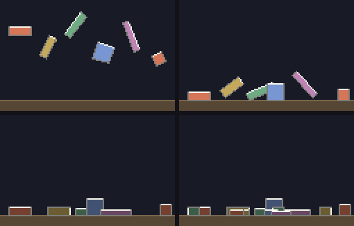

# g64 物理の積み木（剛体の箱）

物理エンジンを**自分で書く** 3 連作の 1 つ目。重力で落ちて、床にぶつかって跳ね、角から落ちて**回り**、摩擦で滑りが止まり、動かなくなると**眠って**完全に静止します。

まだ**箱どうしはすり抜けます**。相手は床と左右の壁だけ。箱と箱をぶつけるのは g65 の主題です。



左上から順に、落下中 → 床に当たって傾いたところ → 全部が眠って止まったところ → さらに箱を落としたところ。**暗い箱が眠っている箱**です（色は変えていないので、どれがどれか分かります）。

今回の主題は 4 つです。

- **複素数で剛体を扱う** — 位置も速度も複素数（g16 の宇宙船と同じ）。そこに**向き**と**角速度**が加わる。内積は `(a.conjugate() * b).real`、外積は同じかけ算の `.imag`
- **撃力（impulse）で跳ね返す** — 「めり込んだから押し戻す」ではなく、**速度をその場で書き換える**。`j = -(1 + e)·vn / (1/m + (r×n)²/I)`
- **クーロン摩擦** — 面に沿う向きの撃力を、跳ね返りの強さの `FRICTION` 倍で頭打ちにする。これで箱が「転がって止まる」
- **眠らせる（sleeping）** — ほとんど動かない状態が続いたら計算から外す。**これが無いと、床の上の箱は永遠に微かに震え続けます**

## ブラウザ版

インストールせずに遊べます → **https://hicocho.github.io/python-study/g64/**

ソースは [`docs/g64/game.py`](../docs/g64/game.py)。物理は **1 文字も変えずに**持ってきています。落ち着いたあとの画面を CLI 版と**画素で比べて 10080 個すべて一致**しました。

## 遊び方（ターミナル）

```bash
python3 main.py                    # ← → で位置、空白で箱を落とす、r でやり直し、q でやめる
python3 main.py --auto             # 勝手に落とし続けるデモ
python3 main.py --check            # 静かになるまで回して、物理が壊れていないか見る
```

`--check` の出力。

```text
  0.0 秒  動いている 12 / 12  運動エネルギー  5176.29
  1.5 秒  全部止まった
いちばん深いめり込み 0.055 ドット
ぶつかった瞬間の力 207673 → 落ちきったあとの最大 0.00
落ちきったあとに力が増えていない: はい
```

## 仕様

- 画面は 126 × 80 ドット。端末は 2 ドットを 1 行に詰めて 40 行
- 箱は長方形の剛体。重さは面積に比例、回りにくさ（慣性モーメント）は `m(w² + h²)/12`
- 1 コマ（1/60 秒）を **`SUBSTEPS = 4`** に割って解く。刻みが細かいほど、めり込みが浅い
- ぶつかる相手は床（`FLOOR_Y`）と左右の壁だけ。**箱どうしは当たらない**
- 反発係数 0.28、摩擦 0.45、めり込みの見逃し（slop）0.05 ドット

## メモ

### 回るものには「回りにくさ」が要る

```python
    @property
    def inertia(self) -> float:
        """回りにくさ。長方形は m(w² + h²)/12。細長いほど、長い向きに回しにくい。"""
        w, h = 2 * self.half.real, 2 * self.half.imag
        return self.mass * (w * w + h * h) / 12
```

g16 の宇宙船は点でした（向きはあっても、ぶつかる形が無かった）。**大きさのあるものが回る**とき、質量のほかに慣性モーメントが要ります。

そして「箱の上のある点が、今どちらへ動いているか」が必要になります。

```python
    def velocity_at(self, point: complex) -> complex:
        """中心の速度に、回転ぶんを足す。

        2 次元では ω × r が「r を 90 度回して ω 倍」になるので、
        複素数なら spin * 1j * r で書ける。
        """
        return self.vel + self.spin * 1j * (point - self.pos)
```

**`1j` をかけると 90 度回る**——これが 2 次元の外積を複素数で済ませられる理由です。ベクトルの本なら `ω × r` と書くところが、1 行になりました。

### 内積と外積は、同じかけ算の実部と虚部

```python
def dot(a: complex, b: complex) -> float:
    return (a.conjugate() * b).real

def cross(a: complex, b: complex) -> float:
    return (a.conjugate() * b).imag
```

`ā · b` を展開すると、実部が内積、虚部が外積になります。この 2 行のおかげで、以下の物理が**すべて複素数のまま**書けました。ベクトルのクラスも `numpy` も要りません（標準ライブラリだけ、という縛りにも合います）。

### 撃力 — 「押し戻す」のではなく「速度を書き換える」

```python
        j = -(1 + BOUNCE) * vn / (1 / body.mass + rn * rn / body.inertia)
        body.push(point, j * normal)
```

素朴に作ると「めり込んだぶんだけ位置を戻す」になりますが、それでは**跳ね返りません**（step2 がまさにそれ）。

やることは「ぶつかったあと、その点の法線方向の速さを **−e 倍**にする」。そのために必要な撃力の大きさが上の式です。分母の `rn * rn / I` が**回転ぶんの効き**で、これがあるから**箱の角で当たると回り出す**。

```python
    def push(self, point: complex, impulse: complex) -> None:
        r = point - self.pos
        self.vel += impulse / self.mass
        self.spin += cross(r, impulse) / self.inertia
```

同じ強さでも、**中心を突けば真っすぐ飛び、端を突けば回る**。`cross(r, impulse)` がその差です。

### 摩擦は「跳ね返りの強さ」に比例して頭打ち

```python
        jt = -vt / (1 / body.mass + rt * rt / body.inertia)
        jt = max(-FRICTION * j, min(FRICTION * j, jt))              # クーロン摩擦の頭打ち
```

面に沿った速さをちょうど 0 にする撃力 `jt` を計算し、**`FRICTION × j` を超えないように挟む**。これがクーロンの摩擦法則（静止摩擦は垂直抗力に比例する、を撃力の言葉にしたもの）です。

摩擦が無いと、箱は傾いたまま床を滑り続けます。実測では 6 秒後の**傾きの平均が 0.79 → 0.26 ラジアン**になりました（摩擦を入れた step4 で、箱が転がって平らに落ち着く）。

### つまずいた 1: すみごとに押し戻すと、平らな箱が跳ね続ける

最初は、めり込んだすみを見つけるたびに位置を戻していました。**平らに載った箱は 2 つのすみが同時にめり込む**ので、1 コマで 2 回押し上げられ、いつまでも小さく跳ねます。

```python
    deepest, push_dir = 0.0, 0j
    for corner in body.corners():
        for depth, normal in edges(corner):
            if depth <= SLOP:
                continue
            bounce_off(body, corner, normal)        # 速さの直しは、すみごとに入れる
            if depth > deepest:
                deepest, push_dir = depth, normal
    if deepest > 0:
        body.pos += push_dir * (deepest - SLOP) * CORRECTION        # 位置の直しは 1 回だけ
```

**速さの直しはすみごと、位置の直しは 1 コマに 1 回、いちばん深いぶんだけ。** 全部を戻さず `CORRECTION = 0.6` 倍にとどめ、`SLOP = 0.05` ドットは見逃す——直しすぎると、今度は震えます。

### つまずいた 2: 触れているだけで目を覚ますと、永遠に眠れない

眠りを入れたのに `awake` が減らない。原因は、ぶつかりを解くたびに `wake()` を呼んでいたことでした。**床に載っているだけの箱も毎コマぶつかっている**ので、「動かないまま経った時間」が毎回 0 に戻ります。

```python
        if vn < -WAKE_SPEED:                        # しっかりぶつかったときだけ目を覚ます
            body.wake()                             # 床に載っているだけの震えは −5 くらい。測って決めた
```

`WAKE_SPEED` は勘で決めず、**載っているだけの箱の `vn` を実際に測って**（最大 −4.64）、その倍以上の 20.0 にしました。物理の定数は、測ってから決められます。

### つまずいた 3: 経った時間をそのまま渡すと、ブラウザで眠らない箱ができる

ブラウザ版で、1 つだけいつまでも起きている箱が出ました。原因は時間の進め方です。

```python
            lag = min(lag + now - last, 0.25)       # ためすぎない（追いつけなくなる）
            last = now
            while lag >= STEP:                      # たまったぶんだけ、決まった幅で進める
                world.update(STEP)
                lag -= STEP
```

経った時間 `dt` をそのまま `update()` に渡すと、コマが飛んだときに刻みが大きくなります。すると**1 回の刻みで進む距離が `SLOP` を超え、床とのぶつかりを見落として**、深く入ってから強く跳ね返る——を繰り返し、速さが `SLEEP_SPEED` を下回りません。

直し方は**刻み幅を固定して、足りない時間はためておく**（fixed timestep）。これで物理が「機械の速さ」から切り離され、端末とブラウザで**同じ結果**になります。実際、落ち着いたあとの画面は**画素まで一致**しました。

### 段階を追う

ステップごとに 6 秒動かして測ると、何が効いているかが数字で見えます。

| | 足したもの | 床からのはみ出し | 運動エネルギー | 傾きの平均 | 動いている |
|---|---|---|---|---|---|
| step1 | 重力だけ | **+4646.49** | 17,886,960 | 0.55 | 6 / 6 |
| step2 | 床で止める | +4.38 | **17,886,960** | 0.55 | 6 / 6 |
| step3 | 撃力で跳ね返す | +0.06 | 5.36 | 0.79 | 6 / 6 |
| step4 | 摩擦 | +0.06 | 3.49 | **0.26** | 6 / 6 |
| step5 | 眠り | +0.05 | **0.00** | 0.26 | **0 / 6** |

step2 が面白いところです。**画面上は床で止まって見えるのに、運動エネルギーは step1 と 1 の位まで同じ**。位置を戻しているだけで速度を触っていないので、箱は「落ち続けながら毎コマ引き戻されている」。**見た目が正しくても、物理は間違っていることがある。**

### 検証

| 何を | どう確かめたか | 結果 |
|---|---|---|
| 全部止まるか | `--check` を 12 秒 | 1.5 秒で 12 個すべて眠った |
| めり込み | 落ち着いたあとの最深部 | 0.055 ドット（`SLOP` の範囲） |
| エネルギーが湧かないか | 落ちきったあと（3 秒以降）の最大 | 0.00（`isclose(..., abs_tol=0.5)`） |
| 落とした箱も眠るか | 乱数の種 8 通りで 1 つ落とす | 全部 1.0〜1.5 秒で眠った |
| 各ステップ | step1〜5 を 6 秒動かす | 上の表 |
| 端末の入力 | `pty.fork()` で ← 空白 → 空白 r q | 画面更新 342 回、箱 6 → 8 → 6、動いている 0〜7、カーソルを戻して終了 |
| ブラウザ | Playwright で落とす・寄せる・やり直す | 箱 6 → 8、落とすと `動いている 1`、5 秒で 0。エラー 0 |
| **CLI とブラウザが同じか** | 落ち着いた画面の画素をすべて比較 | **10080 / 10080 一致** |

### 次

g65 で**箱どうしの衝突**（分離軸で重なりを見つけて、同じ撃力の式で押し返す）。ここまで来れば箱が積めます。g66 は積んだ塔をパチンコで崩して、崩れ具合で採点。
