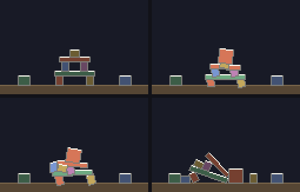

# g65 物理の積み木（箱どうしの衝突）

g64 の続き。**箱どうしがぶつかる**ようになりました。重なりは**分離軸**で見つけ、g64 と同じ撃力の式を 2 体ぶんに広げて押し返します。おかげで**箱が積める**——塔が建ち、重い塊をぶつけると崩れます。



左上から順に、建った塔（全部眠っている）→ 重い塊が当たる瞬間 → 崩れる途中 → 崩れきったところ。

今回の主題は 5 つです。

- **分離軸法（SAT）** — 4 本の軸に影を落として、**どれか 1 本でも隙間があれば当たっていない**。全部重なっていたときは、いちばん浅い軸が押し返す向き
- **`typing.NamedTuple`** — 接触 1 点を `Contact` に。1 コマで何百個も作っては捨てるので、tuple の軽さがそのまま速さになる
- **`math.inf` を質量に入れる** — 床と壁は「無限に重い箱」。**`1 / inf` はちょうど `0.0`** なので、「動かない」を `if` で書かずに済む
- **撃力の 2 体版** — 分母が「2 つの体の動きやすさの合計」になるだけ。片方が動かない体なら、g64 とまったく同じ式に戻る
- **`@dataclass(slots=True)`** — `__dict__` を持たなくなるぶん速い。実測で **9%**

## ブラウザ版

インストールせずに遊べます → **https://hicocho.github.io/python-study/g65/**

ソースは [`docs/g65/game.py`](../docs/g65/game.py)。物理は **1 文字も変えずに**持ってきています。落ち着いたあとの画面を CLI 版と**画素で比べて 10080 個すべて一致**しました。

## 遊び方（ターミナル）

```bash
python3 main.py                    # ← → で位置、空白で箱、r でやり直し、q でやめる
python3 main.py --check            # 塔を建てたまま回して、物理が壊れていないか見る
python3 main.py --smash            # 重い塊を落として、崩れるか見る
python3 main.py --auto             # 勝手に落とし続けるデモ
```

`--check` の出力。

```text
建てた直後    高さ 30.00  箱 9
 0.43 秒で全部止まった
  高さ 29.70  いちばん深いめり込み 0.121 ドット
1 つ落とすと  いちばん多いときで 動いている 8 / 10（下の箱も目を覚ます）
 1.75 秒でまた全部止まった
  高さ 32.66  いちばん深いめり込み 0.177 ドット
落ち着いたあとの運動エネルギー 0.00（力を作り出していない）
塔は自分から崩れていない: はい
```

## 仕様

- 箱は長方形の剛体。相手は**ほかの箱**と、床・左右の壁（無限に重い箱）
- 1 コマ（1/60 秒）を `SUBSTEPS = 4` に割り、接触を `ITERATIONS = 8` 周なだめる
- 反発 0.05・摩擦 0.55（g64 より跳ねにくく、滑りにくい。積み木なので）
- 塔は 9 個（柱・梁・柱・梁・かんむり＋端に 2 つ）。高さ 30 ドット

## メモ

### 分離軸法 — 「隙間が 1 本でもあれば当たっていない」

```python
def overlap(a: Body, b: Body) -> tuple[float, complex] | None:
    between = b.pos - a.pos
    found = []
    for body in (a, b):
        for axis in (body.rotation, body.rotation * 1j):
            gap = a.extent(axis) + b.extent(axis) - abs(dot(between, axis))
            if gap <= 0:
                return None                         # 隙間があった ＝ 当たっていない
            found.append((gap, axis if dot(between, axis) > 0 else -axis))
    return min(found, key=lambda pair: pair[0])     # いちばん浅い重なりが、押し返す向き
```

回った四角形どうしの重なり判定は、まともにやると面倒です。分離軸法は**「2 つが離れているなら、それを証明する 1 本の線が必ずある」**という定理を使います。四角形どうしなら、調べるのは**両方の辺の向き 4 本だけ**。

`min(..., key=)` が効いています。全部の軸で重なっていたときの押し返す向きは、**いちばん浅い軸**。そこを押せば、いちばん短い距離で離れられるからです。

影の長さは `extent()`。

```python
    def extent(self, axis: complex) -> float:
        rot = self.rotation
        return (abs(dot(rot * self.half.real, axis))
                + abs(dot(rot * 1j * self.half.imag, axis)))
```

2 辺のベクトルを軸に射影して**絶対値で足す**。どちらへ回っていても「いちばん飛び出しているすみ」までの長さになります。

### `math.inf` を質量に入れると、「動かない」が特別扱いでなくなる

```python
    @property
    def inv_mass(self) -> float:
        """質量の逆数。mass が inf なら ちょうど 0.0 になる ＝ どんな力でも動かない。"""
        return 1 / self.mass
```

g64 は床を「`solve_floor()` という別の関数」で扱っていました。g65 では**床も壁もただの大きな箱**にして、`mass=inf` を渡します。

```python
WALLS = (
    (WIDTH / 2, FLOOR_Y + 20, WIDTH + 40, 40),      # 床
    (WALL_L - 20, HEIGHT / 2, 40, HEIGHT * 3),      # 左の壁
    (WALL_R + 20, HEIGHT / 2, 40, HEIGHT * 3),      # 右の壁
)
```

`1 / math.inf` は**ちょうど 0.0**（近似ではなく厳密に）。だから撃力を受けても `vel += impulse * 0.0` で何も起こらない。**「動かない体」を `if` で書き分けずに済み、床用の関数がまるごと消えました。**

慣性モーメントも `inf * 有限 = inf` なので、こちらも逆数が 0。回転もしません。

割り算を逆数のかけ算に書き換えたのは、このためです（`impulse / mass` のままだと `inf` で割ることになる——答えは同じ 0 ですが、意図が読めません）。

### 撃力の 2 体版は、分母が足し算になるだけ

```python
def share(a: Body, b: Body, ra: complex, rb: complex, axis: complex) -> float:
    """その向きに突いたとき、2 つの体がどれだけ動きやすいか（撃力の式の分母）。"""
    return (a.inv_mass + b.inv_mass
            + cross(ra, axis) ** 2 * a.inv_inertia
            + cross(rb, axis) ** 2 * b.inv_inertia)
```

g64 の分母は `1/m + (r×n)²/I` でした。相手が増えても、**同じ項が相手のぶん足されるだけ**。動かない体は 0 しか足さないので、**式は g64 と完全に同じ形に戻ります**。

受け取る側も対称です。

```python
    a.push(hit.point, -j * hit.normal)
    b.push(hit.point, j * hit.normal)
```

作用と反作用が、符号の違いだけで書けています。

### 接触点は「相手の中に入っているすみ」

```python
def contacts(a: Body, b: Body):
    hit = overlap(a, b)
    if hit is None:
        return
    depth, normal = hit
    points = [c for c in a.corners() if b.contains(c)]
    points += [c for c in b.corners() if a.contains(c)]
    for point in points[:2]:
        yield Contact(a, b, point, normal, depth)
```

**ジェネレータにしてあるので、呼ぶ側は「当たったかどうか」を気にせず `for` で回せます**（当たっていなければ 0 回）。

点が 1 つだと箱は必ず傾きます。**箱が箱の上に平らに載っているときは、上の箱の下 2 すみが下の箱に入る**ので、ちょうど 2 点。これで面で支えられます。

### 1 周では積めない ― 反復の回数を測る

```python
            for _ in range(ITERATIONS):             # 1 周では足りない。積むほど周が要る
                for hit in found:
                    resolve(hit)
```

接触を 1 個ずつ解くと、**さっき直したものが、次を直したときに崩れます**（塔の下の箱を押せば上の箱がずれる）。何周かなだめると、だんだん全員が納得する値に近づきます。

回数と押し戻しの強さを振って測りました（塔を建てて眠るまで）。

| `ITERATIONS` | `CORRECTION` | いちばん深いめり込み | 眠るまで | 塔の高さ | 1 コマ |
|---|---|---|---|---|---|
| 4 | 0.35 | 0.158 | 0.43 秒 | 29.63 | 1.7 ms |
| 4 | 0.60 | 0.060 | **4.72 秒** | **23.14**（崩れた） | 0.9 ms |
| **8** | **0.35** | **0.121** | 0.43 秒 | 29.70 | 2.8 ms |
| 12 | 0.60 | 0.089 | 0.43 秒 | 29.76 | 3.8 ms |
| 16 | 0.35 | 0.103 | 0.43 秒 | 29.68 | 4.9 ms |

**押し戻しを強くすれば、めり込みは減るが塔が壊れる**（4 周・0.6 で高さ 23）。周を増やせば両立しますが、そのぶん遅くなる。1 コマ 16.7 ms の予算のうち何をどれだけ使うかの話なので、8 周・0.35 にしました。

### つまずいた: 塔が永遠に震えて、一度も眠らない

眠りは g64 で入れてあるのに、9 個中 7 個がいつまでも起きたままでした。速さは 0.7〜0.9（`SLEEP_SPEED = 3.0` より十分遅い）なのに、「動かないまま経った秒数」が **0.02 のまま増えません**。

犯人は、自分で書いた「触られたら起きる」でした。

```python
            for hit in found:                       # ← 最初に書いた形
                if not hit.a.asleep:
                    hit.b.wake()
                if not hit.b.asleep:
                    hit.a.wake()
```

塔の箱は全部**起きている**ので、毎コマ互いを `wake()` し合い、`still` が 0 に戻り続けていました。直した形。

```python
def nudge(hit: Contact) -> None:
    """動いている相手に触られた、眠っている箱を起こす。

    **「眠っているものだけ」を起こすのが肝。** 起きている箱に wake() を呼ぶと
    「動かないまま経った秒数」が毎コマ 0 に戻り、塔が永遠に眠れなくなる。
    """
    for one, other in ((hit.a, hit.b), (hit.b, hit.a)):
        if one.asleep and not other.asleep and abs(other.vel) > SLEEP_SPEED:
            one.wake()
```

g64 でも「触れているだけで起こすと眠れない」を踏んでいます。**同じ間違いを、形を変えてもう一度やった。** 眠りを入れるときは「誰が起こすのか」を先に決めた方がよさそうです。

### 眠りが無いと、何もしていない画面に 130 倍の時間がかかる

| 状態 | 1 コマ |
|---|---|
| 塔を建てている間 | 1.29 ms |
| **全部眠ったあと** | **0.01 ms**（接触 0 点） |
| 箱を 6 個落とした直後（15 個） | 2.48 ms |

眠った箱の組は `find()` が飛ばすので、**接触を探す仕事そのものが消えます**。「止まっているものは計算しない」がここまで効くのは、`combinations` で組の数が箱の 2 乗で増えるからです。

### `slots=True` はどれだけ速いか

```python
@dataclass(slots=True)
class Body:
```

`__dict__` を持たなくなり、属性が固定されるかわりに読み書きが速くなります。箱 17 個が動き続ける状態で測ると、

```text
slots=True            4.216 ms/コマ
ふつうの dataclass     4.646 ms/コマ
```

**9% 速い。** 劇的ではありませんが、1 コマで数千回 `pos` や `vel` を触るので効きます。速さを謳うより、「属性を後から生やせなくなる」＝**書き間違いが `AttributeError` で止まる**方が、日常的にはありがたい効果かもしれません。

### 段階を追う

各ステップを 6 秒動かして測りました。

| | 足したもの | 塔の高さ | 床の下へ | 箱どうしのめり込み | 動いている | 運動エネルギー |
|---|---|---|---|---|---|---|
| step1 | 分離軸で判定だけ | — | **+4683** | — | 9 / 9 | 19,468,800 |
| step2 | 接触点と押し戻し | 7.62 | +5.10 | 3.869 | 9 / 9 | **19,468,800** |
| step3 | 撃力（2 体版） | 8.05 | +0.06 | 6.021 | 1 / 9 | 336.51 |
| step4 | 摩擦と反復 | **29.70** | +0.11 | 0.121 | 0 / 9 | 0.00 |
| step5 | 眠りの伝播 | 29.70 | +0.11 | 0.121 | 0 / 9 | 0.00 |

step2 で運動エネルギーが step1 と 1 の位まで同じなのは、g64 と同じ理由です（位置を戻しているだけで速度を触っていない）。

**step4 と step5 は、この表では区別が付きません。** 違いが出るのは、**眠っている塔にそっと箱を載せたとき**。

| | そっと載せた箱の落ち着き先 | かんむりの上端 | 起きた箱 |
|---|---|---|---|
| step4 | **61.08**（塔を突き抜けて沈んだ） | 58.13 | 6 |
| step5 | **39.42**（ちゃんと上に載った） | 42.38 | 8 |

眠っている箱は速度を持てない（`settle` が 0 にする）ので、そっと触られただけでは反応せず、**幽霊のようにすり抜けられます**。強くぶつけたときは `resolve()` が起こすので step4 でも崩れましたが、**そっと置くと沈む**。これが `nudge()` の要る理由です。

### 検証

| 何を | どう確かめたか | 結果 |
|---|---|---|
| 塔が建つ | `--check` | 0.43 秒で 9 個すべて眠り、高さ 30.00 → 29.70 |
| めり込み | 箱どうしの組をすべて | 0.121 ドット（載せたあとで 0.177） |
| 眠りが伝わる | 眠った塔に 1 つ落とす | いちばん多いときで 8 / 10 が起きた |
| エネルギーが湧かないか | 落ち着いたあと | 0.00（`isclose(..., abs_tol=0.5)`） |
| 崩れるか | `--smash`（重さ 40 の塊） | 元の場所から動いた箱 7 / 9 |
| 反復の回数 | 4 / 8 / 12 / 16 × 押し戻し 3 通り | 上の表 |
| `slots=True` | 箱 17 個で 90 コマ × 3 回の最速 | 9% 速い |
| 各ステップ | step1〜5 を 6 秒動かす＋そっと載せる | 上の 2 つの表 |
| 端末の入力 | `pty.fork()` で ← 空白 → 空白 r q | 画面更新 319 回、箱 9 → 11 → 9、動いている 0〜9 |
| ブラウザ | Playwright で落とす・ぶつける・やり直す | 塊で 9 個が起き、高さ 29.7 → 19.7。エラー 0 |
| **CLI とブラウザが同じか** | 落ち着いた画面の画素をすべて比較 | **10080 / 10080 一致** |

### 次

g66 でパチンコ（弾を撃つ）と面と採点。崩した高さと動かした箱の数で点を付けます。
