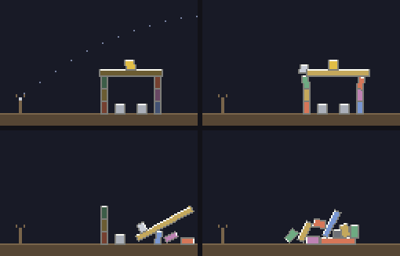

# g66 物理の積み木（パチンコで崩す）

物理 3 連作の**完成形**（g64 → g65 → g66）。g64 で書いた剛体、g65 で書いた箱どうしの衝突の上に、**パチンコ**と**面**と**得点**を載せました。

点線がねらいの見当。石を当てて**標的**（茶 100・銀 250・金 500 点）を割り、全部割ればクリア。残した弾は 1 発 100 点です。



左上から順に、ねらっているところ（点線が予測）→ 石が飛んでいるところ → 当たって金の標的が割れたところ → 次の面をクリアしたところ。

今回の主題は 4 つです。

- **`enum.IntEnum`** — 標的の種類が**そのまま点数**。`int` そのものなので `sum(taken)` で合計が出るし、色の辞書の鍵にもそのまま使える
- **`itertools.groupby`** — 得点の内訳を種類ごとに。**先に並べ替えないと分かれない**のが落とし穴
- **`bisect.insort`** — 上位 5 件の記録を、**並べ直さず並んだまま**差し込む（`key=` が使えます）
- **`contextlib.suppress`** — まだ記録が無い最初の 1 回を、`try/except` より短く素直に

## ブラウザ版

インストールせずに遊べます → **https://hicocho.github.io/python-study/g66/**

ソースは [`docs/g66/game.py`](../docs/g66/game.py)。物理も面の表も得点の内訳も、**キーを受ける `obey()` まで 1 文字も変えずに**持ってきています。違うのは記録の置き場所だけ（CLI は `records.json`、ブラウザは `localStorage`）。同じ狙いで撃った結果を**画素で比べて 10080 個すべて一致**しました。

## 遊び方（ターミナル）

```bash
python3 main.py                    # ←→ 角度、↑↓ 強さ、空白で撃つ、n 次の面、r やり直し、q やめる
python3 main.py --check            # 面の作り間違いを調べ、全部の面を自動で撃って解けるか見る
python3 main.py --auto             # 自動で撃つところを 1 面ぶん見せる
python3 main.py --physics          # 物理が壊れていないか見る
python3 main.py --records          # 残っている記録を出す
```

`--check` の出力。

```text
面の作り: 問題なし
かべ    クリア      1200 点  取った 3/3（GOLD 1・STONE 2）  残した弾 2
とう    クリア      1050 点  取った 3/3（GOLD 1・STONE 1・WOOD 1）  残した弾 2
やぐら   クリア       550 点  取った 3/3（STONE 1・WOOD 2）  残した弾 1
```

## 仕様

- 面は 3 つ（かべ 3 発 / とう 3 発 / やぐら 4 発）。**並び順は自動プレイで決めました**（下の「面の順番」）
- 角度は −70° 〜 −10° の 13 段階、強さは 4 段階。組み合わせは 52 通り
- 標的は **強くぶつかると割れる**（`shock > BREAK`）。落ちてきた箱でも割れるので、**連鎖**が起きます
- 得点は 標的の点数の合計 ＋ 残した弾 × 100。面をまたいで積み上がります
- 記録は上位 5 件。CLI は `main.py` の隣の `records.json`、ブラウザは `localStorage`

## メモ

### `IntEnum` — 種類と点数を 1 つにする

```python
class Prize(IntEnum):
    """標的の種類。**値がそのまま点数**なので、取った標的を sum() すれば合計になる。

    ふつうの Enum と違って int そのものなので、足し算も比較もそのままできる。
    「種類」と「点数」を別々に持つと、必ずどちらかを直し忘れる。
    """

    WOOD = 100
    STONE = 250
    GOLD = 500
```

`Enum` なら `Prize.GOLD.value` と書かないと足せませんが、`IntEnum` は `int` そのもの。

```python
                self.score += int(box.prize)        # IntEnum なので、そのまま足せる
```

```python
    if box.prize is not None:
        return PRIZE_COLORS[int(box.prize)]         # IntEnum なので、そのまま鍵に使える
```

`sorted(taken, reverse=True)` も、点数の高い順に並びます（`GOLD` → `STONE` → `WOOD`）。**「種類」と「点数」と「並び順」が 1 か所で決まる。**

### `groupby` は「並んでいるもの」しかまとめられない

```python
def breakdown(taken: list[Prize]) -> list[tuple[str, int, int]]:
    """取った標的を種類ごとにまとめる。(名前, 個数, 小計) の一覧。

    **groupby は「並んでいるもの」しかまとめられない。** 撃った順のまま渡すと、
    金・木・金 が 3 組になってしまう。だから先に並べ替える。
    """
    rows = []
    for kind, group in groupby(sorted(taken, reverse=True)):
        got = list(group)
        rows.append((kind.name, len(got), sum(got)))
    return rows
```

SQL の `GROUP BY` と同じ名前ですが、中身は違います。`itertools.groupby` は**隣り合った同じものを束ねるだけ**。並べ替えを忘れると、

```text
[GOLD, WOOD, GOLD] → GOLD 1 個 ・ WOOD 1 個 ・ GOLD 1 個
```

になります。エラーにはならず、**それらしい間違った表**が出るのがたちの悪いところ。

`group` は使い捨ての反復子なので、`len()` も 2 回目の `for` もできません。`list(group)` で受けてから数えます。

### `bisect.insort` — 並べ直さずに差し込む

```python
def remember(rows: list[Record], record: Record, keep: int = 5) -> list[Record]:
    """記録を差し込む。**並べ直さず、並んだままの所へ挿す**（bisect.insort）。

    key に -score を渡すと、得点の高い順に並んだ列を保てる。
    毎回 sort し直しても結果は同じだが、insort は「どこへ入るか」を二分探索で
    見つけて挿すだけなので、列が長くなっても速い。
    """
    insort(rows, record, key=lambda r: -r.score)
    return rows[:keep]
```

`bisect` に `key=` が付いたのは Python 3.10 から。これが無かった頃は「並べ替え用の値を先頭に持つタプル」を作る必要がありました。

5 件しか持たないので速さは関係ありませんが、**「並んでいる列を、並んだまま保つ」という書き方**を覚えるのが目的です。g58 で `bisect_right`（探す側）を使ったので、今回は挿す側。

### `contextlib.suppress` — 「無かったら何もしない」を 1 行で

```python
def load_records(path: Path = RECORDS) -> list[Record]:
    """記録を読む。**まだ 1 回も遊んでいなければ、空で始まる。**

    suppress を使うと「無かったら何もしない」が 1 行で書ける。
    except で潰すのと同じだが、「握りつぶしているのはこれだけ」がはっきりする。
    """
    rows: list[Record] = []
    with suppress(FileNotFoundError, json.JSONDecodeError):
        rows = [Record(**row) for row in json.loads(path.read_text())]
    return rows
```

`try/except: pass` と同じ意味ですが、**握りつぶす例外が `with` の行に並んで見える**のが利点。`pass` だけの `except` は、あとから読むと「何を握りつぶすつもりだったのか」が分かりません。

### 割れる強さは、測って決める

標的は「強くぶつかった」ときだけ割れます。その境目を勘で決めると、割れなさすぎるか、置いただけで割れます。

```python
    def crack(self) -> None:
        """強くぶつかった標的を割る。落ちてきた箱でも割れるので、連鎖が起きる。"""
        for box in self.boxes:
            if box.prize is not None and box.shock > BREAK:
```

`Body.push()` に 1 行足して、1 コマぶんの衝撃を貯めます。

```python
        self.shock += abs(impulse)                  # 割れるかの判定に使う
```

そのうえで測りました。

| | 標的が受ける衝撃 |
|---|---|
| ただ置いてあるだけ（面が落ち着くまで） | 最大 **10.9** |
| 石が当たったとき（52 通りの狙いのうち上位） | 493 〜 **770** |
| 同じく、全部の狙いの真ん中あたり | 196 |

**置いただけの 10.9 と、当たったときの 200〜770 のあいだ**なら何でもよく、`BREAK = 90.0` にしました。連鎖（崩れてきた箱が別の標的を割る）は 94 くらいで起きるので、ここを高くしすぎると連鎖が消えます。

### 面の順番は、自動プレイで決めた

52 通りの狙いを全部試して、いちばん点の入る 1 発を選ぶ——を弾がなくなるまで繰り返す `autoplay()` を書きました。3 つの面を作った時点で走らせると、

| 面 | クリアに要った弾 | 得点 |
|---|---|---|
| かべ | 1 発 | 1200 |
| とう | 1 発 | 1050 |
| やぐら | **3 発** | 550 |

**やぐら（梁の下に標的が隠れている）がいちばん難しい**と分かったので、かべ → とう → やぐら の順に並べ替えました。作った順（やぐら → かべ → とう）のままだと、いちばん難しい面が 1 面目になります。

### つまずいた: 自動プレイが 3 発とも同じ狙いを撃った

最初の `best_shot()` は、狙いを試すたびに**面を作り直して**いました。

```python
            trial = World(level=world.level)        # ← 悪い。1 発目で崩した形が消える
```

そのため 2 発目以降も「まっさらな面に 1 発撃つ」を評価してしまい、**3 発とも同じ角度**を選びます（やぐらで 100 点しか取れなかった）。

```python
            trial = deepcopy(world)                 # 今の世界をまるごと複製してから撃つ
```

に直したら、同じ面で 450 点まで伸びました。**先を読むには「今の世界」を複製する。** 物理が決まった刻みで動く（g64 の fixed timestep）ので、同じ狙いなら必ず同じ結果になり、比べる意味があります。

### 面の作り間違いを、動かす前に見つける

```python
def check_layout() -> list[str]:
    """面の作り間違いを、動かす前に見つける。

    見るのは 3 つ。箱どうしが最初から重なっていないか、床にめり込んでいないか、
    宙に浮いていないか（浮いていると、撃つ前に崩れてしまう）。
    """
```

最初に作った 3 面のうち、**標的が梁の中に埋まっている**面が 2 つありました（`(74, 62)` の標的と `(82, 62)` の梁が重なっていた）。動かすといきなり吹き飛びます。

この検査を書いたら 4.32 ドットのめり込みが一発で見つかり、直したあとは 0.128 に。**g62 で「事件が詰まないか」を機械に調べさせたのと同じ考え方**です——作ったデータが正しいかを、動かす前に機械に言わせる。

ただし「撃つ前に少しも動かない」を条件にすると厳しすぎます。接ぎ目ごとのめり込み（0.1〜0.4 ドット）が積み上がるので、5 階建ての塔は 1 ドットほど沈むのが普通。閾値は 2.0 ドットにしました。

### ねらいの点線は、物理を通さない

```python
    def flight(self, steps: int = 26, every: int = 3) -> list[complex]:
        """ねらいの見当。ぶつかりを無視して、重力だけで飛ばした点を並べる。

        当たり判定を通さないので本番とは少しずれるが、「どのあたりへ飛ぶか」は
        これで十分わかる。物理そのものを使わずに、同じ式だけを使うのが要点。
        """
```

本物の `World` を複製して飛ばせば完全に正確ですが、毎コマ 52 通り…ではなく 1 通りとはいえ重すぎます。**重力と速度の式だけを使い回す**のが答え。`Body.step()` と同じ 2 行なので、ずれるのは「何かに当たったあと」だけです。

### 段階を追う

同じ狙い（−25°・強 2）で 1 発撃って測りました。

| | 足したもの | 1 発の得点 | 全部割ったあと | 自動プレイ |
|---|---|---|---|---|
| step1 | パチンコと点線 | 0（標的はまだ割れない） | — | — |
| step2 | 標的が割れる（`IntEnum`） | **500** | 撃ち放題なので 1000 点まで取れる | — |
| step3 | クリア・おしまい・面送り | 500 | **クリアで止まる** | 1000 点 |
| step4 | 内訳・弾のおまけ・面の検査 | 500 | 同上 | **1200 点**（残した弾 2 × 100） |
| step5 | 記録 | 500 | 同上 | 1200 点＋記録が残る |

### 検証

| 何を | どう確かめたか | 結果 |
|---|---|---|
| 面の作り | `check_layout()`（重なり・床・浮き） | 3 面とも問題なし（最初は 4.32 ドットの重なりを検出） |
| 面が解けるか | 52 通りの狙いを総当たりする自動プレイ | **3 面ともクリア**（1200 / 1050 / 550 点） |
| 物理 | `--physics`（g65 と同じ 3 つ） | 0.43 秒で全部眠り、めり込み 0.178、エネルギー 0.00 |
| 割れる強さ | 置いただけ / 当たったとき の衝撃を測る | 10.9 と 196〜770。`BREAK = 90` はその間 |
| `groupby` | 撃った順のまま渡した場合と比べる | 並べ替えないと同じ種類が分かれる |
| 記録 | 端末で遊んで `records.json` を読む | 1 件書かれ、`--records` で読めた |
| 端末の入力 | `pty.fork()` で → → → ↓ 空白 n q | 画面更新 427 回、面が かべ → とう、得点 0 → 250 → 500 |
| ブラウザ | Playwright で狙って撃つ・弾切れまで | 500 点で「おしまい」、`localStorage` に記録が 1 件。エラー 0 |
| **CLI とブラウザが同じか** | 同じ狙いで撃った結果を画素で比較 | **10080 / 10080 一致**（得点も内訳も同じ） |

### 物理 3 本（g64〜g66）で覚えた文法

| # | 作ったもの | 覚えた文法 |
|---|---|---|
| g64 | 剛体の箱 | 複素数で剛体（`1j` をかけて 90 度回す）/ 撃力での衝突解決 / クーロン摩擦 / 眠り / 固定の刻み幅 |
| g65 | 箱どうしの衝突 | 分離軸法（SAT）と `min(key=)` / `typing.NamedTuple` / `math.inf` を質量に / `@dataclass(slots=True)` |
| g66 | パチンコで崩す | `enum.IntEnum` / `itertools.groupby` / `bisect.insort` / `contextlib.suppress` / `copy.deepcopy` で先を読む |

**この 3 本を通しての学びは、「物理の定数は勘で決めず、測って決められる」**ことでした。`WAKE_SPEED` は載っているだけの箱の速度から、`ITERATIONS` はめり込みと速さの表から、`BREAK` は置いただけと当たったときの衝撃から。**そして面の難しさも、自動プレイに測らせて並べ替えました。**

もうひとつは、**同じ間違いを形を変えて繰り返す**こと。g64 で「触れているだけで起こすと眠れない」を踏み、g65 で同じことを「触られたら起きる」の形でやり、g66 では「複製せずに評価する」で 3 発とも同じ狙いを撃ちました。どれも**「今の状態」と「もとの状態」を取り違えた**という同じ形をしています。
