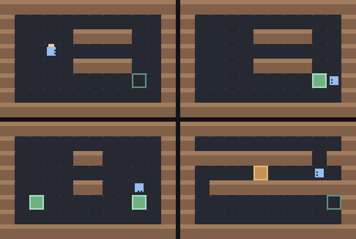

# g67 倉庫のロボット（自作ミニ言語）

**言語を自分で作る** 3 連作の 1 つ目。`move 3` や `right` と書いてロボットに命令し、倉庫の荷物を棚まで運ばせます。

字句解析（文字を語に切る）→ 命令の組み立て → 1 コマずつの実行、を全部自分で書いています。**書き間違いは行と桁と `^` で教えてくれます**——Python 自身の `SyntaxError` と同じ出し方です。



左上から順に、荷物を持ち上げたところ → 棚に置いた（**緑が置き終わった荷物**）→ 面 2 を運び終わったところ → 面 3 の長い通路。

今回の主題は 4 つです。

- **`re.finditer` と名前付きの枠**（`(?P<name>...)`）で**字句解析器**を書く。**最後に「ほかのどれでもない 1 文字」の枠を置く**のが肝
- **位置を持ったトークン** — `Token` に行と桁を入れておくから、あとで「3 行目の 6 文字目」と指せる
- **自作の例外に報告を書かせる** — `ProgramError.report()` が、行の中身・`^`・説明の 3 行を返す
- **ジェネレータで 1 コマずつ実行** — `run()` が `yield` するので、呼ぶ側が「1 命令だけ進める」「今の行を光らせる」を自由にできる

## ブラウザ版

インストールせずに遊べます → **https://hicocho.github.io/python-study/g67/**

ソースは [`docs/g67/game.py`](../docs/g67/game.py)。字句解析も、命令の組み立ても、書き間違いの報告も、実行も、キーを受ける `obey()` まで **1 文字も変えずに**持ってきています。同じお手本を走らせた結果を**画素で比べて 9600 個すべて一致**しました。

## 遊び方（ターミナル）

```bash
python3 main.py                    # 空白 1 コマ / r 一気に / b もどす / n 次の面 / q やめる
python3 main.py プログラム.txt       # 自分で書いたプログラムを走らせる
python3 main.py --tokens           # 語の一覧（字句解析の結果）を見る
python3 main.py --trace            # 1 コマずつ、何が起きたかを書き出す
python3 main.py --check            # お手本が全部の面を解けるか見る
python3 main.py --mistakes         # わざと間違えて、報告の出方を見る
```

`--check` の出力。

```text
面 1 はこびだし    解けた  10 命令 →  19 コマ  書き間違い なし
面 2 ふたつ      解けた  18 命令 →  24 コマ  書き間違い なし
面 3 ながいみち    解けた  12 命令 →  34 コマ  書き間違い なし
```

## 言葉の仕様

| 命令 | 意味 |
|---|---|
| `move N` | N マス前へ。壁や荷物にぶつかったら、そこで止まる |
| `left` / `right` | その場で 90 度回る |
| `pick` | **目の前**の荷物を持つ。手はひとつだけ |
| `drop` | **目の前**に置く。棚の上に置けば運び終わり |
| `wait N` | N コマ何もしない |
| `# …` | 行末までメモ |

- 1 行に 1 命令。空行とメモは無視されます
- 面は 3 つ。全部の棚に荷物が載ればクリア

## メモ

### 字句解析 — 最後に「何でも 1 文字」の枠を置く

```python
WORDS = re.compile(r"""
      (?P<space>[ \t]+)
    | (?P<comment>\#[^\n]*)
    | (?P<newline>\n)
    | (?P<number>\d+)
    | (?P<name>[A-Za-z_][A-Za-z_0-9]*)
    | (?P<bad>.)
""", re.VERBOSE)
```

`re.finditer` は「当たったところ」を順に返します。名前付きの枠（`(?P<name>...)`）を `|` で並べておくと、`m.lastgroup` で**どの枠に当たったか**が分かる。これだけで字句解析器になります。

要点は**いちばん最後の `bad`**です。`.` は「ほかのどれでもない 1 文字」に当たるので、**読めない文字が黙って消えることがなくなる**。これが無いと `move ★` の `★` は素通りして、`move` だけが残り、「なぜか動きがおかしい」になります。

順番も大事で、`number` を `name` より先に置いています。逆にすると `3` は `name` に当たりません（`name` は数字で始まらないので今回は問題になりませんが、`if` と `iffy` のような並びでは**長い方を先に**書く必要があります）。

### 位置を捨てない

```python
class Token(NamedTuple):
    """語 1 つ。**どの行のどの桁にあったか**まで覚えておく。

    これがあるから、あとで「3 行目の 6 文字目が読めません」と言える。
    位置を捨ててしまうと、間違いの場所を指せなくなる。
    """

    kind: str
    text: str
    line: int
    col: int
```

行と桁は、`finditer` を回しながら数えます。

```python
    line, start = 1, 0                              # start はこの行が始まる位置
    for m in WORDS.finditer(source):
        ...
        token = Token(kind, m.group(), line, m.start() - start + 1)
```

**桁は「この行が始まった位置からの差」**。改行に当たるたびに `start` を更新するので、行をまたいでも数え直しが要りません。

`--tokens` で結果を目で見られるようにしてあります。

```text
  行   桁  種類       中身
  1  11  newline  改行
  2   1  name     right
  2   6  newline  改行
  3   1  name     move
  3   6  number   2
```

### 例外に報告を書かせる

```python
class ProgramError(Exception):
    """書き間違い。**どの語が悪かったか**を覚えていて、そのまま画面に出せる。

    Python 自身の SyntaxError も、出しているのは同じ 3 つ——行の中身、
    どこかを指す ^、そして説明。位置を持った Token を作っておいたのは、
    このためだった。
    """

    def __init__(self, message: str, token: Token):
        super().__init__(message)
        self.token = token

    def report(self, source: str) -> list[str]:
        """3 行の報告を組み立てる。行の中身・^・説明。"""
```

**例外に「どう表示するか」まで持たせる**のが効きました。投げる側は `raise ProgramError("…", token)` と書くだけ。受ける側（端末・ブラウザ・テスト）は `report()` を呼ぶだけで、同じ形の報告が出ます。

見ているのは 7 つ。

```text
2 行目 1 文字目: jmp という命令はありません（使えるのは move・left・right・pick・drop・wait）
  jmp 2
  ^^^

1 行目 1 文字目: move には回数が要ります（例: move 3）
  move
  ^^^^

1 行目 6 文字目: left に回数は付けられません
  left 2
       ^
```

`^` の長さは語の長さに合わせています（`jmp` なら 3 つ）。ここを 1 文字にすると、どこまでが悪いのかが分からない。

### ジェネレータで 1 コマずつ

```python
def run(world: Warehouse, program: list[Order]):
    """プログラムを 1 コマずつ実行する。**ジェネレータなので途中で止められる。**

    move 3 は「1 マス進む」を 3 コマに分ける。まとめて動かすと、
    途中で壁にぶつかった様子が見えない。
    """
    for order in program:
        for _ in range(max(order.count, 1)):
            yield Beat(order.line, act(world, order.name))
```

呼ぶ側はこれだけ。

```python
    def advance(self) -> bool:
        if self.beats is None:
            self.beats = run(self.world, self.program)
        beat = next(self.beats, None)
        ...
```

**「どこまで実行したか」を自分で数えなくていい**のが、ジェネレータの効き目です。`for` の入れ子（命令の列 × 回数）が 2 段あるのに、外から見れば `next()` を 1 回呼ぶだけ。

もし普通の関数にしていたら、「今どの命令の、何回目か」を `Game` が持つことになり、`move 3` の途中で止める処理を自分で書くことになります。

`Beat` に**行番号**を入れて返すので、画面はその行を光らせるだけで済みます（端末は `▶`、ブラウザは同じ `listing()` の文字列）。

### つまずいた: 終わった瞬間に画面が「はじめから」に戻る

`advance()` を最初こう書いていました。

```python
        self.beat = next(self.beats, None)          # ← 悪い
        if self.beat is None:
            return False
```

実行が終わると `beat` が `None` になり、**最後に何が起きたか（「棚に置いた」）が消えて**、画面が「はじめから」に戻ります。ブラウザ版では終了時に描き直していなかったので気づかず、CLI 側で見つかりました。

```python
        beat = next(self.beats, None)
        if beat is None:                            # 終わっても最後のコマは消さない
            self.running = False                    # （消すと画面が「はじめから」に戻ってしまう）
            return False
        self.beat = beat
```

**「終わった」と「何も起きていない」を同じ `None` で表さない。** ついでにブラウザ側も「止まった回も描く」ように直しました（描かないことで症状が隠れていた）。

### 面は、お手本が解けることを機械に確かめさせる

```python
def check_stages() -> list[str]:
    """全部の面で、お手本のプログラムが本当に解けるかを見る。"""
```

面を手で作ると、**通れない道や、届かない棚**を平気で作ってしまいます。実際、面 3 は最初「棚の上のマスが壁で、どこからも `drop` できない」形になっていました。

お手本のプログラムを置いて `--check` で走らせると、そこが一発で分かります。g62 で「事件が詰まないか」を、g66 で「面の作り間違い」を機械に調べさせたのと同じ考え方です。

### 倉庫の絵

1 マス 10 × 10 ドット、12 × 8 マスで 120 × 80。ロボットは正面に目を 2 つ描くだけで向きが分かります。

```python
    dx, dy = WAYS[world.facing]
    for side in (-1, 1):
        screen.plot(cx + dx * 2 - dy * side, cy + dy * 2 + dx * side, ROBOT_EYE)
```

`(dx, dy)` が進む向き、`(-dy, dx)` がその直角。**向きのベクトルを 90 度回すだけで「顔の左右」になる**ので、4 方向ぶんの絵を描かずに済みます（g64 で `1j` をかけて 90 度回したのと同じ考え方を、整数の組でやっているだけ）。

棚に載った荷物は**緑**にしました。載せる前と同じ色だと、棚の枠が荷物に隠れて「置けたのかどうか」が見えません。

### 検証

| 何を | どう確かめたか | 結果 |
|---|---|---|
| 字句解析 | `--tokens` で行・桁・種類を目で見る | コメントと空白は落ち、改行が残る。桁が 1 から数えられている |
| 書き間違い | 7 通りのわざと間違えたプログラム | 7 通りとも行・桁・`^` 付きで報告（`--mistakes`） |
| 面が解けるか | お手本を `--check` で走らせる | 3 面とも解けた（19 / 24 / 34 コマ） |
| 1 コマずつ | `--trace` で 1 行ずつ書き出す | 命令と位置と向きが順に並ぶ |
| 端末の入力 | `pty.fork()` で 空白×3 → r → n → r → b → q | 面 1 → 面 2、出来事 5 種類、0〜24 コマ、「運び終わった！」まで |
| ブラウザ | Playwright で 1 コマ・走らせる・書き間違い・次の面 | 19 コマで完了、`jmp` に赤い報告、面 2 へ |
| **CLI とブラウザが同じか** | お手本を走らせ切った画面を画素で比較 | **9600 / 9600 一致** |

### 次

g68 で `repeat 4 { ... }` と `if front is wall { ... }`——**再帰下降パーサ**と自作の構文木。面 3 の「同じ手順の繰り返し」が短く書けるようになります。g69 で変数と関数（`ChainMap` でスコープ）。
