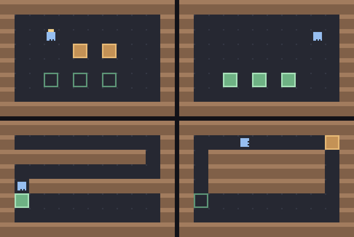

# g68 倉庫のロボット2（繰り返しと条件）

g67 の続き。言葉に **`repeat` と `if` と `while`** が入りました。並んだ命令を読むだけだった作りを、**再帰下降で構文木を作り、`functools.singledispatch` で実行する**形に組み直しています。

書き間違いは **1 つ目で止めず、全部まとめて**報告します（`ExceptionGroup` と `except*`）。



左上から順に、面 1 で荷物を持ち上げたところ → 3 つとも棚に置き終わったところ（緑）→ 面 2 の突き当たり → 面 3 の輪になった通路。

今回の主題は 4 つです。

- **再帰下降パーサ** — 「文を読む関数」が「中身の文を読む関数」を呼ぶ。**それがそのまま入れ子の構造**になる。条件式の `or` < `and` < `not` の優先順位も、関数の呼び出しの深さで表す
- **`functools.singledispatch`** — 木の節の種類ごとに関数を登録する。**同じ木に「実行する」「字にする」「数える」を、木を触らずに足せる**
- **`textwrap.indent`** — 木を字にするとき、子の固まりを丸ごと字下げする。1 段ぶんの字下げを 1 か所に書くだけ
- **`ExceptionGroup` と `except*`** — 見つけた書き間違いを貯めておいて、まとめて 1 つの例外として投げる

## ブラウザ版

インストールせずに遊べます → **https://hicocho.github.io/python-study/g68/**

**書いたプログラムの構文木が画面に出ます。** ソースは [`docs/g68/game.py`](../docs/g68/game.py)。パーサも実行も **1 文字も変えずに**持ってきていて、同じお手本を走らせた結果は**画素で 9600 個すべて一致**しました。

## 遊び方（ターミナル）

```bash
python3 main.py                    # 空白 1 コマ / r 一気に / b もどす / n 次の面 / q やめる
python3 main.py --tree             # 構文木を見る
python3 main.py --check            # お手本が全部の面を解けるか見る
python3 main.py --mistakes         # わざと間違えて、報告の出方を見る
python3 main.py --trace            # 1 コマずつ書き出す
```

`--check` の出力。

```text
面 1 くりかえし    解けた  書いた文 15（repeat を開くと  32）→  42 コマ  書き間違い 0 か所
面 2 つきあたり    解けた  書いた文 15（repeat を開くと  15）→  52 コマ  書き間違い 0 か所
面 3 ぐるり      解けた  書いた文 11（repeat を開くと  11）→  92 コマ  書き間違い 0 か所
```

## 言葉の仕様（g67 からの追加）

| 書き方 | 意味 |
|---|---|
| `repeat N { … }` | 中身を N 回 |
| `if 条件 { … } else { … }` | 条件を見て、どちらかを 1 回。`else` は省ける |
| `while 条件 { … }` | 条件が本当である間ずっと |
| `front is wall / free / crate / shelf` | 目の前を見る。`free` は「通れるか」 |
| `holding` | 荷物を持っているか |
| `not` / `and` / `or` / `( )` | 条件をつなぐ。強さは `not` > `and` > `or` |

## メモ

### 再帰下降 — 入れ子を、関数の入れ子で読む

```python
    def braced(self) -> tuple:
        """{ から } まで。中身は block がそのまま読む（＝再帰）。"""
        self.want("punct", "{", "ここには { が要ります")
        body = self.block(closing="}")
        self.want("punct", "}", "} が足りません")
        return body
```

`block()` が `statement()` を呼び、`statement()` が `braced()` を呼び、`braced()` がまた `block()` を呼ぶ。**この輪がそのまま「入れ子はいくらでも深くできる」を意味します。** `repeat` の中に `if` があり、その中にまた `while` があっても、同じ関数が再帰で呼ばれるだけで、深さを数える変数はどこにもありません。

条件式の優先順位も同じ形で書けます。

```python
    def test(self):
        """条件式。or がいちばん弱く、not がいちばん強い。

        「弱い方から順に関数を呼ぶ」と、優先順位がそのまま関数の呼び出しの
        深さになる。掛け算が足し算より強い、を同じ形で書ける。
        """
        node = self.and_test()
        while self.at("name", "or"):
            self.take()
            node = Either(node, self.and_test())
        return node
```

`test → and_test → not_test → atom` と、**弱い順に呼ぶ**。`a or b and c` は `a or (b and c)` と読まれます。かっこの `atom` が `test()` を呼び戻すので、`(a or b) and c` も書けます。

### `singledispatch` — 木を触らずに、ふるまいを足す

構文木の節は `frozen` な dataclass で、**何が書いてあったか**しか持っていません。

```python
@dataclass(frozen=True)
class Repeat:
    """repeat N { ... }。body の中にまた節が入るので、木になる。"""

    count: int
    body: tuple
    line: int
    col: int
```

実行は、節の外側で振り分けます。

```python
@singledispatch
def perform(node, world: Warehouse):
    """節を 1 つ実行する。**節の種類ごとに、下で別々の関数を登録する。**

    if の連なりや match で振り分けてもいいが、singledispatch なら
    「節を 1 つ足したら、その節のための関数を 1 つ足す」だけで済む。
    木の側（dataclass）は何も知らなくていい。
    """
    raise TypeError(f"知らない木の節です: {node!r}")


@perform.register
def perform_repeat(node: Repeat, world: Warehouse):
    """回数ぶん、中身をそのまま流す。**yield from が入れ子をつなぐ。**"""
    for _ in range(node.count):
        yield from walk(node.body, world)
```

ステップ1 では `isinstance` の連なりで書いていました。

```python
    if isinstance(node, Do):
        ...
    elif isinstance(node, Repeat):
        ...
```

節が 2 種類のうちは差がありませんが、**最終的に節は 9 種類**になります。`singledispatch` にしておくと、節を足すときに触るのは「その節のための関数を 1 つ足す」だけ。既にある関数を開いて `elif` を差し込む必要がありません。

そして効き目が出るのは、**同じ木に別のふるまいを足すとき**です。この課題では 4 つ足しました。

| 何をする | 入口 |
|---|---|
| 実行する | `perform` |
| 条件を確かめる | `ask` |
| 字にする（構文木の表示） | `sketch` / `phrase` |
| 文の数を数える | `count` |
| `repeat` をほどいたら何文か | `unroll` |

**木（dataclass）には、表示のコードも数えるコードも 1 行も入っていません。**

### `yield from` が入れ子をつなぐ

```python
def walk(body: tuple, world: Warehouse):
    """並んだ節を順に実行する。木をたどる入口。"""
    for node in body:
        yield from perform(node, world)
```

g67 で「1 コマずつ実行する」をジェネレータにしておいたのが、ここで効きました。`repeat` の中の `if` の中の `while` の中の `move` が出す 1 コマも、`yield from` の鎖をたどって外まで出てきます。**呼ぶ側は相変わらず `next()` を 1 回呼ぶだけ。**

`while` は毎回「条件を見た」という 1 コマを出します。

```python
@perform.register
def perform_while(node: While, world: Warehouse):
    """条件が本当である間、ずっと。**毎回 1 コマ使う**ので、止まらない
    プログラムも呼ぶ側の上限で必ず打ち切れる。"""
    while ask(node.test, world):
        yield Beat(node.line, "条件は本当")
        yield from walk(node.body, world)
    yield Beat(node.line, "条件は違う")
```

中身が空の `while` でも 1 周につき 1 コマ出るので、**上限（4000 コマ）で必ず止められます**。止まるかどうかを先に調べることはできない（停止性問題）ので、こうやって守るしかありません。

### `textwrap.indent` — 字下げを 1 か所に

```python
@sketch.register
def sketch_repeat(node: Repeat) -> str:
    return f"repeat {node.count}\n" + indent(sketch_all(node.body), "    ")
```

`indent(text, "    ")` は**複数行の文字列の、行という行の頭に**印を付けます。子が何行あっても、何段深くても、書くのは 1 回だけ。自分で `"\n".join("    " + line for line in ...)` と書くのと同じですが、**空行には字下げを入れない**という違いがあります（それが欲しい挙動）。

出てくる木。

```text
while not holding
    if front is crate
        pick
    else
        if front is free
            move 1
        else
            right
while not front is shelf
    if front is free
        move 1
    else
        right
drop
```

### `ExceptionGroup` — 間違いを全部まとめて

パーサはふつう、1 つ目の間違いで止まります。それだと**直しては走らせ、を間違いの数だけ繰り返す**ことになる。

```python
            try:
                body.append(self.statement())
            except ProgramError as err:
                self.errors.append(err)
                self.recover()
```

```python
def build(source: str) -> tuple:
    """文字列から構文木を作る。書き間違いは**全部**集めてから、まとめて投げる。

    ExceptionGroup は「同時に起きた複数の失敗」を 1 つにまとめて運ぶ入れ物。
    1 つ目で止めると、直しては走らせ、を間違いの数だけ繰り返すことになる。
    """
    parser = Parser(scan(source), source)
    body = parser.block()
    if parser.errors:
        raise ExceptionGroup("プログラムに書き間違いがあります", parser.errors)
    return body
```

受ける側は `except*`。

```python
        try:
            self.program = build(source)
        except* ProgramError as group:
            self.program = ()
            self.errors = list(group.exceptions)
```

`except*` は「そのグループの中から、その種類のものだけ」取り出す書き方です（3.11 から）。ふつうの `except` でも `ExceptionGroup` を丸ごと受け取れますが、`except*` なら**種類ごとに別々に扱える**（ここでは 1 種類しか投げないので、恩恵は「意図が読める」ことの方）。

5 本のわざと間違えたプログラムで測ると、

| | 報告できた間違い |
|---|---|
| ステップ4 まで（1 つ目で止まる） | 5 か所 |
| ステップ5（まとめて投げる） | **10 か所** |

### つまずいた: エラーから立ち直るときに、同じ場所で永遠に回った

間違いを見つけたあと、続きを読むために「次の行まで飛ばす」処理（`recover`）を書きました。最初はこうでした。

```python
        while not self.at("end") and not self.at("newline") and not self.at("punct", "}"):
            self.i += 1
```

**`}` の上で間違いが起きると、1 つも進まないまま戻ります。** すると同じ `}` でまた失敗し、また進まず……で固まりました（`--mistakes` が返ってこなくなった）。

```python
        if not self.at("end"):
            self.i += 1
        while not self.at("end") and not self.at("newline") and not self.at("punct", "}"):
            self.i += 1
```

**エラーから立ち直る処理は、必ず 1 つは進める。** 「進まないかもしれない繰り返し」は、それだけで無限ループの種です。

もうひとつ、回復のあとに**つられた間違い**が出ます。

```text
1 行目 8 文字目: repeat には回数が要ります（例: repeat 4 {）
  repeat {
         ^

3 行目 1 文字目: 行のはじめは命令か repeat / if / while です
  }
  ^
```

`{` を開いたことになっていないので、`}` が余った語に見えている。本物のコンパイラでも同じことが起きます（1 つ目を直すと 2 つ目も消える）。**まとめて出す代わりに、後ろの方は当てにならない**——それを承知で出す、という取引です。

### 段階を追う

| | 足したもの | 使える文 | 解ける面 | 報告できた間違い | 実行の振り分け |
|---|---|---|---|---|---|
| step1 | `{ }` と `repeat`、構文木 | 命令・repeat | 1 / 1 | 5 | `isinstance` の連なり |
| step2 | `singledispatch` に置き換え | 命令・repeat | 1 / 1 | 5 | **`singledispatch`** |
| step3 | センサーと `if` / `else` | ＋ if | 1 / 1 | 5 | `singledispatch` |
| step4 | `while` と打ち切りの上限 | ＋ while | **3 / 3** | 5 | `singledispatch` |
| step5 | `ExceptionGroup` | ＋ while | 3 / 3 | **10** | `singledispatch` |

### 検証

| 何を | どう確かめたか | 結果 |
|---|---|---|
| 面が解けるか | お手本を `--check` で走らせる | 3 面とも解けた（42 / 52 / 92 コマ） |
| `repeat` の効き目 | 書いた文と、ほどいた文を数える | 面 1 は 15 文 → ほどくと 32 文 |
| 構文木 | `--tree` で表示 | 入れ子が字下げで出る（上の例） |
| 書き間違い | 5 本のプログラム（合計 10 か所） | step4 は 5 か所、step5 は **10 か所** |
| 立ち直り | `}` だけの行、閉じ忘れ | 固まらずに報告できる（上の「つまずいた」） |
| 端末の入力 | `pty.fork()` で 空白×3 → r → n → r → b → q | 面 1 → 面 2、出来事 7 種類（「条件は本当 / 違う」を含む）、0〜44 コマ |
| ブラウザ | Playwright で走らせる・木を見る・書き間違い・面送り | 42 コマで完了、木が出る、2 か所の報告。エラー 0 |
| **CLI とブラウザが同じか** | 面 1 を走らせ切った画面を画素で比較 | **9600 / 9600 一致** |

### 次

g69 で**変数と関数**。`collections.ChainMap` でスコープを作り、自分で定義した手順を名前で呼べるようにします。
