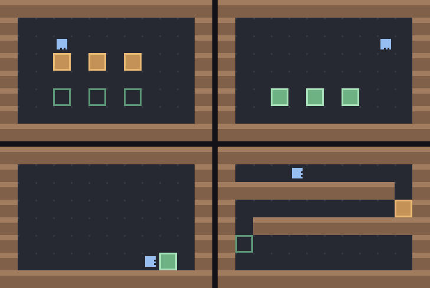

# g69 倉庫のロボット3（変数と手順）

自作ミニ言語 3 連作の**完成形**（g67 → g68 → g69）。**変数**（`set n = 2`）と**手順**（`to carry { … }`）が書けるようになりました。

手順の中で作った変数は**外に漏れません**——`collections.ChainMap` を 1 段かぶせるだけで、スコープになります。自分を呼ぶ**再帰**も書けます。



今回の主題は 4 つです。

- **`collections.ChainMap`** — 手順を呼ぶたびに `new_child()` で 1 段かぶせ、出るときに `.parents` で 1 段外す。**書くのは手前の段、読むのは奥まで探す**
- **`operator` の関数を表に入れる** — `CALCS = {"+": add, "-": sub, "*": mul, "/": floordiv}`。記号を増やすのが 1 行になる
- **書き間違いと、動かして分かる間違いを分ける** — `ProgramError`（読む前に分かる）と `RunError`（通ってみないと分からない）
- **再帰と、その見張り** — 呼び出しの深さに上限を付ける。止まるかどうかは先に調べられない

## ブラウザ版

インストールせずに遊べます → **https://hicocho.github.io/python-study/g69/**

ソースは [`docs/g69/game.py`](../docs/g69/game.py)。Parser も、`singledispatch` の振り分けも、`ChainMap` のスコープも **1 文字も変えずに**持ってきていて、同じお手本を走らせた結果は**画素で 9600 個すべて一致**しました。

## 遊び方（ターミナル）

```bash
python3 main.py                    # 空白 1 コマ / r 一気に / b もどす / n 次の面 / q やめる
python3 main.py --check            # お手本が全部の面を解けるか、星がいくつか
python3 main.py --tree             # 構文木を見る
python3 main.py --mistakes         # 2 種類の間違いの出方を見る
```

`--check` の出力。

```text
面 1 てじゅん     解けた  書いた文 17（目安 18）→  46 コマ  ★★★     手順 1 個  いちばん深い呼び出し 1 段
面 2 かぞえる     解けた  書いた文 11（目安 12）→  19 コマ  ★★★     手順 0 個  いちばん深い呼び出し 0 段
面 3 さいき      解けた  書いた文 18（目安 20）→  80 コマ  ★★★     手順 2 個  いちばん深い呼び出し 10 段
```

## 言葉の仕様（g68 からの追加）

| 書き方 | 意味 |
|---|---|
| `set 名前 = 式` | 変数に入れる |
| `to 名前 { … }` | 手順を決める（呼ばれるまで動かない） |
| `名前` | 決めた手順を呼ぶ |
| 式 | 数・変数・`+ - * /`・`( )`。`*` `/` の方が強い |
| `式 < 式` / `>` / `=` | 条件として使える |

- `move` や `repeat` の回数に**式**が書けます（`move step * 2`）
- 手順は**先に集める**ので、呼ぶ場所より後ろで決めても構いません（再帰も書けます）

## メモ

### `ChainMap` — 1 段かぶせるだけでスコープになる

```python
@perform.register
def perform_call(node: Call, run: "Runtime"):
    """決めた手順を呼ぶ。**入るとき 1 段かぶせ、出るとき 1 段外す。**

    かぶせるのは ChainMap.new_child()、外すのは .parents。これだけで
    「手順の中で作った変数は、外に漏れない。外の変数は中から見える」になる。
    """
    ...
    run.vars = run.vars.new_child()
    try:
        yield from walk(body, run)
    finally:
        run.vars = run.vars.parents                 # 途中で止めても、必ず戻す
```

`ChainMap` は**辞書を何枚も重ねて、1 枚の辞書のように見せる**道具です。

- 読むとき（`vars["n"]`）は、手前の段から順に探し、無ければ奥へ
- **書くとき（`vars["n"] = 3`）は、いちばん手前の段にだけ書く**

この 2 つが、そのまま「関数のローカル変数」の性質です。実際に測ると、

| | 手順の中で `set` した変数を、外から読む |
|---|---|
| ステップ3（1 つの辞書） | **読めてしまう（漏れる）** |
| ステップ4（ChainMap） | 「hidden という変数はまだありません」 |

`finally` で戻すのが大事です。手順の途中で実行を止めても（1 コマずつ進めている最中に `b` を押しても）、段が積まれたままになりません。

g51〜g54 の格闘ゲームでも `ChainMap` を使いましたが、あちらは「既定の設定に、その場の設定をかぶせる」用途でした。**同じ道具が、変数のスコープになる。**

### `operator` — 記号から関数を引く

```python
# 計算と比べ方。**演算子を自分で書かず、operator の関数を表に入れる。**
# こうすると「記号 → 何をするか」が 1 行になり、増やすのも 1 行で済む。
CALCS = {"+": add, "-": sub, "*": mul, "/": floordiv}
CHECKS = {"<": lt, ">": gt, "=": eq}
```

使うところはこれだけ。

```python
@value.register
def value_calc(node: Calc, run: "Runtime") -> int:
    """計算。記号から関数を引くだけ（CALCS の表）。"""
    left, right = value(node.left, run), value(node.right, run)
    if node.op == "/" and right == 0:
        raise RunError("0 では割れません", node)
    return CALCS[node.op](left, right)
```

`match node.op: case "+": ...` と書くのと同じですが、**「使える記号の一覧」が表そのもの**になります。パーサ側も `self.at("punct", "+")` ではなく表を見れば済むし、エラーメッセージの `' '.join(CHECKS)` もここから作れます。

`operator.floordiv` にしたのは、この言葉に整数しか無いからです（`5 / 2` は 2）。

### 式の優先順位は、また同じ形

g68 で条件式の `or` < `and` < `not` を「弱い方から順に関数を呼ぶ」で書きました。四則も**まったく同じ形**です。

```python
    def expr(self):
        """足し算・引き算。**条件のときと同じ手で、弱い方から順に呼ぶ。**"""
        node = self.term()
        while self.at("punct", "+") or self.at("punct", "-"):
            op = self.take()
            node = Calc(op.text, node, self.term(), op.line, op.col)
        return node

    def term(self):
        """掛け算・割り算。足し算より強いので、内側で読む。"""
        node = self.factor()
        while self.at("punct", "*") or self.at("punct", "/"):
            ...
```

`set n = 2 + 3 * 4` は **14** になります（`(2 + (3 * 4))`）。木を見れば一目です。

```text
set n = (2 + (3 * 4))
```

### 2 種類の間違いを分ける

```python
class RunError(Exception):
    """**動かしてみて初めて分かった**間違い。書いている時点では気づけない。

    未定義の変数、決めていない手順、0 で割った、呼び出しが深すぎる——どれも
    「そこを通ったら分かる」もの。書き間違い（ProgramError）と分けて扱う。
    """
```

`--mistakes` は 2 つの見出しで出します。

```text
── 書く前に分かる間違い ──
書き間違いが 2 か所あります
1 行目 5 文字目: set のあとは変数の名前です（例: set n = 3）
  set 3 = n
      ^
…

── 動かしてみて分かる間違い ──
動かしてみたら、止まりました
1 行目 6 文字目: n という変数はまだありません
  move n
       ^
```

### 手順を足したら、「知らない命令」が書く前に分からなくなった

g68 までは、`jmp 2` と書くと**読んだ時点で**「jmp という命令はありません」と言えました。g69 で `to` を入れると、**名前だけの行は「手順の呼び出し」として文法的に正しく**なります。

```python
            case _:
                if head.text in ORDERS:
                    return self.order()
                self.take()                         # 命令でも合言葉でもなければ、手順の呼び出し
                self.line_end()
                return Call(head.text, head.line, head.col)
```

そのため「そんな名前は無い」は**実行時**に回りました。

```text
1 行目 1 文字目: fetch という手順は決まっていません
  fetch
  ^
```

**言葉に自由さを足すと、読むだけで分かることが減ります。** Python でも同じで、`fetch()` と書いても実行するまで `NameError` は出ません（静的に調べたければ、別の道具が要る）。この課題では、その代わりに `RunError` を丁寧に作りました。

### 再帰と、その見張り

```python
to dig {
  if front is free {
    move 1
    dig
  }
}
```

`while` を使わずに、**自分を呼ぶ**ことで進みます。手順は走らせる前に `collect()` で集めておくので、自分の名前を自分の中から呼べます。

```python
def collect(body: tuple, procs: dict) -> dict:
    """`to …` を先に集めておく。**呼ぶ場所より後ろで決めていてもいい**ようにする。"""
```

止まらない再帰（`to loop { loop }`）は書けてしまいます。**止まるかどうかを先に調べることはできない**ので、深さで守ります。

```python
    if run.depth >= DEPTH:
        raise RunError(f"手順の呼び出しが深すぎます（{DEPTH} 段まで）", node)
```

面 3 のお手本は **10 段**まで潜りました（`--check` が出します）。Python 自身の再帰上限（既定 1000）と同じ考え方で、**「深すぎる」を実行時に伝える**しかありません。

### 段階を追う

| | 足したもの | `2 + 3 * 4` | 比べる | 手順 | 中の変数が外へ | 再帰の見張り | 星 |
|---|---|---|---|---|---|---|---|
| step1 | 変数と式、`RunError` | **14** | — | — | — | なし | なし |
| step2 | 比べる（`operator` の表） | 14 | ○ | — | — | なし | なし |
| step3 | `to` と呼び出し | 14 | ○ | ○ | **漏れる** | なし | なし |
| step4 | `ChainMap` のスコープ | 14 | ○ | ○ | **漏れない** | なし | なし |
| step5 | 再帰の見張りと星 | 14 | ○ | ○ | 漏れない | **あり** | **あり** |

step3 と step4 の違いは、`to inner { set hidden = 9 }` を呼んだあとに `move hidden` と書けば分かります。

### 検証

| 何を | どう確かめたか | 結果 |
|---|---|---|
| 面が解けるか | お手本を `--check` | 3 面とも ★★★（46 / 19 / 80 コマ） |
| 式の優先順位 | `set n = 2 + 3 * 4` | 14（木は `(2 + (3 * 4))`） |
| スコープ | 手順の中の変数を外から読む | step3 は読めた、step4 以降は `RunError` |
| 再帰 | 面 3 の `dig` / `seek` | いちばん深い呼び出し 10 段 |
| 止まらない再帰 | `to loop { loop }` | 40 段で `RunError` |
| 2 種類の間違い | `--mistakes`（書き間違い 5 本 ＋ 実行時 4 本） | 書き間違い 11 か所、実行時 4 件を報告 |
| 端末の入力 | `pty.fork()` で 空白×3 → r → n → r → b → q | 面 1 → 面 2、`carry` の呼び出しと `step` の代入が出る、0〜46 コマ、★★★ |
| ブラウザ | Playwright で走らせる・スコープ・書き間違い | 46 コマで ★★★、`hidden` が漏れない、2 か所の報告。エラー 0 |
| **CLI とブラウザが同じか** | 面 1 を走らせ切った画面を画素で比較 | **9600 / 9600 一致** |

### 自作ミニ言語 3 本（g67〜g69）で覚えた文法

| # | 作ったもの | 覚えた文法 |
|---|---|---|
| g67 | 字句解析と実行 | `re.finditer` と名前付きの枠 / 位置を持つ `Token` / 自作の例外に `report()` / ジェネレータで 1 コマずつ |
| g68 | 繰り返しと条件 | 再帰下降パーサ / `functools.singledispatch` / `textwrap.indent` / `ExceptionGroup` と `except*` |
| g69 | 変数と手順 | `collections.ChainMap` でスコープ / `operator` の関数を表に / 実行時エラーの分離 / 再帰と深さの見張り |

**この 3 本を通しての学びは、「言葉を作るとは、間違いの伝え方を作ることでもある」**でした。g67 で行と桁と `^` を、g68 でまとめて報告することを、g69 で「読めば分かる間違い」と「動かさないと分からない間違い」を分けることを覚えました。**言葉に自由さを足すたびに、読むだけで分かることが減っていきます。**

もうひとつは、**同じ形が何度も出てくる**こと。優先順位（条件式・四則）は「弱い方から順に関数を呼ぶ」、入れ子（`{ }`・木・スコープ）は「1 段かぶせて、出るときに外す」。**構造が同じなら、書き方も同じでいい。**
