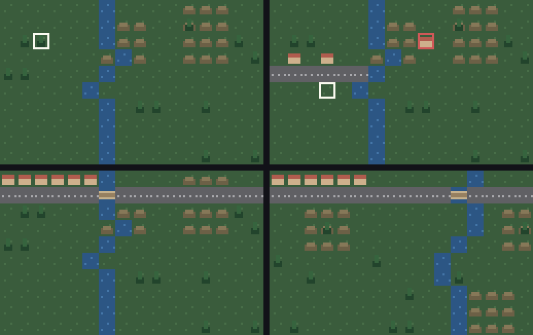

# g70 街づくり（土地と道）

街づくり 3 連作の 1 つ目。土地に**道と建物を置いて街を作る**ゲームです。

建物は**道に触れていないと仲間はずれ**——道でつながった一団が「区画」になります。予算 300 円で、**家 6 軒をひとつの区画につなげたら街びらき**。



左上から順に、さら地（カーソルが白い枠）→ 道と家を置いたところ（**赤い枠は道につながっていない家**）→ 自動で作った街（川に橋が架かっている）→ 別の土地。

今回の主題は 4 つです。

- **`enum.Flag`** — 1 マスが**複数の性質**を持てる。「森のある丘」は `HILL | FOREST`。ふつうの `Enum` だと組み合わせの数だけ名前を作ることになる
- **`typing.Literal`** — 資源と建物の種類を**文字列そのものを型にして**縛る。実行時はただの `str` なので、辞書の鍵にもそのまま使える
- **`decimal.Decimal`** — お金。`0.1 + 0.2` が `0.30000000000000004` になる世界では家計簿は付けられない
- **道でつながった区画を幅優先で見つける** — 道から道へ塗り、そのあと建物が周りを見る。**番号が付かない建物が「つながっていない」建物**

## ブラウザ版

インストールせずに遊べます → **https://hicocho.github.io/python-study/g70/**

ソースは [`docs/g70/game.py`](../docs/g70/game.py)。土地の作り方も、お金の計算も、区画を見つける幅優先も、キーを受ける `obey()` まで **1 文字も変えずに**持ってきています。同じキーの並びを打ち込んだ結果を**画素で比べて 10240 個すべて一致**しました。

## 遊び方（ターミナル）

```bash
python3 main.py                    # 矢印でカーソル、数字で建てるもの、空白で建てる、x 壊す、r さら地、q やめる
python3 main.py --seed 5           # 別の土地
python3 main.py --check            # 配る土地が、どれも目標に届くか見る
python3 main.py --auto             # 自動で街を作ってみせる
```

`--check` の出力。

```text
種 1  水 10 丘 15 森  7  道 16 本  家 6 軒  残り     47 円  区画 1  街びらき
種 2  水 10 丘 24 森  8  道 16 本  家 6 軒  残り     55 円  区画 1  街びらき
種 3  水 10 丘 18 森 12  道 16 本  家 6 軒  残り     47 円  区画 1  街びらき
```

## 仕様

- 土地は 16 × 10 マス、1 マス 8 × 8 ドット（128 × 80）
- 川が 1 本、丘と森がいくつか。**同じ種なら必ず同じ土地**
- 建てられるもの 7 種類。道路 5 / 家 25 / 畑 20 / 店 40 / 発電所 80 / 井戸 15 / 公園 10 円
- **川は道路だけが渡れる**（橋。+15 円）。森のマスは +8 円。畑は丘に建てられない
- 壊すと半額もどる。目標は家 6 軒がひとつの区画

## メモ

### `enum.Flag` — 1 マスに性質をいくつも持たせる

```python
class Land(Flag):
    """土地の性質。**1 つのマスが複数の性質を持てる**ので Flag にする。

    「森のある丘」は HILL | FOREST。ふつうの Enum だと組み合わせの数だけ
    名前を作ることになる。in で「丘を含むか」を聞けるのも Flag の効き目。
    """

    PLAIN = 0                                       # 何も無い平地
    WATER = auto()
    HILL = auto()
    FOREST = auto()
```

`Flag` は**ビットの旗**です。`auto()` が 1, 2, 4 … と 2 の累乗を振ってくれるので、`|` で重ねられ、`&` で「含むか」を聞けます。

```python
        if self.at(spot) & Land.WATER and not BUILDS[kind].on_water:
            return "水の上には建てられない（橋にできるのは道路だけ）"
```

`PLAIN = 0` は「何も立っていない旗」。`Land.PLAIN` は `if` の中で偽になるので、「平地か」は `not land` でも聞けます。

g20 のモンスターでも `enum.Flag` を使いましたが、あちらは**状態**（毒・眠り）でした。こちらは**土地の性質**で、生成時に決まって変わりません。同じ道具が、変わるものにも変わらないものにも使えます。

### `typing.Literal` — 文字列そのものを型にする

```python
# 資源の名前。**文字列そのものを型にする**ので、"powr" と書き間違えると型検査で止まる。
# 実行時はただの str なので、辞書の鍵にもそのまま使える。
Resource = Literal["power", "water", "food", "goods"]

# 建てられるものの名前。こちらも Literal。増やすときはここと BUILDS の 2 か所。
Kind = Literal["road", "house", "farm", "shop", "plant", "well", "park"]
```

`Enum` にすると `Kind.ROAD.value` と書くことになり、辞書の鍵や JSON との行き来でいちいち `.value` が要ります。`Literal` なら**実行時はただの文字列**。それでいて `"powr"` と書けば型検査器が止めてくれます。

g61 の `NewType`（`PlaceId = NewType("PlaceId", str)`）と似ていますが、あちらは「どんな文字列でもいいが、種類を分けたい」。`Literal` は**「この 4 つのどれか」**まで縛れます。

### `decimal.Decimal` — お金は浮動小数で持たない

```python
BUILDS = {
    "road": Build("road", "道路", Decimal("5"), on_water=True),
    "house": Build("house", "家", Decimal("25"), needs=frozenset({"power", "water", "food"})),
    ...
}
```

なぜ `float` ではないのか。

```text
>>> 0.1 + 0.2
0.30000000000000004
>>> Decimal("0.1") + Decimal("0.2")
Decimal('0.3')
```

`float` は 2 進の小数なので、`0.1` をぴったり表せません。買い物のたびに足し引きすると、誤差が積もって「残高がぴったり 0 にならない」が起きます。**お金・数量・点数のように「人が数えるもの」は `Decimal`**。

`Decimal("5")` と**文字列から作る**のが作法です。`Decimal(0.1)` にすると、すでに誤差を含んだ `float` から作ることになります。

割り算も `Decimal` のまま。

```python
        back = BUILDS[kind].cost / 2                # Decimal どうしなので、割っても Decimal
```

### 区画は「道から塗って、建物が周りを見る」

```python
    def districts(self) -> dict:
        """道でつながったかたまりに番号を振る。建物は隣の道の番号をもらう。

        道から道へ幅優先で塗り、そのあと建物が周りを見る。**道に触れていない
        建物には番号が付かない**——それが「つながっていない」ということ。
        """
        number, mark = {}, 0
        for spot, kind in sorted(self.tiles.items()):
            if kind != "road" or spot in number:
                continue
            mark += 1
            number[spot] = mark
            queue = deque([spot])
            while queue:
                for near in neighbours(queue.popleft()):
                    if self.tiles.get(near) == "road" and near not in number:
                        number[near] = mark
                        queue.append(near)
        for spot, kind in sorted(self.tiles.items()):
            if kind == "road":
                continue
            near = [number[p] for p in neighbours(spot) if self.tiles.get(p) == "road"]
            if near:
                number[spot] = min(near)            # 2 つの道に挟まれたら、若い方に付く
        return number
```

**幅優先を道だけに走らせる**のが要点です。建物まで一緒に塗ると、建物どうしが隣り合っているだけでつながったことになってしまう。「道でつながる」を素直に書くと、この 2 段になります。

`sorted(self.tiles.items())` で順を固定しているのは、**番号の振られ方を決まったものにする**ため。辞書の順（＝建てた順）のままだと、同じ街でも建てた順で番号が変わり、CLI とブラウザで表示が食い違います（g37〜42 の将棋で踏んだのと同じ話）。

つながっていない建物は、番号が付かないことで分かります。

```python
    def alone(self) -> set:
        """道につながっていない建物。"""
        number = self.districts()
        return {spot for spot in self.tiles if spot not in number}
```

### 川を「渡れない壁」にしなかった理由

最初、水の上には何も建てられない形にしていました。すると `--check` がこうなりました。

```text
種 1  …  道 15 本  家 6 軒  残り 67 円  区画 2  まだ
種 2  …  道 15 本  家 6 軒  残り 67 円  区画 2  まだ
```

**川が土地を必ず 2 つに割るので、家 6 軒がひとつの区画に収まらない。** 8 つの種のうち 2 つが達成不能でした。

橋（水の上の道、+15 円）を入れたら 8 つとも届くようになり、しかも**「川をどこで渡るか」という判断**が生まれました。

```text
種 1  …  道 16 本  家 6 軒  残り 47 円  区画 1  街びらき
```

**「達成できない土地を配らない」を機械に確かめさせたら、遊びが 1 つ増えた。** g66 で面の作り間違いを検査したのと同じ流れです。

### 難しさは、下手な自動プレイで測る

```python
def autobuild(town: Town) -> list[str]:
    """自動で街を作る。**目標が達成できる土地かどうか**を、これで確かめる。

    やり方は素朴に「水と丘を避けて、横一本の道を通し、その上下に家を置く」。
    人が遊ぶより下手でいいが、これで届かない土地は配ってはいけない。
    """
```

わざと下手に作ってあります（横一本の道＋その上下に家）。それで残るお金が **31〜55 円**。人が考えれば道をもっと短くできるので、**下手なやり方でぎりぎり届く**が今の難しさです。予算を 250 にすると自動プレイが届かなくなるので、そこが下限。

### 絵：丘は「盛り上がり」にする

最初、丘をマスいっぱいの茶色で塗ったら、**建物に見えました**（下の左）。草地を敷いてから下半分に盛り上がりを描くと、地形に見えます。

```python
    screen.box(px, py, CELL, CELL, GRASS)           # まず草地。丘も森もこの上に乗せる
    screen.plot(px + 2, py + 5, GRASS_DOT)
    screen.plot(px + 5, py + 2, GRASS_DOT)
    if land & Land.HILL:                            # 丘は「盛り上がり」。四角く塗ると建物に見える
        screen.box(px + 1, py + 4, CELL - 2, 3, HILL_C)
        screen.box(px + 2, py + 3, CELL - 4, 2, HILL_TOP)
```

**1 マス 8 × 8 ドットでは、「何であるか」より「何でないか」が大事**でした。地形は下に寄せて低く、建物は上に伸ばして高く。それだけで見分けが付きます。

### 段階を追う

| | 足したもの | 建てられる | お金 | 区画 | はなれた建物 | 目標判定 |
|---|---|---|---|---|---|---|
| step1 | 土地（`enum.Flag`） | — | — | — | — | — |
| step2 | 建てる・壊す（`Literal`） | **○** | — | — | — | — |
| step3 | お金（`Decimal`） | ○ | **204 円** | — | — | — |
| step4 | 区画（幅優先） | ○ | 204 円 | **1** | **1** | **できる** |
| step5 | 自動プレイと検査 | ○ | 204 円 | 1 | 1 | できる |

（同じ手順——道を 6 本、家を 2 軒（1 軒は道から離して）——を各ステップで打った結果）

### 検証

| 何を | どう確かめたか | 結果 |
|---|---|---|
| 土地 | 8 つの種の内訳と、同じ種で 2 回作る | 水 10・丘 12〜24・森 7〜12。**同じ種なら必ず同じ土地** |
| 配る土地 | `--check`（下手な自動プレイで 8 種） | 8 種とも街びらき、残り 31〜55 円 |
| 橋を入れる前 | 同じ検査 | **8 種中 2 種が達成不能**（区画 2 のまま） |
| つながり | 道から離して家を建てる | 赤い枠が付き、`はなれた建物 1` |
| お金 | 森のマス・橋・こわす | +8 円 / +15 円 / 半額もどる |
| 端末の入力 | `pty.fork()` で 1 → ↓×4 → 空白と→ を 10 回 → 2 → ↑空白 → x → r → q | 画面更新 30 回、財布 300 → 210 → 300、橋も架かる |
| ブラウザ | Playwright でボタンと地図クリック | 7 つのボタンが `BUILDS` から作られ、クリックで建ち、離れた家に赤枠 |
| **CLI とブラウザが同じか** | 同じキーの並び 31 個を打ち込んで画素を比較 | **10240 / 10240 一致**（財布・区画・はなれた数も同じ） |

### 次

g71 で**需給と人口、そして災害**。電気・水・食べものを配り（`heapq.merge`）、**どれかが 0 なら満足度も 0**（`math.prod`）にします。火事も起こします。
