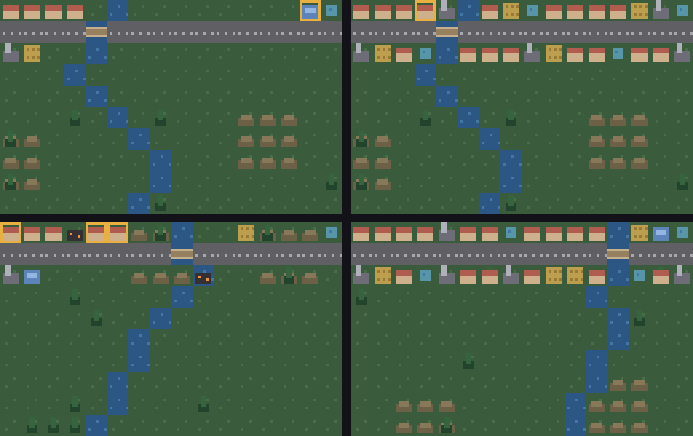

# g71 街づくり2（需給と人口と災害）

g70 の続き。**月が進むと資源が配られ、満ち足りた家に人が入ります**。人が増えれば税が入り、建物が増えれば維持費もかさむ。そして**火事と洪水**が起きます。

30 か月で**人口 60 人**が目標。



左上から順に、できたての街（黄色い枠は**何かが足りていない建物**）→ 育った街（22 か月で 60 人）→ 災害のあと（**黒いのが焼け跡**）→ 別の土地。

今回の主題は 4 つです。

- **`heapq.merge`** — 出す建物ごとに「近い順に並べた列」を作り、**もう並んでいる列どうしを混ぜる**。全部を集めて並べ直すより素直で、足りなくなった時点で打ち切れる
- **`math.prod`** — 満足度。電気・水・食べもののうち**どれかが 0 なら全体も 0**。空のとき 1 を返すので、何も要らない建物は自動的に満ち足りる
- **災害の乱数を、街づくりの乱数と分ける** — しかも**毎月きっかり 4 つの数を引く**。引く数が建物の数で変わると、遊び方しだいで災害の並びが変わってしまう
- **`Decimal` の収支** — 税と維持費を毎月足し引きする。ここで浮動小数を使うと、残高が「ぴったり」にならない

## ブラウザ版

インストールせずに遊べます → **https://hicocho.github.io/python-study/g71/**

ソースは [`docs/g71/game.py`](../docs/g71/game.py)。配り方も満足度も災害の乱数も、キーを受ける `obey()` まで **1 文字も変えずに**持ってきています。同じキーの並びを打ち込んだ結果を**画素で比べて 10240 個すべて一致**しました。

## 遊び方（ターミナル）

```bash
python3 main.py                    # 矢印でカーソル、数字で建てるもの、空白で建てる、n で次の月
python3 main.py --check            # 配る土地が、どれも目標に届くか見る
python3 main.py --auto             # 下手な市長が 30 か月やってみせる
python3 main.py --supply           # （ステップ1〜3）どこに何が届くかを見る
```

`--check` の出力。

```text
種 1  22 月  人  60/60  家 17  財布    108.6 円  焼け跡 0  達成
種 2  26 月  人  61/60  家 16  財布    181.8 円  焼け跡 0  達成
種 7  29 月  人  60/60  家 16  財布    155.2 円  焼け跡 0  達成
```

## 仕様

- 家は**電気・水・食べもの**が全部そろって 4 人、品物も届けば 5 人
- 発電所 4 軒ぶん / 井戸 6 軒ぶん / 畑 4 軒ぶん（水が要る）/ 店 6 軒ぶん（電気が要る）
- 税は 1 人 1 円/月。維持費は 発電所 1・店 1・畑 0.5・井戸 0.5・公園 0.5・道 0.2 円/月
- 予算 500 円から。**お金が尽きたらおしまい**
- 火事 10%/月・洪水 6%/月。**焼け跡に建て直すと半額**

## メモ

### `heapq.merge` — 並んでいる列を混ぜるだけ

```python
    def deliver(self) -> dict:
        """区画ごとに、近い順で資源を配る。返すのは「どこに何が届いたか」。

        出す建物ごとに「同じ区画で、それを要る建物」を**近い順に並べた列**を作り、
        heapq.merge でひとつの流れにまとめる。**もう並んでいる列どうしを混ぜるだけ**
        なので、全部を集めて並べ直すより素直で、足りなくなった時点で打ち切れる。
        """
        number = self.districts()
        got = {spot: set() for spot in self.tiles}
        for resource in RESOURCES:
            streams, left = [], {}
            takers = [s for s, k in self.tiles.items()
                      if resource in BUILDS[k].needs and s in number]
            for spot, kind in sorted(self.tiles.items()):
                if resource not in BUILDS[kind].gives or spot not in number:
                    continue
                left[spot] = BUILDS[kind].supply
                streams.append(sorted((far(spot, t), t, spot) for t in takers
                                      if number[t] == number[spot]))
            for _, taker, giver in merge(*streams):
                if left[giver] and resource not in got[taker]:
                    left[giver] -= 1
                    got[taker].add(resource)
        return got
```

`heapq.merge` は「**すでに並んでいる列**をいくつか受け取って、並んだままの 1 本の流れにする」道具です。`sorted(chain(*streams))` でも同じ結果になりますが、

- **全部をメモリに広げない**（流れなので、途中でやめられる）
- 「各発電所から見た近い順」という**列の意味**がコードに残る

`(距離, 相手, 出す人)` の組で並べているので、混ぜた流れは**街全体で近い順**になります。だから「近い家から電気が届く」が自然に出ます。

`--supply` で確かめられます。

```text
家 10 軒  出す建物 発電所4・井戸6・畑4・店6
  家 (0, 0)  届いた: 電気・食べもの
  家 (5, 0)  届いた: 電気・水・食べもの・品物
```

**井戸から遠い端の家には水が来ない。** 供給を増やすか、井戸をもう 1 つ建てるかは、遊ぶ人の判断です。

### `math.prod` — どれかが 0 なら全体が 0

```python
    def happy(self, spot: tuple[int, int], got: dict) -> bool:
        """満ち足りているか。**どれかが 0 なら全体も 0**——それを掛け算で表す。

        prod は空っぽのとき 1 を返すので、何も要らない建物（道路や公園）は
        いつでも満ち足りている扱いになる。if を並べるより、この方が短い。
        """
        needs = BUILDS[self.tiles[spot]].needs
        return prod(1 if r in got.get(spot, ()) else 0 for r in needs) == 1
```

`all(...)` でも書けますが、`prod` にしたのは**あとで「半分だけ届いた」を入れられる**からです。今は 0 か 1 しか返しませんが、`0.5` を返すようにすれば「満足度 50%」がそのまま掛け算で伝わります。`all` だと真偽値なので、そこで作り直しになります。

`prod(())` が **1**（掛け算の単位元）なのも効いています。道路や公園は `needs` が空なので、条件を書かずに「満ち足りている」側に落ちます。

### 災害の乱数は、街づくりの乱数と分ける

```python
    def disaster(self) -> str:
        """月の終わりに、たまに何かが起きる。**乱数は街づくりのものと別に持つ。**

        しかも**毎月きっかり 4 つの数を引く**。引く数が建物の数で変わると、
        遊び方しだいで災害の並びが変わってしまい、「同じ種なら同じ災害」が
        崩れる（g54 のリプレイで覚えたのと同じ話）。
        """
        fire, flood, pick_a, pick_b = (self.luck.random() for _ in range(4))
```

2 つの決まりごとがあります。

1. **別の `random.Random` を持つ**（`seed * 1000 + 7`）。土地の生成と混ざると、遊ぶたびに土地が変わってしまう
2. **毎月引く数を固定する**。`self.luck.choice(建物のリスト)` と書くと、建物の数によって乱数の進み方が変わる。だから 0〜1 の数を引いてから `int(pick * len(候補))` で選ぶ

2 つ目は g54（格闘ゲームのリプレイ）で覚えたことの再演です。**「同じ種なら同じ災害」を守りたいなら、乱数を引く回数を遊び方から切り離す。**

### つまずいた: 発電所が焼けると、街が二度と立ち直れない

最初の設定は「発電所 80 円・10 軒ぶん」でした。下手な市長に 30 か月やらせると、8 種のうち 2 種でこうなりました。

```text
 8 月  人  20  財布     56.4  家  6  不足なし     発電所が焼けた
 9 月  人  13  財布     23.2  家  6  電気7
10 月  人   8  財布     31.0  家  6  電気7      道路が流された
 …
19 月  人   0  財布     -5.2  家  5  電気6・食べもの1
```

**発電所を建て直すには 80 円。人が減って税が入らないので、いつまでも 80 円が貯まらない。** 死のらせんです。

直したのは 2 つ。

```python
        水の上の道は橋なので高い。**焼け跡は半額**——建て直せない街は死ぬので、
        立ち直る道を残しておく（火事で発電所を失うと詰んだ。実際に詰んだ）。
        """
        extra = BRIDGE if self.at(spot) & Land.WATER else self.clearing(spot)
        cost = BUILDS[kind].cost + extra
        return cost / 2 if spot in self.burnt else cost
```

そして**発電所を「安くて小さい」ものに**しました（80 円・10 軒ぶん → 30 円・4 軒ぶん）。数で持てば、1 つ落ちても全部は止まりません。

振ってみた結果です（下手な市長で 8 種）。

| 発電所の値段 | 何軒ぶん | 届いた種 | 人口の平均 | いちばん低い |
|---|---|---|---|---|
| 80 円 | 10 | 7/8 | 59.0 | 44 |
| 50 円 | 6 | 7/8 | 58.9 | 41 |
| 40 円 | 5 | 7/8 | 60.6 | 59 |
| **30 円** | **4** | **8/8** | 60.2 | **60** |

**「大きな 1 つ」より「小さないくつか」の方が、災害に強い。** ゲームの話でもあり、そうでない話でもあります。

災害そのものの確率を下げる手も試しましたが、**効きませんでした**（乱数の並びが変わるだけで、別の種が死ぬ）。

| | 届いた種 | いちばん低い人口 |
|---|---|---|
| 火事 10% / 洪水 6%（今の形） | 7/8 | 44 |
| 火事 8% / 洪水 5% | 7/8 | 44 |
| 火事 6% / 洪水 4% | 7/8 | **0** |

**「運が悪いと詰む」を運の側で直そうとしても直らない。詰まない仕組みを作る方が早い。**

### 道が切れると街が死ぬ

自動プレイに 1 行だけ特別扱いを入れました。

```python
        for x in range(COLS):                       # **道が切れたら、何をおいても直す**
            spot = (x, main)                        # 道が無いと供給が届かず、街が死ぬ。
            if spot not in town.tiles and town.purse >= town.price(spot, "road"):
                town.build(spot, "road")            # しかも道は安い（貯金を待つ理由がない）
```

洪水で道が 1 マス流されると、そこで区画が 2 つに割れ、片側の家に何も届かなくなります。**道は 5 円**なので、貯金の都合を考える意味がありません。

### 順番を決めておく

```python
    def advance(self) -> dict:
        """1 か月ぶん進める。配る → 人が動く → 精算 → 災害。

        **順番が大事**。災害を先に起こすと、その月の税が入る前に建物が消える。
        毎月きっかりこの順なので、「なぜ人口が減ったか」を追える。
        """
```

シミュレーションは「毎月これをこの順で」を決めた瞬間に、**追いかけられるもの**になります。順番が曖昧だと、同じ状態から同じ結果が出ません。

### 段階を追う

道を 1 本引き、発電所・井戸・畑・店を 1 つずつ、家を 4 軒。それを各ステップで動かした結果です。

| | 足したもの | 届いた資源 | 満ち足りない家 | 12 か月後の人口 | 12 か月の収支 | 8 種 |
|---|---|---|---|---|---|---|
| step1 | 需給の表と `heapq.merge` | **13** | — | — | — | — |
| step2 | `math.prod` の満足度 | 13 | **0** | — | — | — |
| step3 | 人口の増減 | 13 | 0 | **16** | +0.0 | — |
| step4 | 税と維持費、目標 | 13 | 0 | 16 | **+94.6** | **7/8** |
| step5 | 災害と焼け跡 | 13 | 0 | **0** | −7.8 | **8/8** |

step5 で人口が 0 になっているのは失敗ではありません。**手を入れない街は、災害で死ぬ**ということです（この 4 軒の街は火事で発電所を失いました）。同じ設定でも、毎月手を入れる自動プレイなら 8 種すべてで 60 人に届きます。

### 検証

| 何を | どう確かめたか | 結果 |
|---|---|---|
| 配り方 | `--supply` で「どこに何が届いたか」 | 井戸から遠い家に水が来ない（近い順に配れている） |
| 満足度 | 4 軒の街で `happy()` | 全部そろった家だけ人が入る |
| 目標に届くか | `--check`（下手な市長で 8 種） | **8 種とも達成**、22〜29 か月 |
| 焼け跡の半額 | 割引ありとなしで 8 種 | あり **8/8** / なし 6/8 |
| 災害の重さ | 災害なしで 8 種 | 7/8（22〜24 か月）——**災害が無くても 1 種は届かない** |
| 発電所の大きさ | 4 通りの値段と供給量 | 30 円・4 軒ぶんで 8/8（上の表） |
| 災害の確率 | 3 通り | 下げても 7/8 のまま（別の種が死ぬ） |
| 端末の入力 | `pty.fork()` で道 12・発電所・井戸・畑・家 4 → n を 8 回 | 8 か月で人口 0 → 12、災害 2 回 |
| ブラウザ | Playwright で同じ手順 | 3 月・財布 346.8・「水が 1」まで一致 |
| **CLI とブラウザが同じか** | 同じキーの並び 48 個を打ち込んで画素を比較 | **10240 / 10240 一致** |

### 次

g72 で**復興と記録**。消防署と堤防で備え、`itertools.cycle` で季節を巡らせ、`csv` で街の記録を書き出します。
