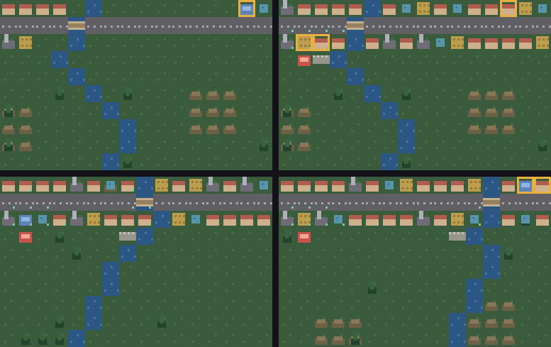

# g72 街づくり3（季節と備えと記録）

街づくり 3 連作の**完成形**（g70 → g71 → g72）。**季節が巡り**、**消防署と堤防**が災害を止め、街の歩みが**毎月 1 行の記録**に残ります。

36 か月で**人口 60 人**が目標。



左上から順に、できたての街 → 育った街（28 か月で 60 人）→ **備えのある街**（赤いのが消防署、川ぎわの灰色が堤防）→ 別の土地。

今回の主題は 4 つです。

- **`itertools.cycle`** — 季節。終わりのない列を作って、3 か月ごとに `next()` を 1 回。夏は水を使い、冬は電気を使い、秋は実る
- **備えは「起きない」ではなく「起きたうえで止まる」** — 消防署も堤防も、災害そのものは防ぎません。起きて、止まって、記録に残る
- **`csv.DictWriter` と `io.StringIO`** — 記録を「字」にしてから出す。端末はファイル、ブラウザは画面。**出す先を選ばずに済む**
- **同じ種なら、同じ災害が同じ月に** — g71 で仕込んだ「乱数を分けて、引く回数を固定する」を、2 回走らせて突き合わせる

## ブラウザ版

インストールせずに遊べます → **https://hicocho.github.io/python-study/g72/**

ソースは [`docs/g72/game.py`](../docs/g72/game.py)。季節も備えも記録も、キーを受ける `obey()` まで **1 文字も変えずに**持ってきています。同じキーの並びを打ち込んだ結果を**画素で比べて 10240 個すべて一致**しました。

## 遊び方（ターミナル）

```bash
python3 main.py                    # 矢印でカーソル、数字で建てるもの、空白で建てる、n で次の月
python3 main.py --check            # 配る土地が、どれも目標に届くか見る
python3 main.py --replay           # 同じ種で同じ災害が起きるか確かめる
python3 main.py --csv              # 自動プレイの記録を town.csv に書き出す
python3 main.py --auto             # 下手な市長が 36 か月やってみせる
```

`--check` の出力。

```text
種 1  28 月  人  60/60  家 17  財布    151.0 円  守った 1  失った 6  達成
種 3  32 月  人  60/60  家 16  財布    197.9 円  守った 1  失った 6  達成
種 7  33 月  人  60/60  家 16  財布    168.5 円  守った 2  失った 7  達成
```

## 仕様（g71 からの追加）

| | |
|---|---|
| 季節 | 3 か月で 1 つ。夏は井戸 6 → 5、冬は発電所 4 → 3、秋は畑 4 → 6 |
| 消防署 30 円 | まわり 3 マスの火事を止める。**道に面していなくてよい** |
| 堤防 15 円 | 水ぎわにしか建てられない。まわり 3 マスの洪水を止める |
| 記録 | 毎月 1 行（月・季節・人口・財布・家・建物・焼け跡・出来事） |
| 期限 | 36 か月（g71 は 30 か月。備えを買う時間ぶん延ばした） |

## メモ

### `itertools.cycle` — 終わりのない列

```python
# 季節。**itertools.cycle で終わりのない列にして、3 か月ごとに 1 つ進める。**
SEASONS = ("春", "夏", "秋", "冬")
SEASON_LEN = 3                                      # 1 つの季節は 3 か月

# 季節で変わる供給。夏は水を使い、冬は電気を使い、秋は実る。
SEASON_SHIFT = {"夏": {"well": -1}, "秋": {"farm": 2}, "冬": {"plant": -1}}
```

```python
        if self.turning is None:
            self.turning = cycle(SEASONS)           # 終わりのない列。next() で 1 つ進む
            self.season = next(self.turning)
```

```python
        if self.month > 1 and self.month % SEASON_LEN == 1:   # 3 か月で 1 つ季節を進める
            self.season = next(self.turning)
```

`SEASONS[(month // 3) % 4]` と書いても同じですが、`cycle` にすると**「巡っている」ことがコードに残ります**。季節を 5 つに増やしても、割り算の数を直す必要はありません。

供給への効き方は表を 1 つ引くだけ。

```python
    def supply_now(self, kind: Kind) -> int:
        """今の季節での供給量。**夏は水を使い、冬は電気を使い、秋は実る。**

        表を 1 つ引くだけ。季節を増やしたくなったら SEASON_SHIFT に足す。
        """
        shift = SEASON_SHIFT.get(self.season, {}).get(kind, 0)
        return max(BUILDS[kind].supply + shift, 0)
```

### 備えは「起きない」のではなく「止まる」

```python
                if self.guarded(spot, "fire"):      # 備えは「起きない」ではなく「止まる」
                    news.append("消防署が火を止めた")
                else:
                    news.append(f"{BUILDS[self.tiles.pop(spot)].name}が焼けた")
                    self.burnt.add(spot)
```

**火事の判定を先にやってから、止められるかを見る。** 逆にして「消防署があれば火事を起こさない」にすると、乱数の引き方が街の形で変わってしまいます（g71 で固定したものが崩れる）。

そして何より、**「消防署のおかげで助かった」が記録に残る**。備えが効いていることが、遊ぶ人に見えます。

```text
種 2  出来事  5 件  …  5月 家が焼けた  11月 堤防が水を止めた  13月 家が焼けた
```

### つまずいた: 備えを建てると、かえって目標に届かなくなった

消防署と堤防を入れて、下手な市長に建てさせたら——**達成が 8/8 から 3/8 に落ちました**。

| | 達成 | 守った | 失った |
|---|---|---|---|
| 備えを建てない | **8/8** | 0 | 34 |
| 備え 30 円（道ぎわに建てる） | 3/8 | 21 | 19 |
| 備え 20 円（道ぎわに建てる） | 2/8 | 19 | 22 |
| 備え 15 円（道ぎわに建てる） | 1/8 | 18 | 22 |

**災害は 21 回も止めているのに、負けている。** 値段を下げても悪くなるばかり。

理由は場所でした。この街は大通りの上下 2 列しか建てられません。**そこに消防署を建てると、家が 1 軒減る**——家 1 軒は 5 人なので、守った建物より失う人口の方が大きい。

```python
def spare_spots(town: Town, main: int, kind: Kind) -> list:
    """大通りから離れたマス。**備えは道に面していなくても働く**（供給が要らない）。

    道ぎわは家や畑に取っておきたい。消防署や堤防を道ぎわに建てると、
    そのぶん家が減る——場所こそが、いちばん高い費用だった。
    """
```

さらに 2 つ直して 8/8 に戻りました。

```python
                    # **いちばん多くの建物を守れる所**に置く（ただ空いている所ではなく）
                    town.build(max(spots, key=lambda s: sum(far(s, t) <= GUARD
                                                            for t in town.tiles)), kind)
```

```python
        if town.people >= GUARD_AFTER:              # **備えは、街が立ってから**
            for kind in ("fire", "levee"):          # 早すぎると、家に回すお金が無くなる
```

| | 達成 |
|---|---|
| 空き地に建てる（置き場所は適当） | 5/8 |
| ＋ いちばん多く守れる所に置く | 5/8（36 か月なら 5/8） |
| ＋ 人口 25 を超えてから建てる（36 か月） | **8/8** |

**費用はお金だけではない。場所と、時期も費用のうち。**

### `io.StringIO` — 出す先を選ばない

```python
    def csv_text(self) -> str:
        """記録を csv の字にする。**ファイルに書くのも画面に出すのも、これを使う。**

        DictWriter は「見出しの並び」を fieldnames で決める。辞書の順に
        頼らないので、あとから項目を足しても列が入れ替わらない。
        io.StringIO に書けば、出す先を選ばずに済む（端末はファイル、
        ブラウザは画面）。
        """
        if not self.log:
            return ""
        out = io.StringIO()
        writer = csv.DictWriter(out, fieldnames=list(self.log[0]), lineterminator="\n")
        writer.writeheader()
        writer.writerows(self.log)
        return out.getvalue()

    def save(self, path: Path = RECORD) -> int:
        """記録をファイルへ。**utf-8-sig** にすると Excel が文字化けしない。"""
        path.write_text(self.csv_text(), encoding="utf-8-sig")
        return len(self.log)
```

`csv.writer` は「書き込める物」を受け取ります。ファイルでも `StringIO` でもいい。**字にするところと、出すところを分ける**と、ブラウザ版でそのまま使えます（ブラウザにファイルは無い）。

`lineterminator="\n"` を指定したのは、既定が `\r\n` だからです。ブラウザの `<pre>` に出すと空行だらけになります。

出てくる記録。

```text
月,季節,人口,財布,家,建物,焼け跡,出来事
1,春,0,293.8,0,20,0,
2,春,3,232.6,2,22,0,
3,春,8,184.4,4,24,0,
```

### 同じ種なら、同じ災害

```python
def replay_check(count: int = 4) -> list[str]:
    """**同じ種なら、同じ災害が同じ月に起きるか。** 2 回走らせて記録を比べる。

    乱数を分けて引く回数を固定したのは、これを成り立たせるため。
    ここが崩れると、面として配ることも、あとで振り返ることもできなくなる。
    """
```

g71 で「災害の乱数を分け、毎月きっかり 4 つ引く」と決めました。**その決まりが守られているかを、機械が確かめます。**

```text
種 1  出来事  7 件  2 回目と同じ: はい  4月 道路が流された  8月 家が焼けた  10月 店が焼けた
種 2  出来事  5 件  2 回目と同じ: はい  5月 家が焼けた  11月 堤防が水を止めた  13月 家が焼けた
```

決まりを作っただけでは守られません。**守られていることを確かめる仕掛けまで作って、はじめて決まりになる。**

### 「つながっていない」ではなく「つながっていないと困る」

```python
    def alone(self) -> set:
        """道につながっていなくて、**困る**建物。

        消防署・堤防・公園は何も要らず何も出さないので、道から離れていてよい。
        「つながっていない」ではなく「つながっていないと困る」を数える。
        """
        number = self.districts()
        return {spot for spot, kind in self.tiles.items()
                if spot not in number and (BUILDS[kind].needs or BUILDS[kind].gives)}
```

g70 では「道に触れていない建物」に赤い枠を付けていました。備えを入れたら、**空き地に建てた消防署に赤枠が付いて**しまった。警告の意味が変わったので、条件も変えました。

### 段階を追う

| | 足したもの | 季節 | 備え | 守った | 記録 | リプレイの確認 | 8 種 |
|---|---|---|---|---|---|---|---|
| step1 | 季節（`cycle`） | **あり** | — | 0 | 2 項目 | — | 8/8 |
| step2 | 消防署と堤防を建てられる | あり | **あり** | 0 | 2 項目 | — | **7/8** |
| step3 | 備えが災害を止める | あり | あり | **8** | 2 項目 | — | **8/8** |
| step4 | `csv` で記録 | あり | あり | 8 | **csv** | — | 8/8 |
| step5 | リプレイの確認 | あり | あり | 8 | csv | **あり** | 8/8 |

**step2 で 7/8 に落ちて、step3 で 8/8 に戻る**のが、この課題のいちばん短い要約です。備えは、建てられるだけでは負担でしかない。

### 検証

| 何を | どう確かめたか | 結果 |
|---|---|---|
| 季節 | 自動プレイの記録を並べる | 春春春夏夏夏秋秋秋冬冬冬…（3 か月で 1 つ） |
| 季節の効き | 4 つの季節で供給量を出す | 夏 井戸 5・秋 畑 6・冬 発電所 3 |
| 目標に届くか | `--check`（下手な市長で 8 種） | **8 種とも達成**、28〜33 か月 |
| 備えの効き | 8 種の合計 | 守った 8 / 失った 33 |
| 備えの置き場所 | 道ぎわ / 空き地 / 時期を遅らせる | 3/8 → 5/8 → **8/8** |
| 記録 | `--csv` | 28 行（見出し＋27 か月） |
| リプレイ | 同じ種で 2 回走らせて出来事を比べる | 4 種とも**完全に一致** |
| 端末の入力 | `pty.fork()` で街を作って n を 10 回 | 10 か月で人口 0 → 16、季節 4 つ、災害 3 回 |
| ブラウザ | Playwright で同じ手順 | 6 月・夏・財布 276.2・記録の 1 行目まで一致 |
| **CLI とブラウザが同じか** | 同じキーの並び 66 個を打ち込んで画素を比較 | **10240 / 10240 一致** |

### 街づくり 3 本（g70〜g72）で覚えた文法

| # | 作ったもの | 覚えた文法 |
|---|---|---|
| g70 | 土地と道 | `enum.Flag`（1 マスに複数の性質）/ `typing.Literal` / `decimal.Decimal` / 幅優先で区画 |
| g71 | 需給と人口と災害 | `heapq.merge` / `math.prod` / 災害の乱数を分けて引く回数を固定 / `Decimal` の収支 |
| g72 | 季節と備えと記録 | `itertools.cycle` / `csv.DictWriter` と `io.StringIO` / 決まりを機械に確かめさせる |

**この 3 本を通しての学びは、「バランスは測って決める。しかも、測ると思っていたのと違う答えが出る」**ことでした。

- g70: 川を渡れなくしたら 8 種中 2 種が達成不能 → 橋を入れたら**遊びが 1 つ増えた**
- g71: 発電所が焼けると詰む → **「大きな 1 つ」より「小さないくつか」**。災害の確率を下げても直らなかった
- g72: 備えを建てると**かえって負ける** → いちばん高い費用は場所と時期だった

どれも、頭の中では出てこなかった答えです。**下手な自動プレイに 8 種類の土地を渡して、数字を見る**——それだけで設計が決まっていきました。
